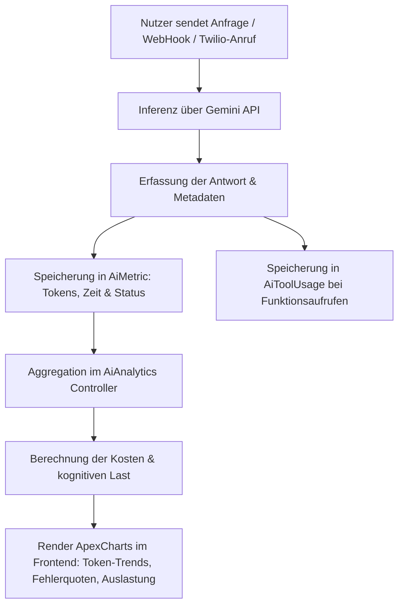

# Agenten-Analyse

Die Agenten-Analyse stellt ein dynamisches Telemetrie- und Kostenüberwachungssystem für die integrierten künstlichen Intelligenzen (KI-Agenten) im Seelenfunke-System bereit. Sie wertet Tokenverbräuche, Antwortlatenzen, Tool-Ausführungsfehler und finanzielle Belastungen in Echtzeit aus.

## Zielsetzung
Das Modul ermöglicht die vollständige Transparenz und Kostenkontrolle über die genutzten Large Language Models (LLMs) von Google Gemini. Es deckt Performance-Flaschenhälse auf (z. B. fehlerhafte MCP-Tools oder hohe Latenzen) und stellt sicher, dass die Auslastung der Agenten (kognitive Last) innerhalb der zulässigen Limits bleibt.

---

## Beteiligte Komponenten & Klassen

### Datenbank-Modelle
- [AiAgent](file:///wsl.localhost/Ubuntu/home/ubuntuxina/meine-projekte/seelenfunke/app/Models/Ai/AiAgent.php): Stammdaten des Agenten (Name, Farbe, zugewiesenes Modell wie `gemini-2.5-flash`).
- [AiMetric](file:///wsl.localhost/Ubuntu/home/ubuntuxina/meine-projekte/seelenfunke/app/Models/Ai/AiMetric.php): Logs für jede Inferenzanfrage, inklusive Tokenzahlen (`input_tokens`, `output_tokens`) und der Antwortzeit (`total_time_ms`).
- [AiToolUsage](file:///wsl.localhost/Ubuntu/home/ubuntuxina/meine-projekte/seelenfunke/app/Models/Ai/AiToolUsage.php): Telemetrie für aufgerufene Funktionsschnittstellen (Tools) mit Fehlerindikatoren (`is_error`).
- [AiChatMemory](file:///wsl.localhost/Ubuntu/home/ubuntuxina/meine-projekte/seelenfunke/app/Models/Ai/AiChatMemory.php): Historie der verarbeiteten Chat-Nachrichten zur Ermittlung des Aktivitätsvolumens.
- [SupportCustomerChatMessage](file:///wsl.localhost/Ubuntu/home/ubuntuxina/meine-projekte/seelenfunke/app/Models/Support/SupportCustomerChatMessage.php): Kundensupport-Chatverlauf, der ebenfalls in das globale Chat-Volumen einfließt.
- [SystemAiHostingPlan](file:///wsl.localhost/Ubuntu/home/ubuntuxina/meine-projekte/seelenfunke/app/Models/System/SystemAiHostingPlan.php): Repräsentiert das aktive System-Hosting-Modell für KI-Ressourcen.

### Livewire-Controller
- [AiAnalytics](file:///wsl.localhost/Ubuntu/home/ubuntuxina/meine-projekte/seelenfunke/app/Livewire/Shop/Ai/AiAnalytics.php): Berechnet die KPIs, erzeugt Trendanalysen für Charts, überwacht die Top-Tools sowie die kognitive Belastung je Agent und steuert das Frontend.

---

## Telemetrie- & Kostenberechnungslogik

Jede Interaktion mit der Gemini-API wird vom System instrumentiert. Die Telemetrie-Pipeline erfasst die Daten wie folgt:

### 1. Finanzielle Kostenkalkulation
Da die API-Kosten je nach Modellklasse stark variieren, berechnet der Controller [AiAnalytics](file:///wsl.localhost/Ubuntu/home/ubuntuxina/meine-projekte/seelenfunke/app/Livewire/Shop/Ai/AiAnalytics.php) die monatlich aufgelaufenen geschätzten API-Gebühren dynamisch anhand des Modell-Präfixes:

- **Pro-Klasse (`gemini-1.5-pro`, `gemini-2.5-pro` oder `gemini-3`):**
  - Input-Tokens: $1.25 pro 1.000.000 Tokens
  - Output-Tokens: $5.00 pro 1.000.000 Tokens
- **Flash-Klasse (z. B. `gemini-2.5-flash`, `gemini-1.5-flash` oder `gemini-3.1-flash-live-preview`):**
  - Input-Tokens: $0.075 pro 1.000.000 Tokens
  - Output-Tokens: $0.30 pro 1.000.000 Tokens

### 2. Kognitive Auslastung (Cognitive Load Timeline)
Die kognitive Last misst, wie nah eine Anfrage an das maximale Kontextfenster (Context Limit) des Modells herangereicht hat. Dies wird im Dashboard visualisiert:
- **Flash-Modelle:** Limit von 1.000.000 Tokens.
- **Pro/Gemini-3-Modelle:** Limit von 2.000.000 Tokens.
- **Formel:** $\text{Prozentuale Auslastung} = \min\left(100\%, \frac{\text{Max Input Tokens}}{\text{Kontext-Limit}} \times 100\right)$

### 3. Tool-Fehleranalyse
Ausfälle von internen Datenbanktools, E-Mail-Scrapern oder Dateimanagern werden über [AiToolUsage](file:///wsl.localhost/Ubuntu/home/ubuntuxina/meine-projekte/seelenfunke/app/Models/Ai/AiToolUsage.php) aufgezeichnet. Der Controller aggregiert diese nach `tool_name` und berechnet eine Top-5 Fehler-Rangliste, um fehlerhafte API-Signaturen oder Berechtigungsfehler im Backend sofort anzuzeigen.
