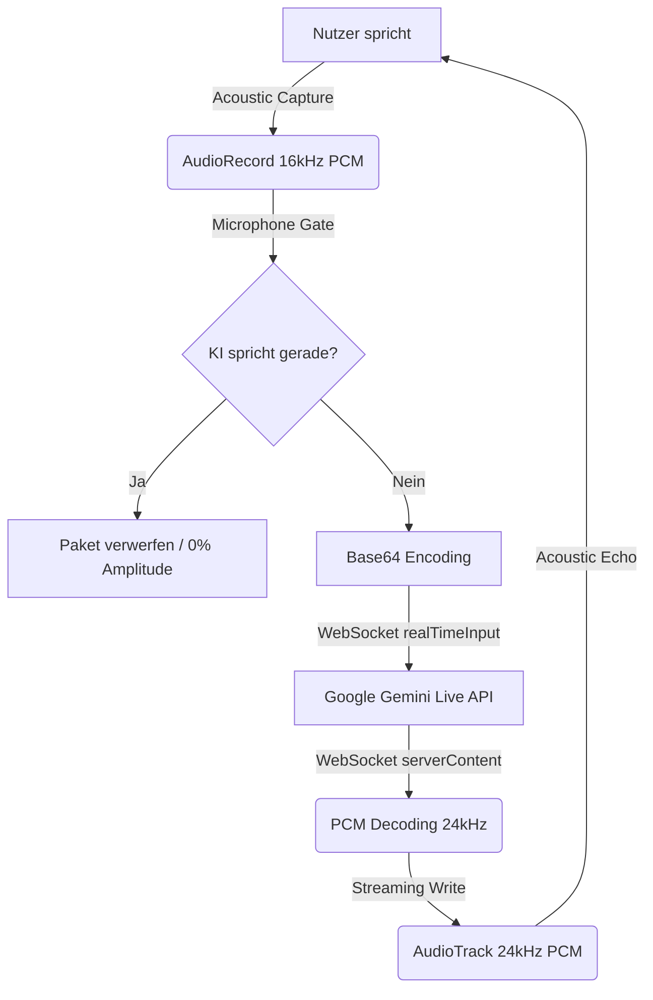

# Abschlussbericht & Systemarchitektur: Android Live KI-Call & Integration

Dieses Dokument dokumentiert die technische Architektur, die Schnittstellen und die Fehlerbehebungen des **Live-KI-Voice-Calls (Funkira Live)** in der Seelenfunke Android-App. Es dient als dauerhafte Referenz für zukünftige Entwicklungen.

---

## 1. Die Google Gemini Multimodal Live API-Schnittstelle

Die Android-App kommuniziert über eine bidirektionale WebSocket-Verbindung direkt mit Googles Gemini-Infrastruktur. 

### A. Verbindungs-Endpunkt (URL)
Die Kommunikation erfolgt verschlüsselt über das Beta-Protokoll:
```text
wss://generativelanguage.googleapis.com/ws/google.ai.generativelanguage.v1beta.GenerativeService.BidiGenerateContent?key=YOUR_API_KEY
```

### B. Genutztes KI-Modell
Wir verwenden das hochmoderne, native Audio-Modell:
* **`models/gemini-2.5-flash-native-audio-latest`**
Dieses Modell ist speziell für extrem geringe Latenzzeiten und die direkte, native Verarbeitung von Audio-Ein- und -Ausgaben optimiert, ohne den Umweg über separate Text-to-Speech (TTS) oder Speech-to-Text (STT) Module zu gehen.

### C. Handshake & Setup-Konfiguration
Sofort nach dem erfolgreichen Öffnen der WebSocket-Verbindung (`onOpen`) muss der Client ein initiales Konfigurations-JSON-Paket an Google senden. Erst nach Erhalt eines Bestätigungspakets (`setupComplete`) wird der Audio-Stream freigegeben.

#### Aufbau des Setup-Pakets:
```json
{
  "setup": {
    "model": "models/gemini-2.5-flash-native-audio-latest",
    "generationConfig": {
      "responseModalities": ["AUDIO"],
      "speechConfig": {
        "voiceConfig": {
          "prebuiltVoiceConfig": {
            "voiceName": "Puck" 
          }
        }
      }
    },
    "systemInstruction": {
      "parts": [
        {
          "text": "Deine System-Anweisung (z.B. Du bist Funkira, eine einfühlsame Begleiterin...)"
        }
      ]
    },
    "tools": [
      {
        "functionDeclarations": [
          {
            "name": "end_call",
            "description": "Beendet das aktuelle Live-Gespräch sofort, wenn sich der Nutzer verabschiedet hat.",
            "parameters": {
              "type": "OBJECT",
              "properties": {}
            }
          }
        ]
      }
    ]
  }
}
```
* **Response Modalities**: `AUDIO` erzwingt, dass die Antwort des Modells als PCM-Audiostream zurückgeliefert wird.
* **Voice Config**: Definiert die Stimme der KI (z.B. `Puck`, `Charon`, `Kore`, `Fenrir` oder `Aoede`).
* **Tools**: Deklariert native Funktionen wie `end_call`, die das Modell autonom aufrufen kann.

---

## 2. Die Audiopipeline (Input / Output)

Die Audiokommunikation arbeitet asynchron mit zwei unterschiedlichen Abtastraten (Sample Rates) für Ein- und Ausgabe.



### A. Audio-Input (Mikrofon)
* **Hardware-Schnittstelle**: `AudioRecord`
* **Konfiguration**: 16.000 Hz (16kHz), 16-Bit PCM, Mono.
* **Verarbeitung**: 
  Die Rohdaten werden in einem `ShortArray(1024)`-Buffer gelesen. Jedes Element (16-Bit Short) wird im **Little-Endian** Format in 2 Bytes zerlegt, in Base64 codiert und als JSON-Chunk an das WebSocket gesendet:
  ```json
  {
    "realtimeInput": {
      "mediaChunks": [
        {
          "mimeType": "audio/pcm;rate=16000",
          "data": "BASE64_ENCODED_PCM_BYTES"
        }
      ]
    }
  }
  ```

### B. Audio-Output (Lautsprecher)
* **Hardware-Schnittstelle**: `AudioTrack` (in Kombination mit `AudioManager`)
* **Konfiguration**: 24.000 Hz (24kHz), 16-Bit PCM, Mono, Stream-Modus.
* **Audio-Routing**: 
  Zur Echominimierung und Rauschunterdrückung wird der Kommunikationsmodus des Systems aktiviert:
  * `AudioManager.MODE_IN_COMMUNICATION`
  * `AudioAttributes.USAGE_VOICE_COMMUNICATION`
  * `AudioAttributes.CONTENT_TYPE_SPEECH`
  * `AudioManager.isSpeakerphoneOn = true` (Lautsprecher-Modus)

---

## 3. Behebung der kritischen Fehler (Bugs)

Im Mai 2026 wurden zwei schwerwiegende Stabilitätsprobleme behoben, die den Live-Call unbrauchbar machten.

### Bug A: Selbst-Unterbrechung der KI (Echoloop / Barge-In)
* **Das Problem**: 
  Im Lautsprechermodus dringt die Stimme der KI aus dem Lautsprecher direkt wieder in das hochempfindliche Mikrofon des Smartphones. Die Gemini Live API interpretiert dieses empfangene Audiosignal fälschlicherweise als Unterbrechung (Barge-In) des Nutzers. Das Modell bricht daraufhin die aktuelle Wiedergabe ab (`interrupted`-Event), antwortet auf das eigene Echo und unterbricht sich sofort wieder. Dies führte zu einer Endlosschleife aus abgehackten Wortfetzen.
* **Die Lösung (Microphone Gate)**:
  Wir haben in [FunkiraLiveViewModel.kt](file:///C:/Users/konta/AndroidStudioProjects/seelenfunke-android/app/src/main/java/de/meinseelenfunke/app/ui/screens/FunkiraLiveViewModel.kt) ein intelligentes Mikrofon-Tor (Gate) implementiert:
  1. Es wurde ein `@Volatile private var isAiSpeaking = false` Zustand eingeführt.
  2. Sobald die App ein Paket mit `modelTurn` (KI beginnt zu antworten) empfängt, wird `isAiSpeaking = true` gesetzt.
  3. Während `isAiSpeaking == true` läuft die lokale Amplitudenberechnung weiter (für den Visualizer), aber **es werden keine Audio-Pakete an den WebSocket gesendet**.
  4. Wird eine echte Unterbrechung vom Server gemeldet (`interrupted`), wird das Gate sofort geschlossen (`isAiSpeaking = false`) und der Audiotrack geleert (`flush()`).
  5. Sendet der Server `turnComplete` (KI fertig mit Sprechen), wartet ein asynchroner Coroutine-Delay von **300 ms** (Puffer-Abfluss-Zeit), bevor `isAiSpeaking = false` gesetzt wird. Dieser Delay verhindert, dass das allerletzte Wortende aus dem Lautsprecher noch in die Mikrofon-Queue rutscht.

---

### Bug B: Hängenbleiben im Status "INAKTIV" (Screen Lock & Background)
* **Das Problem**: 
  Die Sicherheits- und Energiesparrichtlinien von Android verbieten Apps im Hintergrund oder bei gesperrtem Bildschirm den Zugriff auf das Mikrofon (`App op 27 missing, silencing record`). Zudem werden Netzwerk-Sockets im Standby getrennt. Bei Bildschirm-Sperrung stürzte die WebSocket-Verbindung ab und das UI verblieb permanent im Zustand **INAKTIV**, ohne Reconnect-Option.
* **Die Lösung (Triple-Layer Reconnection)**:
  Wir haben in [FunkiraLiveScreen.kt](file:///C:/Users/konta/AndroidStudioProjects/seelenfunke-android/app/src/main/java/de/meinseelenfunke/app/ui/screens/FunkiraLiveScreen.kt) eine automatische und manuelle Wiederverbindung implementiert:
  1. **ON_RESUME Auto-Reconnect**:
     Ein Lifecycle-Observer überwacht den App-Zustand. Sobald die App wieder in den Vordergrund kommt (z. B. nach Entsperren des Bildschirms), wird die Verbindung vollautomatisch neu aufgebaut, sofern Mikrofon-Berechtigungen vorliegen:
     ```kotlin
     val lifecycleOwner = androidx.compose.ui.platform.LocalLifecycleOwner.current
     DisposableEffect(lifecycleOwner) {
         val observer = androidx.lifecycle.LifecycleEventObserver { _, event ->
             if (event == androidx.lifecycle.Lifecycle.Event.ON_RESUME) {
                 if (permissionGranted && !isConnected && !isConnecting) {
                     viewModel.startLiveChat()
                 }
             }
         }
         lifecycleOwner.lifecycle.addObserver(observer)
         onDispose { lifecycleOwner.lifecycle.removeObserver(observer) }
     }
     ```
  2. **Interaktiver Orb-Klick**:
     Das zentrale Visualisierungs-Element (Morphing Orb) wurde im inaktiven Zustand klickbar gemacht. Ein einfacher Tap auf den Orb startet den Call sofort neu:
     ```kotlin
     Box(
         modifier = Modifier.clickable(
             enabled = !isConnected && !isConnecting,
             onClick = { viewModel.startLiveChat() }
         )
     )
     ```
  3. **Status-Hinweis**:
     Der Untertitel im Header wurde von einem statischen "INAKTIV" zu einer klaren Handlungsanweisung geändert: `INAKTIV (Tippe Orb zum Starten)`.

---

## 4. WebSocket-Stabilisierung (Protokoll-Härtung)

Um unvorhergesehene Disconnects und Übertragungsfehler zu verhindern, wurden folgende Härtungsmaßnahmen vorgenommen:
1. **HTTP/1.1 Erzwingung**: 
   Da HTTP/2 Connection-Pooling auf einigen Mobilfunknetzen Probleme mit langlebigen WebSockets verursacht, zwingen wir den `OkHttpClient` zur Nutzung von HTTP/1.1.
2. **Binärframe-Unterstützung (Binary Parsing)**:
   Die Gemini API sendet Audio-Daten teils in Text-Frames, teils in Binär-Frames (Opcodes). Wir fangen nun beide Typen in `WebSocketListener` ab und verarbeiten sie einheitlich:
   ```kotlin
   override fun onMessage(webSocket: WebSocket, text: String) {
       handleServerMessage(text)
   }
   override fun onMessage(webSocket: WebSocket, bytes: okio.ByteString) {
       handleServerMessage(bytes.utf8())
   }
   ```

---

## 5. Zukünftige Wartung & Checkliste

Sollte es in Zukunft zu Problemen beim Live-Call kommen, prüfe folgende Punkte:
1. **API-Key & Credentials**: Liefert das Laravel Backend (`/api/live-credentials`) gültige Schlüssel und die korrekte Model-ID zurück?
2. **Audio-Berechtigungen**: Ist `Manifest.permission.RECORD_AUDIO` im AndroidManifest deklariert und zur Laufzeit freigegeben?
3. **Hardware-Abtastraten**: Arbeitet das Mikrofon wirklich auf 16.000 Hz und der Lautsprecher-Track auf 24.000 Hz? Falsche Raten führen zu Stottern oder verzerren die Stimme wie Micky Maus.
4. **Logcat-Filter**: Zur gezielten Fehlersuche verwende folgenden Filterbefehl in der Entwicklungsumgebung:
   ```powershell
   adb logcat -v time *:S FunkiraLive:D FunkiraLive-Payload:D AudioRecord:E AudioTrack:E OkHttp:D
   ```
