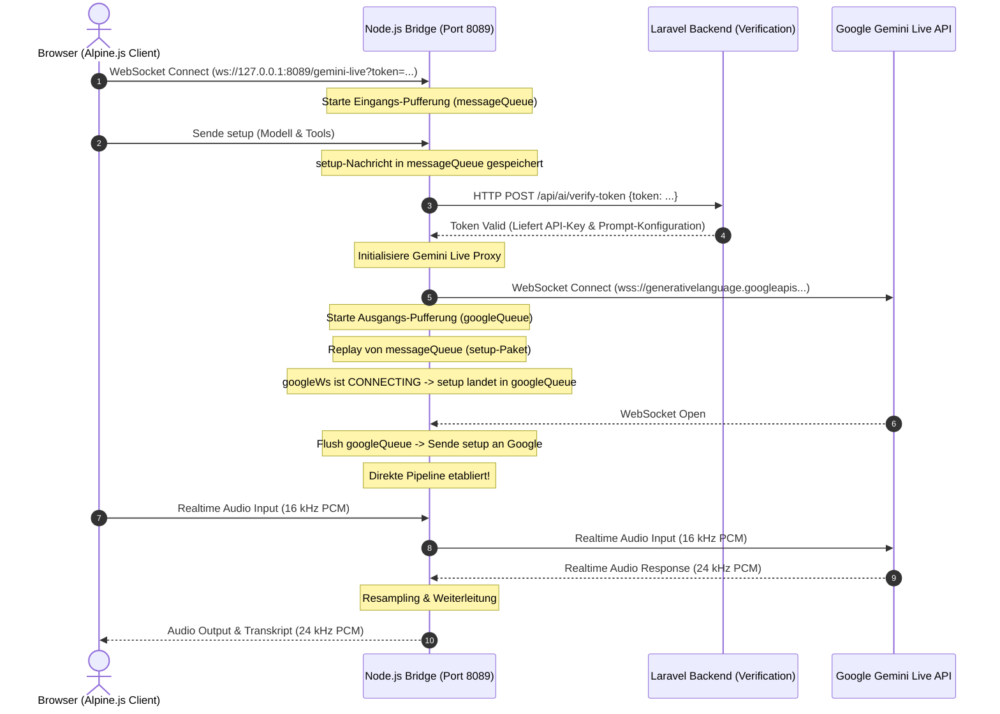
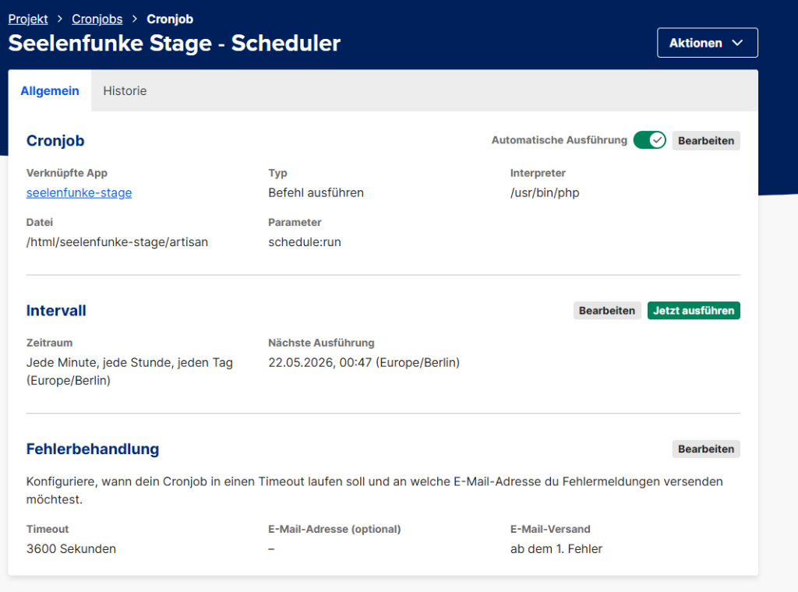
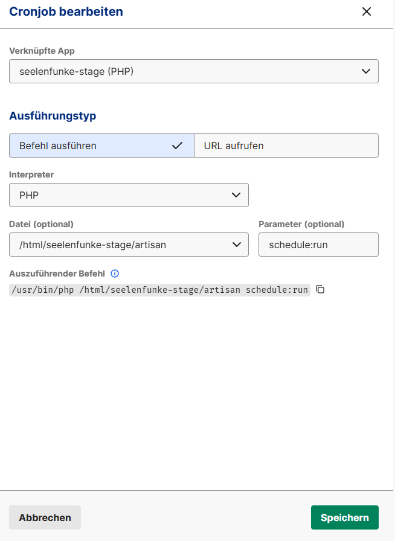
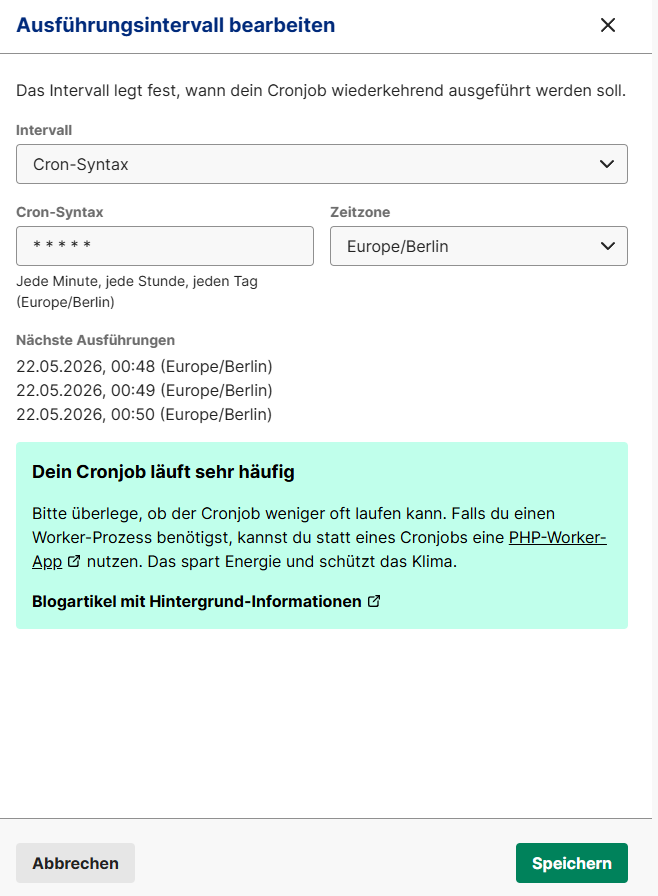

# Abschlussbericht: Integration & Architektur der Gemini Multimodal Live API Bridge

**Datum:** 22. Mai 2026  
**Projekt:** Seelenfunke E-Commerce / AI Workspace  
**Status:** ERFOLGREICH INTEGRIERT & PRODUKTIV (Staging)  
**Entwickler:** Antigravity (Google DeepMind) & Team  

---

## 1. Ausgangssituation & Zielsetzung
Ziel war es, den statischen KI-Agenten des Seelenfunke-Workspace in einen echtzeitfähigen, multimodalen Live-Assistenten zu verwandeln. Der Benutzer soll per Audio (Sprachchat) in Echtzeit mit der KI kommunizieren können. Gleichzeitig muss die KI in der Lage bleiben, Systemwerkzeuge (Tools) auszuführen – beispielsweise Code-Dateien zu editieren, Pläne zu erstellen oder auf die interne Wissensdatenbank zuzugreifen.

Die größte Herausforderung lag in der Zusammenführung dreier Welten:
1. **Der Web-Client (Browser):** Nutzt standardmäßig hohe Abtastraten (44.1/48 kHz) und WebSockets (WSS).
2. **Die Telefonie (Twilio):** Nutzt veraltete Telefoniestandards (8 kHz Mu-Law).
3. **Google Gemini Live API:** Erwartet zwingend ein sehr spezifisches WebSocket-Protokoll (`BidiGenerateContent` auf dem `v1beta`-Endpunkt) mit 16 kHz PCM Mono-Audio.

---

## 2. Systemarchitektur & Verbindungsfluss

Das System läuft über eine performante Node.js-Audiobrücke (`server-twilio.js`), die als mStudio-App (`seelenfunke-nodejs`) auf dem Server läuft und als Proxy zwischen den Clients (Browser/Twilio) und Google fungiert.

### Architektur des Verbindungsflusses (Web-Client)



---

## 3. Die Node.js-Audiobrücke (`server-twilio.js`)

Die Audiobrücke ([server-twilio.js](file:///wsl.localhost/Ubuntu/home/ubuntuxina/meine-projekte/seelenfunke/server-twilio.js)) erledigt das Routing, die Authentifizierung und die Formatkonvertierung. Sie lauscht auf Port `3000` (wird über Docker/Host auf Port `8089` gemappt) und verarbeitet zwei Pfade: `/gemini-live` (für Web-Clients) und `/twilio-stream` (für Twilio-Anrufe).

### 3.1 Token-Verifizierungsfluss & Sicherheit
Um den Gemini API-Key niemals im Browser zu exponieren, wird ein sicherer Handshake durchgeführt:
1. Der Client holt sich im Laravel-Backend ein temporäres Einweg-Token.
2. Der Client verbindet sich mit der Brücke über `ws://.../gemini-live?token=TOKEN`.
3. Die Brücke hält die Verbindung und sendet einen `POST` an den Laravel-Endpunkt `/api/ai/verify-token`.
4. Laravel verifiziert das Token aus dem Cache, löscht es sofort (One-Time-Use) und gibt den API-Key und die Prompt-Daten an die Bridge zurück.

### 3.2 Die Double-Race-Condition & ihre Lösung
Beim Verbindungsaufbau gab es ein gravierendes Timing-Problem (Race Condition):
- **Stufe 1 (Token-Verifizierung):** Der Client sendet unmittelbar nach dem Verbindungsaufbau das `setup`-Paket mit Anweisungen und Tools. Zu diesem Zeitpunkt wartet die Bridge jedoch noch auf die Antwort der HTTP-Verifizierung von Laravel. Frühe Nachrichten gingen verloren.
- **Stufe 2 (Asynchroner Google-Verbindungsaufbau):** Um Stufe 1 zu lösen, wurden die frühen Nachrichten gepuffert. Wenn sie nach der Verifizierung abgespielt wurden, war die ausgehende Verbindung von der Bridge zu Google jedoch oft noch im Zustand `CONNECTING`. Das WebSocket war nicht `OPEN`, weshalb Google das replayed `setup`-Paket verwarf. Ohne `setup` antwortete Google nicht.

**Die Lösung (Zweistufige Pufferung):**
1. **Eingangs-Pufferung (`messageQueue`):** Alle Client-Nachrichten werden ab der ersten Millisekunde in ein Array geschoben, bis die Token-Verifizierung erfolgreich ist.
2. **Ausgangs-Pufferung (`googleQueue`):** Sobald die Google-Verbindung initiiert wird, werden alle ausgehenden Nachrichten (wie das `setup`-Paket und frühe Audio-Chunks) in die `googleQueue` geschoben, solange das Google-WebSocket den Status `CONNECTING` hat. Sobald das Event `googleWs.on('open')` feuert, wird die gesamte Warteschlange der Reihe nach an Google übertragen.

```javascript
// Auszug aus server-twilio.js: Ausgangs-Pufferung
googleWs.on('open', () => {
    debugLog('🧠 Gemini Live Proxy: Verbindung zu Google hergestellt.');
    if (googleQueue.length > 0) {
        debugLog(`📦 Replay von ${googleQueue.length} gepufferten Client-Nachrichten an Google...`);
        while (googleQueue.length > 0) {
            const msg = googleQueue.shift();
            googleWs.send(msg);
        }
    }
});
```

### 3.3 Audio-Konvertierung (Twilio-Modus)
Twilio telefoniert mit 8.000 Hz µ-Law. Gemini arbeitet mit 16.000 Hz linear PCM.
- **Inbound (Anrufer -> Gemini):** Der Proxy wandelt den 8 kHz µ-Law Stream von Twilio mittels der Bibliothek `wavefile` in 8 kHz 16-Bit PCM um und führt anschließend ein Upsampling auf 16.000 Hz durch, bevor er es an Google sendet.
- **Outbound (Gemini -> Twilio):** Google sendet 24 kHz PCM-Audio zurück. Der Proxy liest dies als `Int16Array` ein (wichtig zur Vermeidung von Rauschen), führt ein Downsampling auf 8.000 Hz durch, wandelt es in µ-Law um und streamt es an Twilio.

---

## 4. Das Frontend-Widget (`ai-widget-part2.blade.php`)

Das Frontend ([ai-widget-part2.blade.php](file:///wsl.localhost/Ubuntu/home/ubuntuxina/meine-projekte/seelenfunke/resources/views/livewire/shop/ai/ai-widget-part2.blade.php)) fängt das Mikrofon des Nutzers ab und steuert die Benutzeroberfläche.

### 4.1 Clientseitiges Resampling (Linear Interpolation)
Da Browser standardmäßig in 44.1 kHz oder 48 kHz aufnehmen, die Gemini API jedoch strikt **16 kHz** erfordert, wurde ein linearer Interpolations-Algorithmus direkt im Web Audio API `AudioWorklet` / `ScriptProcessor` implementiert:

```javascript
// Resampling im ScriptProcessor-Handler
let buffer = event.inputBuffer.getChannelData(0);
let inputSampleRate = audioContext.sampleRate;
let outputSampleRate = 16000;

let sampleRateRatio = inputSampleRate / outputSampleRate;
let newLength = Math.round(buffer.length / sampleRateRatio);
let result = new Float32Array(newLength);
let offsetResult = 0;
let offsetInput = 0;

while (offsetResult < result.length) {
    let nextOffsetBuffer = Math.round((offsetResult + 1) * sampleRateRatio);
    let accum = 0, count = 0;
    for (let i = offsetInput; i < nextOffsetBuffer && i < buffer.length; i++) {
        accum += buffer[i];
        count++;
    }
    result[offsetResult] = accum / count;
    offsetResult++;
    offsetInput = nextOffsetBuffer;
}
```
Die resultierenden `Float32`-Werte werden in 16-Bit-Integers (`Int16Array`) umgerechnet, in Base64 konvertiert und per WebSocket gesendet.

### 4.2 Behebung des Stumm-Bugs (Mic Muted)
*   **Fehlersymptom:** Das Mikrofon leuchtete grün, die Verbindung stand, aber Google reagierte nicht auf Sprache.
*   **Ursache:** Im Widget wurde die Variable `isAudioMuted` zur Steuerung der Shop-Hintergrundmusik verwendet. Diese stand standardmäßig auf `true` (stumm). Der Audio-Aufnahme-Handler prüfte irrtümlicherweise ebenfalls `isAudioMuted`. Da der Benutzer stummgeschaltet startete, sandte der Browser nur leere Audio-Pakete an den Proxy.
*   **Die Lösung:** Einführung einer separaten Variable `isMicMuted` (Standard: `false`), die rein die Mikrofonaufnahme steuert. Der Musik-Mute-Status bleibt davon unberührt.

### 4.3 Hardware-Freigabe (Chrome Red-Dot)
Um das rote Aufnahmesymbol in Chrome nach dem Beenden des Live-Modus zuverlässig zu entfernen, werden alle Spuren des MediaStreams explizit gestoppt:
```javascript
if (mediaStream) {
    mediaStream.getTracks().forEach(track => track.stop());
}
```

---

## 5. Das Laravel-Backend (Verifizierung & Session-Sync)

### 5.1 Schema-Sanitizing
Die Gemini Live API weigert sich strikt, Verbindungen aufzubauen, wenn in den Tool-Parameterdeklarationen ungültige OpenAPI-Schlüssel wie `additionalProperties` oder leere Objekte vorhanden sind. Im `AIController` bereinigt eine rekursive Hilfsfunktion alle Schemata, bevor das Token gecached wird:

```php
private function removeAdditionalProperties(array $schema): array {
    unset($schema['additionalProperties']);
    foreach ($schema as $key => $value) {
        if (is_array($value)) {
            $schema[$key] = $this->removeAdditionalProperties($value);
        }
    }
    return $schema;
}
```

### 5.2 Session-Wiederherstellung (Session Restore)
Da der WebSocket-Verbindungsaufbau aus dem Browser heraus *stateless* läuft, erhielten Tool-Aufrufe der KI im Backend standardmäßig eine leere PHP-Session. Dadurch speicherte die KI erstellte Artefakte in "Geister-Ordnern" ab.
*   **Lösung:** Der Client sendet die Laravel-Session-ID im Payload. Das Backend greift diese in `AIController::execute` auf und initialisiert die Session des Benutzers manuell:
    ```php
    if ($request->has('session_id')) {
        session()->setId($request->get('session_id'));
        session()->start();
    }
    ```

---

## 6. Das Diagnosetool (`debug_websocket.php`)

Das Diagnosetool ([debug_websocket.php](file:///wsl.localhost/Ubuntu/home/ubuntuxina/meine-projekte/seelenfunke/Abschlussberichte/Agenten/Gemini-Live-Api-Bridge-and-more/debug_websocket.php)) wurde zur Fehlersuche auf dem Staging-Server entwickelt.

### 6.1 Funktionen
*   **Netzwerkverbindungstest:** Führt einen Port-Check (`fsockopen`) von der Web-App zum PHP-Worker auf Port `6001` (Reverb) durch.
*   **Browser-WSS-Verbindungstest:** Simuliert im Browser des Aufrufers den Verbindungsaufbau zu Laravel Reverb (`wss://ws.mein-seelenfunke.de`).
*   **Browser-Gemini-Proxy-Test:** Testet den Handshake zur Node.js-Bridge (`wss://api-live-bridge.mein-seelenfunke.de/gemini-live`).
*   **Log-Reader:** Liest die letzten 150 Zeilen der Datei `bridge.log` aus und aktualisiert diese live.
*   **PHP CLI Diagnostik:** Prüft, welche PHP-Interpreter auf dem Server vorhanden sind (z.B. `/usr/bin/php8.4`), ob sie kompatibel sind und ob der Laravel-Scheduler läuft.
*   **Umgebungsvariablen-Vergleich:** Vergleicht die `.env`-Dateien der Web-App und der Worker-App auf Mismatches.
*   **Selbstheilungs-Aktionen:** Erlaubt das automatische Reparieren der Worker-`.env`, das Löschen hängender Scheduler-Mutex-Sperren in Redis/Cache und das manuelle Triggern des Schedulers.

### 6.2 Sicherheitsrelevante Verschiebung
Da das Diagnosetool sensible System- und Umgebungsvariablen (wie Passwörter und API-Keys) im Klartext anzeigt und tiefe Eingriffe in das System erlaubt, wurde es **aus dem öffentlichen Verzeichnis (`public/`) gelöscht** und als Referenz in diesen Dokumentations-Ordner verschoben. Es darf unter keinen Umständen im produktiven Web-Verzeichnis verbleiben!

---

## 7. Fehlerhistorie & Critical Learnings

1.  **Port-Kollision unter Windows (Port 8081):**  
    *Problem:* Der Port `8081` war lokal oft belegt.  
    *Lösung:* Die Node.js-Bridge lauscht intern weiter auf `8081` (bzw. `3000`), wird aber über Docker-Compose nach außen auf Port `8089` freigegeben. In der `.env` zeigt `GEMINI_PROXY_WS_URL` auf Port `8089`.
2.  **Modell-Abkündigung durch Google:**  
    *Problem:* Das Modell `models/gemini-2.0-flash-exp` wurde abgeschaltet.  
    *Lösung:* Es wird nun zwingend `models/gemini-3.1-flash-live-preview` genutzt, das die Bidi-WebSocket-Schnittstelle nativ unterstützt.
3.  **Warten auf den User (Twilio):**  
    *Problem:* Die KI fing bei Telefonaten sofort an zu sprechen, noch bevor der Angerufene "Hallo" gesagt hatte (durch Rauschen getriggert).  
    *Lösung:* Ein expliziter System-Prompt weist die KI an, stumm zu bleiben, bis ein klares, menschliches Eröffnungswort registriert wird.
4.  **Resampling-Verzerrungen:**  
    *Problem:* Die Stimme der KI klang verzerrt oder wie Micky-Maus.  
    *Lösung:* Beim Konvertieren der 24 kHz Gemini-Daten in 8 kHz Twilio µ-Law ist die korrekte Definition eines `Int16Array` zwingend notwendig, da rohe Byte-Buffer sonst fälschlicherweise als 16-Bit-Werte interpretiert werden.
5.  **Hardware-Konflikt & Aktivierungston-Schleife ("Düm-Düm") auf Mobilgeräten:**  
    *Problem:* Beim Aktivieren des Live-Modus auf Smartphones ertönte alle 5-6 Sekunden der System-Mikrofon-Aktivierungston des Handys ("düm-düm" bzw. kurzes Beep), auch wenn nichts gesprochen wurde.  
    *Ursache:* Im Live-Modus greift die App das Mikrofon direkt mittels `getUserMedia` ab, um den rohen 16 kHz PCM-Stream an die Gemini Live WebSocket-Verbindung zu senden. Gleichzeitig lief im Hintergrund parallel die native Spracherkennung des Browsers (`webkitSpeechRecognition`), um das gesprochene Wort für die Chat-Historie zu transkribieren. Da Mobilgeräte (iOS/Safari und Android/Chrome) den parallelen Zugriff von zwei API-Instanzen auf dasselbe physische Mikrofon nicht unterstützen, stürzte die native Spracherkennung kontinuierlich ab, triggerte ihr `onend`-Ereignis und startete sofort neu. Dies führte zu einer Dauerschleife von Mikrofon-Reinitialisierungen und den entsprechenden System-Beeps.  
    *Lösung:* Auf Mobilgeräten (`isMobile` ist aktiv) wird die parallele `webkitSpeechRecognition` im Live-Modus nun vollständig übersprungen. Da die Spracheingabe ohnehin direkt als rohes Audio gestreamt und von Gemini verarbeitet wird, bleibt der Live-Chat voll funktionsfähig, ohne dass Systemkonflikte oder störende Aktivierungstöne auftreten.

---

## 8. Fazit
Mit dieser Implementierung verfügt Seelenfunke über eine **hochmoderne, extrem performante und voll integrierte Echtzeit-KI-Architektur**. Der reibungslose Fluss von Audio, System-Tools und synchronisierten Sessions ermöglicht eine bisher unerreichte Benutzererfahrung sowohl im Web-Dashboard als auch in zukünftigen Telefonie-Anwendungen.

---

## 9. Einrichtung & Deployment der Node.js App im mStudio
Für die Ausführung der Gemini Live API Bridge auf dem Live-Server/Staging-Server wird im Mittwald mStudio eine Node.js-Applikation eingerichtet.

### mStudio App-Konfiguration
Folgende Einstellungen müssen beim Anlegen der Node.js App im mStudio hinterlegt werden:

*   **Name:** `seelenfunke-nodejs`
*   **Installationsverzeichnis:** `twilio-bridge`
*   **Startbefehl:** `node server-twilio.js`
*   **Verknüpfung / Domain:** `api-live-bridge.mein-seelenfunke.de`

### Bereitstellung der Dateien
Um die notwendigen Quelldateien aus dem Staging-Projekt in das Installationsverzeichnis der Node.js-App zu kopieren, führen Sie auf dem Server folgende Befehle aus:

```bash
cd /html/twilio-bridge
cp ../seelenfunke-stage/server-twilio.js .
cp ../seelenfunke-stage/.env .
cp ../seelenfunke-stage/package.json .
cp -r ../seelenfunke-stage/node_modules .
```

---

## 10. Einrichtung des Laravel Task Schedulers im mStudio
Für die periodische Ausführung von Hintergrundaufgaben (wie dem Laravel Scheduler) wurde im Mittwald mStudio ein entsprechender Cronjob eingerichtet.

### mStudio Cronjob-Konfiguration
Folgende Einstellungen wurden im Mittwald-Panel hinterlegt:

*   **Verknüpfte App:** `seelenfunke-stage`
*   **Ausführungstyp:** Befehl ausführen
*   **Interpreter:** `PHP` (bzw. `/usr/bin/php`)
*   **Datei:** `/html/seelenfunke-stage/artisan`
*   **Parameter:** `schedule:run`
*   **Auszuführender Befehl:** `/usr/bin/php /html/seelenfunke-stage/artisan schedule:run`
*   **Intervall:** `* * * * *` (Cron-Syntax; Jede Minute, jede Stunde, jeden Tag)
*   **Zeitzone:** `Europe/Berlin`
*   **Fehlerbehandlung:** E-Mail-Versand ab dem 1. Fehler, Timeout bei 3600 Sekunden.

### Visuelle Dokumentation
Hier sind die Einstellungen aus dem Mittwald-Panel zur Referenz:

#### 1. Cronjob Übersicht (Aktiv & Funktionsfähig)


#### 2. Befehls-Konfiguration


#### 3. Intervall-Konfiguration (Cron-Syntax)


