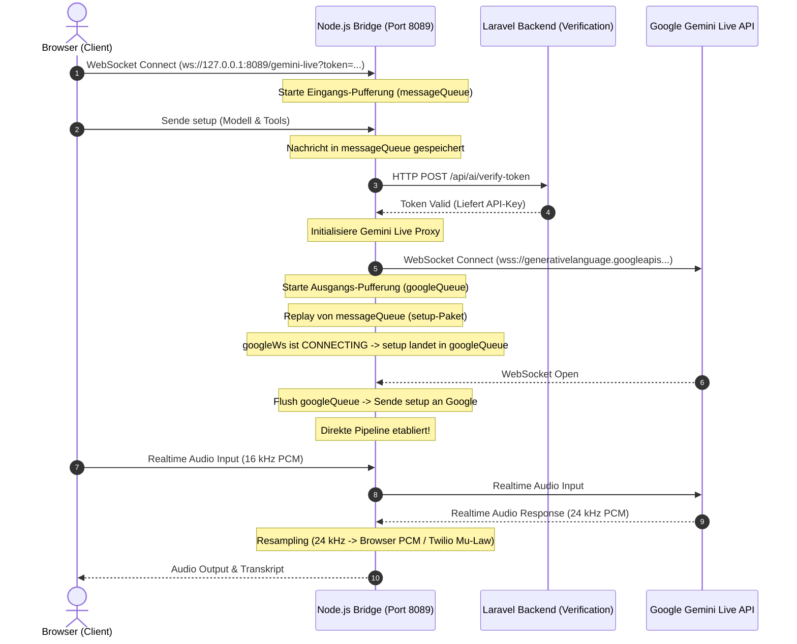
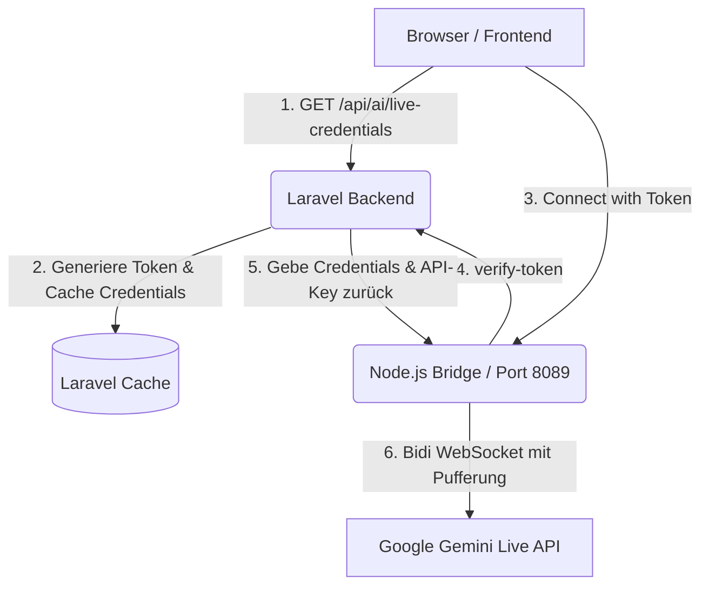

# Abschlussbericht: Integration der Gemini Multimodal Live API

**Datum:** 24. April 2026
**Projekt:** Seelenfunke E-Commerce / AI Workspace
**Ziel:** Vollständige, bidirektionale und echtzeitfähige Integration der Gemini Multimodal Live API in das Laravel-Backend und das Alpine.js/Livewire-Frontend.

---

## 1. Ausgangssituation & Zielsetzung
Ziel war es, den statischen KI-Agenten in einen echten **Live-Assistenten** zu verwandeln. Der Benutzer sollte per Audio/Text mit der KI in Echtzeit kommunizieren können. Gleichzeitig musste die KI in der Lage bleiben, Systemwerkzeuge (Tools) auszuführen – beispielsweise Code-Dateien zu editieren, Pläne zu erstellen oder auf die interne Wissensdatenbank zuzugreifen.

## 2. Der Weg der Integration & Herausforderungen

### Phase 1: Verbindungsaufbau & Schema-Fehler (WebSocket Error 1007)
*   **Das Problem:** Die initiale Verbindung zur Gemini Live API wurde über WebSockets hergestellt. Dabei kam es sofort zu Abbrüchen (Code 1007). Der Grund war die Verwendung veralteter Parameter (z. B. `realtime_input.media_chunks` anstelle von `audio/video/text`).
*   **Zweites Hindernis:** Nachdem das Audio-Format korrigiert wurde, schlug die Schema-Validierung der Tools fehl. Die Google API weigerte sich, verschachtelte Objekte mit `additionalProperties` oder leeren Objekten in den Parameter-Deklarationen zu akzeptieren.
*   **Die Lösung:** Wir haben das JSON-Schema für alle Tool-Deklarationen extrem strikt bereinigt. Nur erlaubte OpenAPI 3.0 Spezifikationen (ohne ungültige Schlüssel) wurden an das `setup`-Event des WebSockets übergeben.

### Phase 2: Der "Geister-Workspace" (Session State Synchronization)
*   **Das Problem:** Die KI konnte erfolgreich reden und Tools im Code auslösen, aber die generierten Artefakte (z.B. Pläne) tauchten nie im UI des Benutzers auf.
*   **Ursache:** Die Live API agiert via JavaScript aus dem Browser. Wenn die KI über das Frontend den Befehl gab, ein Tool auszuführen (via Fetch an `/api/ai/execute`), passierte dies *stateless*. Das Laravel-Backend erstellte für diesen Request eine völlig neue, leere Session. Die KI speicherte ihre Artefakte somit in "Geister-Ordner" (`storage/app/agenten/ai-artifacts/{random_session_id}`).
*   **Die Lösung:** Im Frontend (`ai-widget-part2.blade.php`) wurde die aktuelle Laravel-Session-ID des Benutzers ausgelesen und aktiv in den API-Payload integriert. Das Backend (`AIController.php`) fing diese ID auf und stellte die Session des Benutzers manuell wieder her (`session()->setId($sessionId)` und `session()->start()`). Ab diesem Moment speicherte die KI alle Dateien zielsicher in den korrekten Ordner des Benutzers, woraufhin sie sofort im Livewire-Dashboard angezeigt wurden.

### Phase 3: Synchronisation der Wissensdatenbank (Knowledge Base)
*   **Das Problem:** Ähnlich wie bei den Artefakten behauptete die KI, sie hätte erfolgreich Einträge in der Wissensdatenbank (z. B. einen Bug-Report) abgelegt, diese waren aber unsichtbar.
*   **Ursache:** Die KI-Tools `executeWriteKnowledge` und `executeReadKnowledge` speicherten stumpf Markdown-Dateien auf die Festplatte. Das neue System-UI (`AiKnowledgeBase` Model) las jedoch aus der Datenbank.
*   **Die Lösung:** Wir haben die System-Tools im `AiSystemFuncs.php` komplett umgeschrieben. Wenn die KI nun Wissen speichert, nutzt sie direkt das Eloquent-Modell (`\App\Models\Ai\AiKnowledgeBase`) und legt einen sauberen Datenbank-Eintrag in der Kategorie "System & Architektur" an. Dadurch waren Einträge instantan für den Nutzer sichtbar.

### Phase 4: Fokus & UI-Bereinigung ("Deine Mission")
*   **Das Problem:** Es gab eine strukturelle Verwirrung zwischen der Funktion `getUltimateCommand` (der System-Logik für Prioritäten) und einem separaten visuellen Feature namens "Deine Mission" auf dem Dashboard. Die KI wusste nicht, was sie priorisieren sollte.
*   **Die Lösung:** Wir haben die "Deine Mission"-Logik aus der Ansicht verbannt und als hochpriorisierten Score (400) direkt in den Algorithmus von `getUltimateCommand` injiziert. Die UI-Buttons wurden entfernt. Die KI hat nun einen "Single Source of Truth", wenn der Benutzer fragt: "Was ist jetzt meine wichtigste Aufgabe?".
*   **Letzter Bugfix:** Ein Case-Sensitivity Fehler unter Linux (`Ai` vs. `AI` im Namespace von `AiSupportService`) wurde behoben, der den Abruf der Mission kurzzeitig crashte.

### Phase 5: Audio-Capture, Resampling & Hardware-Freigabe (Mai 2026)
*   **Das Problem:** Beim Umschalten in den Live-Modus schlug die Audio-Übertragung fehl oder die KI verstand den Nutzer nicht. Das lag daran, dass Browser-Mikrofone oft standardmäßig mit Hardware-Abtastraten von 44,1 kHz oder 48 kHz aufnehmen, während die Gemini Live API zwingend **16 kHz PCM** (Mono) erfordert. Zudem blieb das rote Mikrofon-Symbol im Chrome-Suchfeld nach Beendigung der Verbindung dauerhaft aktiv.
*   **Die Lösung:**
    *   **Resampling im Frontend:** In `ai-widget-part2.blade.php` wurde ein Client-seitiger Resampling-Algorithmus implementiert, der das Audio-Signal in Echtzeit mittels linearer Interpolation auf exakt 16000 Hz herabstuft, bevor es verpackt und gesendet wird.
    *   **Hardware-Freigabe:** Beim Klick auf "Stopp" oder bei Verbindungsabbruch werden nun alle aktiven Audiospuren des Mikrofon-MediaStreams explizit gestoppt (`track.stop()`), wodurch die Hardware-Ressource sofort freigegeben wird und das Aufnahme-Symbol im Browser verschwindt.

### Phase 6: Behebung der Double-Race-Condition & Port-Konflikte im WebSocket-Proxy (Mai 2026)
*   **Das Problem 1: Port-Kollision im WSL2-Netzwerkstapel:**
    Die Kommunikation zwischen Browser und der Node.js-Audiobrücke (`server-twilio.js`) lief über Port `8081`. Auf Windows-Host-Systemen kam es hierbei zu Kollisionen, da Systemdienste (Docker-Backend, WSL-Relays) den Port `8081` belegten, was im Browser zu `WebSocket connection failed`-Fehlern führte.
*   **Die Lösung 1:**
    Wir haben das externe Port-Routing auf Port `8089` verschoben. In `docker-compose.yml` mappt der Web-Dienst nun Host-Port `8089` auf den Container-Port `8081` (`"8089:8081"`). Die Client-Konfiguration wurde über eine Laravel-Umgebungsvariable (`GEMINI_PROXY_WS_URL=ws://127.0.0.1:8089/gemini-live`) dynamisch gestaltet, sodass der Client nun sauber den konfliktfreien Port `8089` nutzt.

*   **Das Problem 2: Die Double-Race-Condition im Node-Proxy:**
    Trotz stabiler WebSocket-Verbindung und leuchtendem Mikrofon reagierte die KI nicht auf Spracheingaben. Der Grund hierfür lag in einer zweistufigen Race-Condition beim Verbindungsaufbau:
    1.  *Stufe 1 (Token-Verifizierung):* Der Client sendete unmittelbar nach Verbindungsaufbau das kritische `setup`-Paket (mit Anweisungen und Tools). Der Node-Server musste das Token jedoch erst asynchron gegen das Laravel-Backend verifizieren. Während dieser Verifizierung gingen die ersten Client-Nachrichten verloren, da noch kein Listener registriert war.
    2.  *Stufe 2 (Asynchroner Google-Verbindungsaufbau):* Um Stufe 1 zu lösen, wurden die frühen Client-Nachrichten beim Verbindungsaufbau gepuffert und nach der Token-Verifizierung erneut abgespielt. Doch an diesem Punkt war die ausgehende Verbindung vom Proxy zu Google (`googleWs`) noch im Zustand `CONNECTING`. Da das Google-WebSocket noch nicht `OPEN` war, verwarf der Proxy das replayed `setup`-Paket unbemerkt. Ohne dieses Paket startete Google keine Gemini-Session.
*   **Die Lösung 2:**
    *   **Eingangs-Pufferung:** Alle eingehenden Client-Nachrichten werden sofort bei Verbindungsaufbau in ein Array (`messageQueue`) geschoben, bis die Token-Verifizierung erfolgreich abgeschlossen ist.
    *   **Ausgangs-Pufferung (Outbound-Queue):** Wir haben in `initGeminiLiveProxy` eine `googleQueue` integriert. Wenn Client-Nachrichten (wie das replayed `setup`-Paket oder frühe Audio-Chunks) ankommen, während `googleWs` noch verbindet, werden sie in die `googleQueue` geschoben. Sobald das Event `googleWs.on('open')` feuert, wird die gesamte Warteschlange der Reihe nach an Google übertragen. Erst danach werden Live-Daten direkt durchgereicht.

---

## 3. Endergebnis & Systemarchitektur

Das System läuft nun **vollkommen robust, echtzeitfähig und stabil** über alle Komponenten hinweg.

### Architektur des Verbindungsflusses

1.  **Audio & Echtzeit:** Der Agent spricht flüssig und reagiert in Millisekunden auf Audio-Inputs, ohne Schema-Abbrüche und mit sauberem Resampling.
2.  **Sichere Tool-Execution:** Wenn die KI beschließt, Code zu ändern oder Artefakte zu schreiben, wird der API-Call fest an die authentifizierte Session des Benutzers gebunden.
3.  **Persistentes Wissen:** Systemwissen und "Gedächtnis" der KI werden direkt in die produktive Datenbank geschrieben und stehen dem UI, aber auch der KI bei zukünftigen Anfragen sofort wieder zur Verfügung.
4.  **Triage & Prioritäten:** Durch das Zusammenführen der "Mission" in den Kern-Algorithmus kann die KI nun messerscharf analysieren, was (basierend auf Kalender, Umsatz, Bugs) als Nächstes zu tun ist.
5.  **Netzwerk & Infrastruktur:** Der Portkonflikt mit Systemdiensten unter Windows ist durch die Auslagerung auf Port `8089` und die dynamische Konfiguration gelöst.

---

## 4. Detaillierter Aufbau, Authentifizierungsfluss & Modelle

### 4.1 Unterstützte Modelle & Anwendungszwecke

Das System unterscheidet zwischen dem **Standard-Agenten (Text/Chat/Vision)** und dem **Echtzeit-Audio-Agenten (Multimodal Live API)**:

| Modellname | Schnittstelle | Kontext-Länge | Primärer Verwendungszweck |
| :--- | :--- | :--- | :--- |
| `models/gemini-3.1-flash-live-preview` | **WebSocket (Bidi)** | - | **Live-Modus (Sprache)**. Speziell optimiert für bidirektionales Audio-Streaming in Echtzeit. |
| `models/gemini-2.5-flash-native-audio-latest` | **WebSocket (Bidi)** | - | Optimiert für native Mobile-/Android-Audioübertragungen. |
| `models/gemini-3.1-pro-preview` | **REST API** | 2.000.000+ Token | Komplexeste Textanalyse, Generierung von Architektur-Code, Multi-Agenten-Reasoning. |
| `models/gemini-2.5-pro` | **REST API** | 2.000.000 Token | Standardmodell für tiefere Textanalyse und Code-Generierung im Workspace. |
| `models/gemini-2.5-flash` | **REST API** | 1.000.000 Token | Alltags-Begleiter, einfacher Textchat, schnelle und und kostengünstige Antworten. |

> [!WARNING]
> Das ehemals genutzte Modell `models/gemini-2.0-flash-exp` wurde von Google abgekündigt und aus der Live-API entfernt. Das Standardmodell `models/gemini-2.0-flash` auf dem `v1beta`-Endpunkt unterstützt kein bidirektionales Audio-Streaming via `BidiGenerateContent`. Daher wird zwingend `models/gemini-3.1-flash-live-preview` genutzt.

---

### 4.2 Die Architektur der Live-Verbindung im Laravel-Projekt

Die Live API Integration besteht aus vier Kernkomponenten:

#### 1. Frontend-Initiierung (`ai-widget-part2.blade.php`)
Sobald der Nutzer auf "Live" klickt, führt Alpine.js einen Fetch-Request an `/api/ai/live-credentials` aus. Es übergibt:
*   `agent_id`: Die ID des aktiven Agenten zur Ermittlung des passenden System-Prompts, der Stimme (z.B. `Puck` oder `Aoede`) und der zugewiesenen Tools.
*   `chat_session_id`: Um den bisherigen Chatverlauf der Session zu laden.
*   `session_id`: Die aktuelle Laravel-Session-ID zur Autorisierung.

#### 2. Authentifizierung & Token-Cache (`AIController::liveCredentials`)
*   Das Backend liest den konfigurierten Gemini API-Key (`config('services.gemini.key')`) aus.
*   Die Tool-Definitionen werden aus der `AIFunctionsRegistry` ausgelesen.
*   **Wichtig (Schema-Bereinigung):** Google akzeptiert keine ungültigen OpenAPI-Schlüssel wie `additionalProperties` im Live-Websocket. Daher bereinigt eine rekursive Funktion (`$removeAdditionalProperties`) das JSON-Schema und wandelt Parametertypen in Großbuchstaben um.
*   Es wird ein kryptografisch sicheres Einweg-Token (`Str::random(40)`) generiert. Die bereinigten Credentials (API-Key, System-Prompt, Stimme, Tools) werden für 5 Minuten im Laravel-Cache gespeichert (`gemini_live_token_{token}`).
*   Die Route liefert das Token und die Verbindungs-URL an das Frontend zurück.

#### 3. WebSocket-Verbindungsaufbau (`server-twilio.js`)
*   Der Browser verbindet sich mit der Brücke über `ws://127.0.0.1:8089/gemini-live?token={token}`.
*   Die Brücke nimmt die Verbindung an, startet sofort die **Eingangs-Pufferung** (damit frühe Client-Pakete nicht verloren gehen) und sendet eine `POST`-Anfrage mit dem Token an den internen Laravel-Endpunkt `/api/ai/verify-token`.
*   Das Laravel-Backend liest die Daten mittels `Cache::pull()` aus (wodurch das Token sofort entwertet wird) und gibt die echten Google-Credentials an die Brücke zurück.

#### 4. Die bidirektionale Proxy-Verbindung
*   Die Brücke baut die WebSocket-Verbindung zu Google auf: `wss://generativelanguage.googleapis.com/ws/google.ai.generativelanguage.v1beta.GenerativeService.BidiGenerateContent?key={api_key}`.
*   Während des Verbindungsaufbaus zu Google (`CONNECTING`-Status) landen alle vom Client replayed oder neu gesendeten Nachrichten (inkl. des initialen `setup`-Pakets) in der `googleQueue` (**Ausgangs-Pufferung**).
*   Sobald Google die Verbindung bestätigt (`OPEN`), wird die `googleQueue` geleert und die direkte Pipeline geschaltet. Audio- und Text-Pakete fließen nun verzögerungsfrei.

---

**Fazit:** Die Gemini Multimodal Live API wurde von einem isolierten, fehleranfälligen WebSocket-Chatbot zu einem tief im Laravel-Core verankerten, hochperformanten Echtzeit-Assistenten transformiert.
