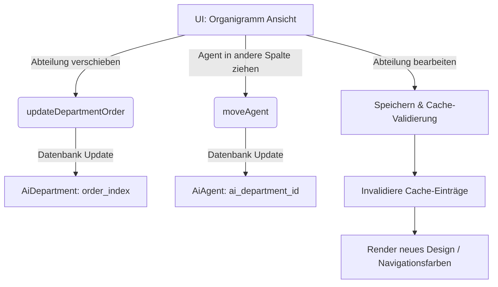

# Agenten-Organigramm

Das Agenten-Organigramm stellt die hierarchische und strukturelle Zuordnung der künstlichen Intelligenzen (KI-Agenten) zu den verschiedenen Unternehmensbereichen (Abteilungen) im Seelenfunke-System visuell und interaktiv dar. 

## Zielsetzung
Das Modul dient der Modellierung der virtuellen Firmenstruktur. Durch Zuweisung von Agenten zu bestimmten Abteilungen ([AiDepartment](file:///wsl.localhost/Ubuntu/home/ubuntuxina/meine-projekte/seelenfunke/app/Models/Ai/AiDepartment.php)) und der Definition spezifischer Aufgabenprofile ([AiRole](file:///wsl.localhost/Ubuntu/home/ubuntuxina/meine-projekte/seelenfunke/app/Models/Ai/AiRole.php)) wird ein strukturiertes Multi-Agenten-System aufgebaut. Dies spiegelt sich auch in der Benutzeroberfläche wider, wo Farbthemen dynamisch auf Basis der Abteilungen gerendert werden.

---

## Beteiligte Komponenten & Klassen

### Datenbank-Modelle
- [AiDepartment](file:///wsl.localhost/Ubuntu/home/ubuntuxina/meine-projekte/seelenfunke/app/Models/Ai/AiDepartment.php): Verwaltet die Abteilungen des virtuellen Unternehmens (z. B. "Marketing", "Buchhaltung", "Support") inklusive Icon, Farbdefinitionen und Sortierindex.
- [AiRole](file:///wsl.localhost/Ubuntu/home/ubuntuxina/meine-projekte/seelenfunke/app/Models/Ai/AiRole.php): Definiert die exakte Rolle eines Agenten innerhalb einer Abteilung sowie die Verknüpfung zu den freigegebenen MCP-Werkzeugen (Tools).
- [AiAgent](file:///wsl.localhost/Ubuntu/home/ubuntuxina/meine-projekte/seelenfunke/app/Models/Ai/AiAgent.php): Die konkrete Instanz des virtuellen Mitarbeiters, verknüpft mit einer Abteilung und einer Rolle.
- [AiTool](file:///wsl.localhost/Ubuntu/home/ubuntuxina/meine-projekte/seelenfunke/app/Models/Ai/AiTool.php): Die Schnittstellen-Werkzeuge, die Rollen (und damit Agenten) zur Funktionsausführung zugewiesen werden.

### Livewire-Controller
- [AiCompanyStructure](file:///wsl.localhost/Ubuntu/home/ubuntuxina/meine-projekte/seelenfunke/app/Livewire/Shop/Ai/AiCompanyStructure.php): Verwaltet die interaktive Baumstruktur (Organigramm), verarbeitet Drag-and-Drop-Sortierungen und steuert die Inline-Erstellung sowie Bearbeitung von Abteilungen.

---

## Interaktions- & Drag-and-Drop-Logik

Die Strukturierung der Abteilungen und Agenten erfolgt im Frontend über eine intuitive Drag-and-Drop-Oberfläche (typischerweise mittels AlpineJS oder HTML5 Drag and Drop realisiert):



### 1. Umsortieren von Abteilungen (`updateDepartmentOrder`)
Die Reihenfolge der Abteilungen kann im Organigramm frei verschoben werden. Die Methode nimmt ein Array von IDs entgegen (`$orderedIds`) und aktualisiert den Sortierschlüssel (`order_index`) der Datenbankeinträge rekursiv:
```php
foreach ($orderedIds as $index => $id) {
    AiDepartment::where('id', $id)->update(['order_index' => $index]);
}
```

### 2. Verschieben von Agenten (`moveAgent`)
Durch das Verschieben eines Agenten in eine andere Abteilungskarte im UI wird die Methode `moveAgent($agentId, $targetDeptId)` aufgerufen. Sie ändert den Fremdschlüssel `ai_department_id` des Modells [AiAgent](file:///wsl.localhost/Ubuntu/home/ubuntuxina/meine-projekte/seelenfunke/app/Models/Ai/AiAgent.php) und löst ein Frontend-Event `structure-updated` aus.

### 3. Dynamische Farbsteuerung & Cache-Validierung
Jeder Abteilung ist ein spezifischer Farbwert (z. B. `emerald-500`, `blue-500`) zugewiesen. Dieser steuert das abteilungsspezifische Styling im gesamten Backend (gelöst über den Trait `WithDepartmentTheming`).
Um eine hohe Performance zu gewährleisten, werden diese Farbbestimmungen im System gecacht. Beim Speichern einer Abteilung (`saveDepartment`) werden diese Cache-Schlüssel gezielt gelöscht (Cache Invalidation), damit Farbänderungen sofort systemweit wirksam werden:
```php
\Illuminate\Support\Facades\Cache::forget(strtolower($dept->name) . '_dept_color');
\Illuminate\Support\Facades\Cache::forget(strtolower($dept->name) . '_dept_class');
\Illuminate\Support\Facades\Cache::forget(strtolower($dept->name) . '_nav_color');
```

### 4. Rollen- & Werkzeugzuweisung
Über die Detailansicht des Agenten-Editors (erreichbar durch Weiterleitung aus dem Organigramm über `editFullAgentDetails`) können dem Agenten spezifische Systemberechtigungen und MCP-Tools zugewiesen werden. Die Berechtigungen sind über die Tabelle `ai_role_tool` als Many-to-Many-Relation realisiert und definieren exakt, welche API-Endpunkte der Agent zur Programmlaufzeit aufrufen darf.
