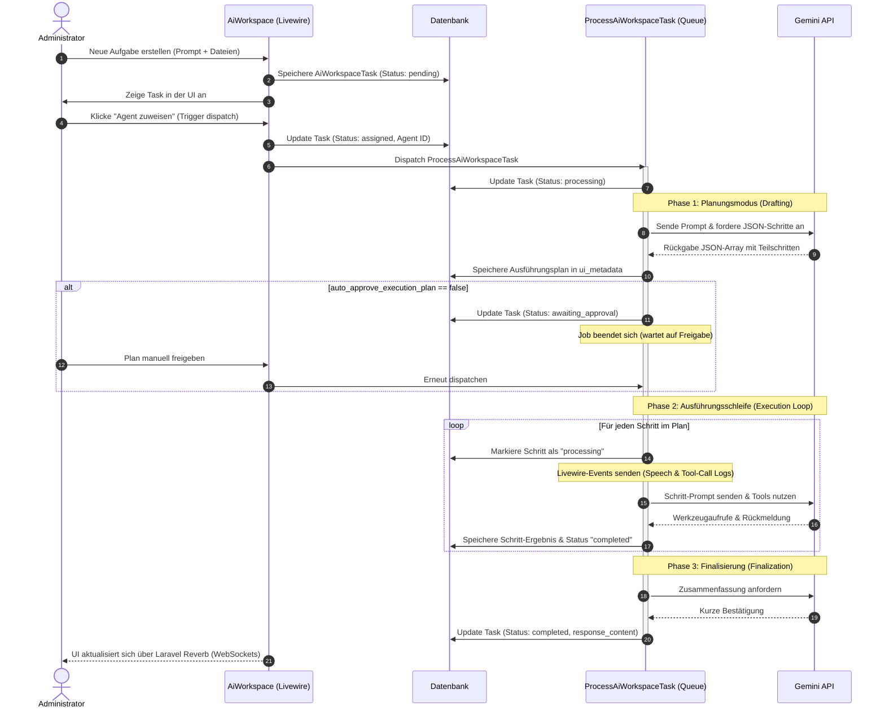

# Agenten-Zentrale (Workspace)

Die Agenten-Zentrale stellt das primäre administrative Cockpit zur Interaktion, Steuerung und Überwachung der künstlichen Intelligenzen (KI-Agenten) im Seelenfunke-System bereit. Sie kombiniert einen interaktiven Chat-Arbeitsplatz mit einem Datei-Manager, der Überwachung von Gesundheitsdaten und der Verwaltung von KI-Aufgaben in einer Hintergrund-Queue.

## Zielsetzung
Das Modul dient als operativer Mittelpunkt für KI-gestützte Workflows. Es ermöglicht dem Administrator, direkt mit spezialisierten Agenten zu chatten, asynchrone Aufgaben (Tasks) zu erstellen und an Agenten zuzuweisen, hochgeladene Dateien zu verwalten, API-Latenzen (LLM & TTS) zu prüfen und Hosting-Tarife für die KI-Infrastruktur zu konfigurieren.

---

## Beteiligte Komponenten & Klassen

### Datenbank-Modelle
- [AiAgent](file:///wsl.localhost/Ubuntu/home/ubuntuxina/meine-projekte/seelenfunke/app/Models/Ai/AiAgent.php): Repräsentiert die einzelnen Agenten-Identitäten inklusive System-Prompts, Farbschemata und TTS-Einstellungen.
- [AiChatSession](file:///wsl.localhost/Ubuntu/home/ubuntuxina/meine-projekte/seelenfunke/app/Models/Ai/AiChatSession.php): Speichert die einzelnen Chat-Konversationen des Benutzers.
- [AiChatMemory](file:///wsl.localhost/Ubuntu/home/ubuntuxina/meine-projekte/seelenfunke/app/Models/Ai/AiChatMemory.php): Enthält den genauen Nachrichtenverlauf (Rollen: `user`, `assistant`, `tool`) inklusive Metadaten und Tool-Outputs.
- [AiWorkspaceTask](file:///wsl.localhost/Ubuntu/home/ubuntuxina/meine-projekte/seelenfunke/app/Models/Ai/AiWorkspaceTask.php): Verwaltet asynchrone Arbeitsaufträge mit zugehörigem Ausführungsplan und Status (`pending`, `processing`, `awaiting_approval`, `completed`, `failed`).
- [AiUserWorkspaceSetting](file:///wsl.localhost/Ubuntu/home/ubuntuxina/meine-projekte/seelenfunke/app/Models/Ai/AiUserWorkspaceSetting.php): Speichert benutzerspezifische UI-Präferenzen wie z. B. die Höhe des Chat-Bereichs oder die automatische Freigabe von Ausführungsplänen.
- [SystemAiHostingPlan](file:///wsl.localhost/Ubuntu/home/ubuntuxina/meine-projekte/seelenfunke/app/Models/System/SystemAiHostingPlan.php): Definiert Tarifpläne für KI-Ressourcen inklusive Token-Limits und monatlicher Bepreisung.
- [AiHealthMedication](file:///wsl.localhost/Ubuntu/home/ubuntuxina/meine-projekte/seelenfunke/app/Models/Ai/AiHealthMedication.php): Verwaltet Medikamentendaten zur Kontextualisierung medizinisch relevanter Agenten-Anfragen.
- [ManagementContact](file:///wsl.localhost/Ubuntu/home/ubuntuxina/meine-projekte/seelenfunke/app/Models/Management/ManagementContact.php): Filtert Kontakte nach Ärzten und Praxen zur Bereitstellung von medizinischen Ansprechpartnern im Workspace.

### Livewire-Controller
- [AiWorkspace](file:///wsl.localhost/Ubuntu/home/ubuntuxina/meine-projekte/seelenfunke/app/Livewire/Shop/Ai/AiWorkspace.php): Der zentrale Livewire-Controller für das Frontend-Layout der Agenten-Zentrale. Bindet die nachfolgenden Traits ein:
  - [ManagesAiChat](file:///wsl.localhost/Ubuntu/home/ubuntuxina/meine-projekte/seelenfunke/app/Livewire/Shop/Ai/Traits/ManagesAiChat.php): Steuert Chat-Sitzungen, Nachrichtenübertragung, Echtzeit-Statusänderungen und Agenten-Zuweisungen.
  - [ManagesAiWorkspaceFiles](file:///wsl.localhost/Ubuntu/home/ubuntuxina/meine-projekte/seelenfunke/app/Livewire/Shop/Ai/Traits/ManagesAiWorkspaceFiles.php): Realisiert einen vollwertigen Datei-Manager (Ordner erstellen, Dateien hochladen, verschieben, umbenennen, zippen und Vorschau).
  - [ManagesHealthData](file:///wsl.localhost/Ubuntu/home/ubuntuxina/meine-projekte/seelenfunke/app/Livewire/Shop/Ai/Traits/ManagesHealthData.php): Steuert das Hinzufügen, Editieren und Löschen von Medikamentendaten und die Verknüpfung mit medizinischen Kontakten.

### Jobs & Services
- [ProcessAiWorkspaceTask](file:///wsl.localhost/Ubuntu/home/ubuntuxina/meine-projekte/seelenfunke/app/Jobs/ProcessAiWorkspaceTask.php): Der Queue-Job zur asynchronen Ausführung von KI-Tasks über den Worker.
- [AiAgentFactory](file:///wsl.localhost/Ubuntu/home/ubuntuxina/meine-projekte/seelenfunke/app/Services/AI/AiAgentFactory.php): Erzeugt die API-Service-Instanz eines Agenten für die Kommunikation mit Google Gemini.

---

## Technischer Datenfluss & Task-Pipeline

Die Interaktionen in der Agenten-Zentrale teilen sich in den interaktiven Echtzeit-Chat und die asynchrone Aufgabenabwicklung auf. Der Lebenszyklus einer Hintergrundaufgabe (Workspace Task) verläuft wie folgt:

### 1. API-Verbindungsprüfung (Ping-Test)
Um sicherzustellen, dass die Gemini API und die Text-to-Speech (TTS) Schnittstellen der Agenten voll funktionsfähig sind, bietet der Controller eine integrierte Ping-Funktion. Diese ermittelt die Latenzen in Millisekunden:
- **LLM-Ping**: Führt eine GET-Anfrage an `/models` mit dem in `config('services.gemini.key')` hinterlegten API-Key aus.
- **TTS-Ping**: Prüft, ob TTS für den Agenten aktiviert ist und sendet eine Testanfrage an die konfigurierte TTS-API-URL.

### 2. Workspace File-Manager
Der File-Manager arbeitet direkt auf der Festplatte über die Laravel-Storage-Facade (Disk: `public`, Pfad: `agenten/workspace`). 
- **Uploads**: Werden in temporären oder festen Unterordnern gespeichert.
- **Zippen**: Nutzt die PHP-Klasse `ZipArchive` zur Rekursion und Paketierung ganzer Ordnerstrukturen, um sie als ein Artefakt für die Agenten bereitzustellen.
- **Vorschau**: Ermöglicht dem Benutzer das direkte Lesen von Textdateien im Workspace.

### 3. KI-Tarife & Abrechnung
Im Workspace können Tarifmodelle ([SystemAiHostingPlan](file:///wsl.localhost/Ubuntu/home/ubuntuxina/meine-projekte/seelenfunke/app/Models/System/SystemAiHostingPlan.php)) angelegt und bearbeitet werden. Diese dienen zur Begrenzung von API-Ressourcen (z. B. Token-Limits pro Benutzer) im System und ermöglichen die Aktivierung oder Deaktivierung vordefinierter Features.
