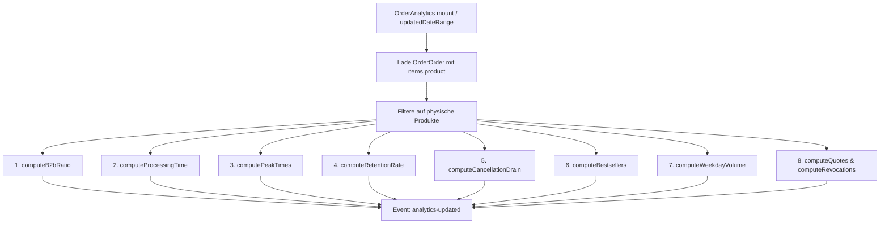

# Bestellungen - Analyse

Dieses Dokument beschreibt die Architektur und Arbeitsweise des Bestellanalyse-Systems (Order Analytics) im Laravel-Projekt. Dieses System bereitet Verkaufs-, Kunden- und Abwicklungsstatistiken in Echtzeit zur Analyse der Shop-Performance auf.

## Zielsetzung
Das Analyse-Modul liefert tiefgehende Einblicke in operative Vertriebskennzahlen. Über variable Filterzeiträume (7, 30, 90, 365 Tage oder Gesamtverlauf) lassen sich logistische Durchlaufzeiten, Retourenfrequenzen, B2B/B2C-Verteilungen und Kundenbindungsraten bewerten.

---

## Beteiligte Komponenten & Modelle

### Backend-Livewire-Controller
* [OrderAnalytics](file:///wsl.localhost/Ubuntu/home/ubuntuxina/meine-projekte/seelenfunke/app/Livewire/Shop/Order/OrderAnalytics.php)
  * Orchestriert das Laden der Bestellungen und führt speicherinterne Aggregationen durch.
  * Kommuniziert über Events (`analytics-updated`) mit dem Frontend zur Visualisierung.

### Beteiligte Modelle
* [OrderOrder](file:///wsl.localhost/Ubuntu/home/ubuntuxina/meine-projekte/seelenfunke/app/Models/Order/OrderOrder.php)
  * Die primäre Quelle für Verkaufsdaten.
* [OrderQuoteRequest](file:///wsl.localhost/Ubuntu/home/ubuntuxina/meine-projekte/seelenfunke/app/Models/Order/OrderQuoteRequest.php)
  * Liefert Daten zu B2B-Angebotsanfragen.
* [OrderRevocation](file:///wsl.localhost/Ubuntu/home/ubuntuxina/meine-projekte/seelenfunke/app/Models/Order/OrderRevocation.php)
  * Liefert Daten zu Kundenwiderrufen.

---

## Technische Berechnungen & Datenfluss

Um Abweichungen zwischen unterschiedlichen SQL-Dialekten (z. B. lokales SQLite vs. Live-MySQL) bei JSON-Spalten-Abfragen zu vermeiden, werden die Bestellungen mitsamt Beziehungen geladen und die Metriken in PHP speichereffizient berechnet.

### Die Kernberechnungen im Detail:

#### 1. B2B-Verhältnis (`computeB2bRatio`)
Unterscheidet Kunden anhand der Rechnungsadresse. Ist das Feld `billing_address['company']` befüllt, wird die Bestellung als B2B gezählt, andernfalls als B2C.

#### 2. Logistische Bearbeitungszeit (`computeProcessingTime`)
Misst die Dauer zwischen Bestelleingang und tatsächlichem Versand für alle erfolgreichen Bestellungen (`status` in `shipped` oder `completed`):
$$\text{Dauer} = | \text{created\_at} - \text{updated\_at} | \text{ in Stunden}$$
Dies wird tagesbasiert gemittelt, um logistische Leistungsengpässe aufzuzeigen.

#### 3. Kauf-Spitzenzeiten (`computePeakTimes`)
Gruppiert alle Transaktionen nach der Stunde des Bestelleingangs (0 bis 23 Uhr), um Rush-Hours für Serverlasten und Support-Besetzung zu identifizieren.

#### 4. Kundenbindungsrate (`computeRetentionRate`)
Prüft anhand der E-Mail-Adresse im JSON-Feld `shipping_address` oder `billing_address`, ob dieser Kunde bereits eine Bestellung mit dem Status `completed` vor dem aktuellen Bestelldatum getätigt hat. Teilt Kunden sauber in *Stammkunden* und *Neukunden* auf.

#### 5. Stornierungsverlust (`computeCancellationDrain`)
Ermittelt das kumulierte Umsatzvolumen (`total_amount`), das durch stornierte, fehlgeschlagene oder erstattete Bestellungen (`status` in `cancelled`, `refunded`, `failed`) verloren ging, aufgeteilt nach Datum.

#### 6. Bestseller (`computeBestsellers`)
Filtert alle nicht stornierten Bestellungen und summiert die Verkaufszahlen der enthaltenen physischen Produkte. Gibt die Top 5 Produkte inklusive deren Namen (abgeschnitten auf 20 Zeichen über `mb_strimwidth`) zurück.

#### 7. Wochentagsvolumen (`computeWeekdayVolume`)
Ermittelt den Bestelleingang nach Wochentag (Montag bis Sonntag) unter Verwendung des Carbon-Formates `N` (1 = Montag, 7 = Sonntag).

#### 8. Angebote & Widerrufe (`computeQuotes` & `computeRevocations`)
Liest die kumulierten Tageswerte für Angebote (`OrderQuoteRequest`) und Widerrufe (`OrderRevocation`) im gewählten Intervall aus, um administrative Aufwände messbar zu machen.
