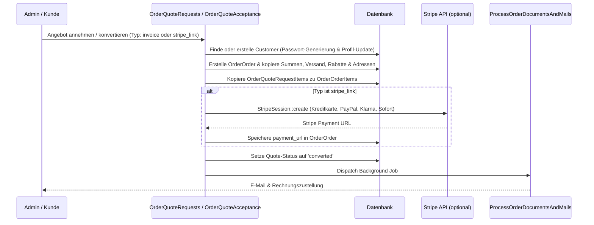

# Bestellungen - Angebote

Dieses Dokument beschreibt die B2B-Angebots-Engine (Quote System) im Laravel-Projekt. Dieses System ermöglicht es gewerblichen Kunden, Angebote anzufordern, diese über ein interaktives Kundenportal anzupassen und zu verhandeln, automatische Preiskalkulationen durchzuführen und Angebote direkt in reguläre Bestellungen mit integrierten Bezahlmethoden umzuwandeln.

## Zielsetzung
Die Angebots-Engine digitalisiert den B2B-Vertrieb. B2B-Kunden erhalten maßgeschneiderte Angebote, die sie online konfigurieren, mit Gutscheinen kombinieren und per Stripe oder auf Rechnung direkt bezahlen können.

---

## Beteiligte Komponenten & Modelle

### Backend-Livewire-Controller
* [OrderQuoteRequests](file:///wsl.localhost/Ubuntu/home/ubuntuxina/meine-projekte/seelenfunke/app/Livewire/Shop/Order/OrderQuoteRequests.php)
  * Ermöglicht dem Vertriebsinnendienst das Einsehen, Löschen, Stornieren und Konvertieren von Angebotsanfragen.

### Frontend-Livewire-Controller
* [OrderQuoteAcceptance](file:///wsl.localhost/Ubuntu/home/ubuntuxina/meine-projekte/seelenfunke/app/Livewire/Shop/Order/OrderQuoteAcceptance.php)
  * Das Kundenportal (aufgerufen über ein sicheres URL-Token), in dem der Kunde das Angebot ansehen, Konfigurationen anpassen, Gutscheine anwenden und das Angebot annehmen oder ablehnen kann.

### Modelle
* [OrderQuoteRequest](file:///wsl.localhost/Ubuntu/home/ubuntuxina/meine-projekte/seelenfunke/app/Models/Order/OrderQuoteRequest.php)
  * Speichert Angebotsdaten: `quote_number`, `token`, `status` (`open`, `converted`, `rejected`), Netto-/Bruttosummen, Steueranteile, Lieferadressdaten, Express-Optionen, Gültigkeit (`expires_at`) und Rabatte.
* [OrderQuoteRequestItem](file:///wsl.localhost/Ubuntu/home/ubuntuxina/meine-projekte/seelenfunke/app/Models/Order/OrderQuoteRequestItem.php)
  * Einzelpositionen mit Produkt-IDs, Stückzahlen, Preisen und Konfigurations-JSONs.
* [Customer](file:///wsl.localhost/Ubuntu/home/ubuntuxina/meine-projekte/seelenfunke/app/Models/Customer/Customer.php)
  * Das Kundenkonto, das bei Angebotsannahme automatisch referenziert oder neu angelegt wird.

---

## Angebotsannahme & Konvertierung (`convertToOrder`)

Nimmt der Kunde ein Angebot an (oder konvertiert der Vertrieb es manuell im Backend), startet folgende Transaktion:

### 1. Kundenregistrierung
Falls die E-Mail-Adresse des Angebots noch nicht existiert, wird mittels `Customer::firstOrCreate` ein neuer B2B-Kundenstamm angelegt. Das Kennwort wird per `Str::random(16)` sicher generiert.

### 2. Zahlungsverarbeitung (Stripe & Rechnung)
* **Rechnung (`invoice`)**: Der Standardweg im B2B-Handel. Die Bestellung wird mit `payment_method = 'invoice'` erstellt und eine Rechnung generiert.
* **Kreditkarte / Online-Zahlung (`stripe_link`)**: Das System baut über den Stripe-SDK-Client eine Checkout-Session auf. Alle gängigen Online-Bezahlmethoden (Card, PayPal, Klarna, Sofort) werden an Stripe übergeben. Der generierte Bezahllink wird im Feld `payment_url` der Bestellung hinterlegt, damit der Kunde direkt online zahlen kann.

---

## Dynamische Preiskalkulation (`recalculateQuoteTotals`)

Passt der B2B-Kunde Stückzahlen oder Varianten im Portal an, berechnet das System in Echtzeit das gesamte Angebot neu:
1. **Mengenstaffelpreise (`calculateTierPrice`)**: Die Preiskalkulation liest das `tier_pricing` des Produkts aus und wählt degressiv den passenden Staffelpreis aus.
2. **Versandkostenberechnung**:
   * **Inland (DE)**: Ab 50,00 € Brutto-Bestellwert kostenfrei, andernfalls 4,90 €.
   * **Ausland**: Ermittlung der logistischen Versandzone (`LogisticsShippingZone`). Anhand des aufsummierten Gewichts der Produkte wird der Frachttarif aus der Zonentabelle gewählt (Fallback: 29,90 €).
3. **Express-Zuschlag**: Berechnet einen prozentualen Aufschlag auf den Warenwert (z. B. 20%), mindestens jedoch einen Festbetrag (z. B. 5,00 €).
4. **Gutschein-Validierung**: Ermöglicht das Einlösen von Aktionscodes aus dem Marketing. Der Rabatt wird vor der Versand- und Expresskostenkalkulation auf den Warenwert angerechnet.
