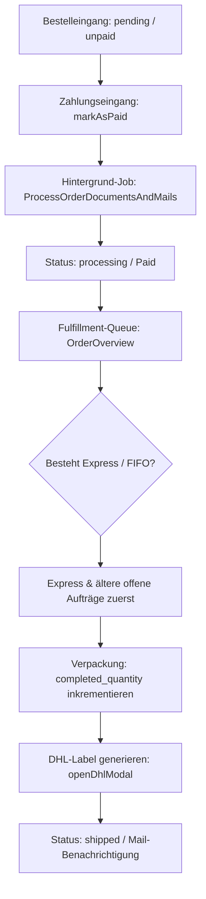

# Bestellungen - Bestellungen

Dieses Dokument beschreibt die technische Struktur und den Abwicklungs-Workflow des Bestellungs-Management-Moduls im Laravel-Backend. Das Modul steuert den Status von Bestellungen, verwaltet den Verpackungsprozess, korrigiert Lagerbestände, bucht Zahlungen und steuert die DHL-Versandschnittstelle inklusive Etikettendruck und PDF-Merging.

## Zielsetzung
Das Bestellungs-Management ist die zentrale Schnittstelle zur physischen Bestellabwicklung (Fulfillment). Es implementiert eine Prioritäts-Sortierung nach dem FIFO-Prinzip (First-In, First-Out) bei gleichzeitiger Bevorzugung von Expresssendungen und integriert Logistikprozesse direkt in die Admin-Oberfläche.

---

## Beteiligte Komponenten & Modelle

### Backend-Livewire-Controller
* [OrderOverview](file:///wsl.localhost/Ubuntu/home/ubuntuxina/meine-projekte/seelenfunke/app/Livewire/Shop/Order/OrderOverview.php)
  * Die primäre administrative Schaltzentrale für Bestellungs-CRUD, Verpackungsfortschritte und Versandlabel-Erstellung.

### Dienste & Jobs
* [DhlService](file:///wsl.localhost/Ubuntu/home/ubuntuxina/meine-projekte/seelenfunke/app/Services/DhlService.php)
  * Kommuniziert mit den APIs von DHL zur Erzeugung von Tracking-IDs und Paketaufklebern.
* [ProcessOrderDocumentsAndMails](file:///wsl.localhost/Ubuntu/home/ubuntuxina/meine-projekte/seelenfunke/app/Jobs/ProcessOrderDocumentsAndMails.php)
  * Hintergrund-Job zur asynchronen PDF-Rechnungserstellung und E-Mail-Zustellung.
* [FileDownloadService](file:///wsl.localhost/Ubuntu/home/ubuntuxina/meine-projekte/seelenfunke/app/Services/Export/FileDownloadService.php)
  * Exportiert Laserdateien (SVGs) für 3D-Gravuren.

### Modelle
* [OrderOrder](file:///wsl.localhost/Ubuntu/home/ubuntuxina/meine-projekte/seelenfunke/app/Models/Order/OrderOrder.php)
  * Speichert Bestell-Header: `order_number`, `status` (`pending`, `processing`, `shipped`, `completed`, `cancelled`, `refunded`, `failed`), `payment_status` (`paid`, `unpaid`), Liefer- und Rechnungsadresse, Express-Status (`is_express`) und Notizen.
* [OrderOrderItem](file:///wsl.localhost/Ubuntu/home/ubuntuxina/meine-projekte/seelenfunke/app/Models/Order/OrderOrderItem.php)
  * Die einzelnen Positionen. Speichert `quantity`, `completed_quantity` (wichtig für die Verpackungsstation) und `is_completed`.
* [OrderShipment](file:///wsl.localhost/Ubuntu/home/ubuntuxina/meine-projekte/seelenfunke/app/Models/Order/OrderShipment.php)
  * Referenziert erzeugte Sendungsdaten und den Pfad zum DHL-PDF-Label.
* [SystemLog](file:///wsl.localhost/Ubuntu/home/ubuntuxina/meine-projekte/seelenfunke/app/Models/System/SystemLog.php)
  * Protokolliert Laufzeitfehler bei Statusänderungen oder API-Fehlern.

---

## Logistischer Workflow (Fulfillment-Schritte)

### 1. Intelligente Priorisierung (Fulfillment-Queue)
Die Listenansicht sortiert standardmäßig nach dem `default_workflow`:
1. Offene Bestellungen (`pending`, `processing`) stehen ganz oben, erledigte/stornierte unten.
2. Express-Bestellungen (`is_express` = `true`) werden vorrangig platziert.
3. Innerhalb dieser Gruppen gilt FIFO: Älteste Bestellungen (`created_at` ASC) werden zuerst abgearbeitet.
* **Lagerbestandsprüfung**: Das System prüft vorab, ob physischer Lagerbestand gesichert ist. Fehlen Artikel eines Express-Auftrags, wird ein kritischer Warnhinweis im Header angezeigt.

### 2. Statusänderungen und Transaktionssicherheit
* **Stornierung (`cancelled`)**: Falls eine unbezahlte Bestellung storniert wird, führt das System automatisch ein Rollback durch und bucht reservierte Artikel-Stückzahlen über `Product::restoreStock` zurück ins Lager.
* **Rechnungserstellung**: Wird eine Bestellung auf `paid` gesetzt, triggert das System im Hintergrund den Dokumenten-Job, um PDF-Rechnungen zu erzeugen und dem Kunden zuzusenden.
* **Verpackungs-Detailkontrolle**: Mitarbeiter können pro Artikelposition die verpackte Menge (`completed_quantity`) steuern. Erst wenn diese mit der bestellten Menge übereinstimmt, gilt das Item als `is_completed`.

### 3. Integrierte DHL-Label-Generierung
Aus der Detailansicht heraus lässt sich ein DHL-Versandaufkleber generieren:
1. **Automatische Gewichtsberechnung (`calculateDhlWeight`)**:
   * Ermittelt das Gesamtgewicht der Produkte (Fallback: 100g pro Artikel).
   * Schlägt ein Verpackungsgewicht (Tara) auf (Standard: 350g oder produktspezifische Kartonage).
   * Teilt das Gewicht durch die Anzahl geplanter Pakete (`dhlPackageCount`).
   * Ergibt das exakte, gerundete Einzelgewicht pro Paket (mind. 0,1 kg bis max. 31,5 kg).
2. **API-Anbindung (`generateDhlLabels`)**: Der `DhlService` übermittelt Empfängerdaten und Gewichte an DHL, empfängt Trackingnummern sowie PDF-Labels und legt sie in `OrderShipment` ab. Der Bestellstatus wird auf `shipped` gesetzt.

### 4. PDF-Sammeldruck (Label-Merging)
Mitarbeiter können über `downloadMergedLabels()` alle Labels der aktuellen Filterliste gebündelt als ein einziges PDF herunterladen:
* Es werden alle Pfade zu den verknüpften PDF-Dateien aus dem Speicher geladen.
* Mittels der FPDI-Bibliothek (`setasign\Fpdi\Fpdi`) werden alle Einzelseiten dynamisch importiert, das Format (Hoch- oder Querformat) ausgelesen und zu einer PDF-Datei zusammengefügt.
* Dies spart erhebliche Zeit beim Ausdrucken an der Packstation.
