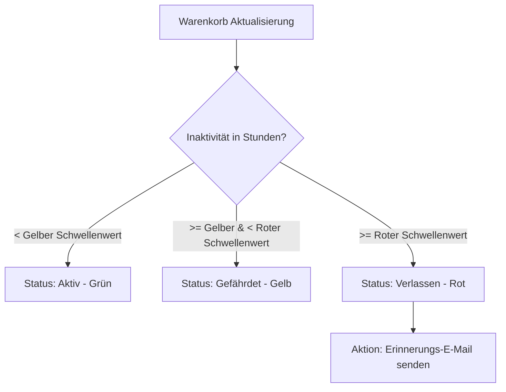

# Bestellungen - Warenkörbe

Dieses Dokument beschreibt das technische System zur Erfassung, Verwaltung und Nachverfolgung aktiver sowie verlassener Warenkörbe (Abandoned Carts) im Laravel-Projekt. Es erläutert das administrative Kontrollzentrum im Backend sowie den automatisierten Mahnprozess für Kunden mit gefüllten, aber nicht abgeschlossenen Warenkörben.

## Zielsetzung
Das Warenkorb-Tracking dient der Senkung der Kaufabbruchquote. Über eine optische Klassifizierung und manuelle oder automatische E-Mail-Erinnerungen können Kunden dazu bewegt werden, ihren Einkauf zu vollenden.

---

## Beteiligte Komponenten & Modelle

### Backend-Livewire-Controller
* [OrderShoppingCarts](file:///wsl.localhost/Ubuntu/home/ubuntuxina/meine-projekte/seelenfunke/app/Livewire/Shop/Order/OrderShoppingCarts.php)
  * Stellt die Benutzeroberfläche zur Administration aller existierenden Warenkörbe bereit.
  * Verwaltet die Ampel-Grenzwerte und steuert den E-Mail-Mahnprozess.

### Frontend-Komponenten & Services
* [Cart](file:///wsl.localhost/Ubuntu/home/ubuntuxina/meine-projekte/seelenfunke/app/Livewire/Shop/Cart/Cart.php)
  * Die Frontend-Livewire-Komponente zur Darstellung des aktuellen Kunden-Warenkorbs.
* [CartService](file:///wsl.localhost/Ubuntu/home/ubuntuxina/meine-projekte/seelenfunke/app/Services/CartService.php)
  * Kapselt die Berechnungslogik (Zwischensummen, Steuern, Mengenstaffelrabatte und Versandkosten je nach Zielland).
* [AbandonedCartReminder](file:///wsl.localhost/Ubuntu/home/ubuntuxina/meine-projekte/seelenfunke/app/Mail/AbandonedCartReminder.php)
  * Die Mailable-Klasse für die Erinnerungs-E-Mail.

### Modelle
* [Cart](file:///wsl.localhost/Ubuntu/home/ubuntuxina/meine-projekte/seelenfunke/app/Models/Cart/Cart.php)
  * Speichert den Warenkorb-Header: `session_id`, `customer_id` (falls angemeldet), `reminder_email_sent_at` und Zeitstempel.
* [CartItem](file:///wsl.localhost/Ubuntu/home/ubuntuxina/meine-projekte/seelenfunke/app/Models/Cart/CartItem.php)
  * Einzelpositionen mit Produkt-ID und `quantity`.

---

## Technischer Datenfluss & Ampel-Grenzwerte

Im Backend wird jeder Warenkorb nach der Inaktivitätsdauer klassifiziert. Die Schwellenwerte können in der Administration konfiguriert werden und werden in der Tabelle `system_settings` persistiert:
1. **Gelbe Zone (`cart_abandoned_yellow_hours`, Standard: 3 Std.)**:
   * Der Warenkorb wurde seit mehr als X Stunden nicht mehr aktualisiert, aber das Limit für die rote Zone ist noch nicht erreicht. Signalisiert einen potenziellen Abbruch.
2. **Rote Zone (`cart_abandoned_red_hours`, Standard: 24 Std.)**:
   * Der Warenkorb liegt seit über Y Stunden unberührt im System. Signalisiert einen definitiven Abbruch.

---

## Administrative Eingriffsmöglichkeiten

Der Administrator hat vollen Zugriff auf den Inhalt fremder Warenkörbe und kann helfend eingreifen, um z. B. telefonische Kundenbestellungen manuell zu begleiten:
* **Mengenänderung**: Über `increment()`, `decrement()` oder manuelle Eingabe (`updateQuantity()`) wird die Stückzahl angepasst. Hierbei berechnet der `CartService` im Hintergrund automatisch Staffelpreise (`tierPrices`) und Steuersätze neu.
* **Artikel entfernen (`removeItem`)**: Einzelne Posten können gelöscht werden. Sinkt die Artikelanzahl im Warenkorb auf 0, wird der gesamte Cart-Eintrag aus der Datenbank entfernt.
* **Warenkorb löschen (`deleteCart`)**: Entfernt verwaiste Carts restlos aus der Datenbank.

---

## Kaufabbruch-Mahnwesen (`sendReminderEmail`)

Befindet sich ein registrierter Kunde im Warenkorb (E-Mail vorhanden):
1. Der Administrator kann per Knopfdruck eine Erinnerungsmail senden.
2. Die Mailable-Klasse `AbandonedCartReminder` rendert den aktuellen Warenkorb-Inhalt und generiert einen personalisierten Direktlink zurück zum Checkout.
3. Bei erfolgreichem Versand wird das Feld `reminder_email_sent_at` auf den aktuellen Zeitstempel gesetzt. Dies verhindert doppelte Anschreiben an denselben Kunden.
