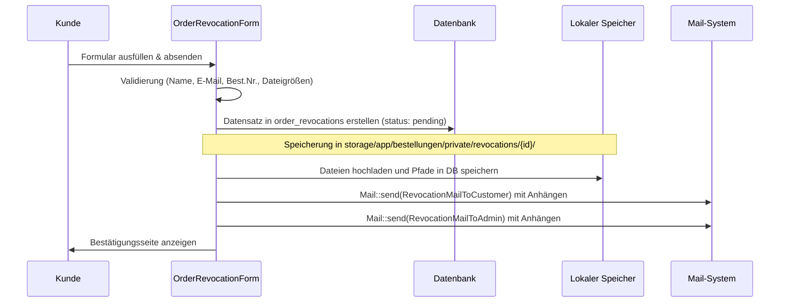

# Bestellungen - Widerrufe

Dieses Dokument beschreibt das technische System zur Erfassung, Prüfung und Abwicklung von Kundenwiderrufen (Revocations) im Laravel-Projekt. Es erläutert das öffentliche Kundenformular zur Einreichung eines Widerrufs sowie das administrative Prüfungs- und Bearbeitungspanel im Backend.

## Zielsetzung
Das Widerrufssystem digitalisiert den gesetzlich vorgeschriebenen Prozess des Vertragsrücktritts für Kunden. Es ermöglicht das Hochladen von Schadensbildern oder Belegen, die sichere, private Speicherung dieser Dokumente auf dem Server und bietet dem Support-Team einen strukturierten Workflow zur rechtlichen Prüfung (z. B. Ausschluss bei personalisierter Ware), zur Annahme oder zur begründeten Ablehnung.

---

## Beteiligte Komponenten & Modelle

### Frontend-Formular (Kundenbereich)
* [OrderRevocationForm](file:///wsl.localhost/Ubuntu/home/ubuntuxina/meine-projekte/seelenfunke/app/Livewire/Shop/Order/OrderRevocationForm.php)
  * Livewire-Komponente für das öffentliche Widerrufsformular.
  * Verwaltet die Validierung von Pflichtfeldern und die Bereinigung von Datei-Uploads.

### Backend-Livewire-Controller (Administration)
* [OrderRevocations](file:///wsl.localhost/Ubuntu/home/ubuntuxina/meine-projekte/seelenfunke/app/Livewire/Shop/Order/OrderRevocations.php)
  * Das administrative Backend-Panel zur Bearbeitung und Dokumentation aller Widerrufsanträge.
  * Bietet Workflows zur Prüfung, Freigabe, Ablehnung und Löschung.

### Hilfskomponenten & Mails
* [RevocationMailToCustomer](file:///wsl.localhost/Ubuntu/home/ubuntuxina/meine-projekte/seelenfunke/app/Mail/RevocationMailToCustomer.php)
  * Mailable für die gesetzlich vorgeschriebene, sofortige Eingangsbestätigung an den Kunden (mit angehängten Uploads).
* [RevocationMailToAdmin](file:///wsl.localhost/Ubuntu/home/ubuntuxina/meine-projekte/seelenfunke/app/Mail/RevocationMailToAdmin.php)
  * Interne Benachrichtigungs-Mail an den Shopbetreiber bei einem neuen Widerrufseingang.
* [RevocationProcessedMail](file:///wsl.localhost/Ubuntu/home/ubuntuxina/meine-projekte/seelenfunke/app/Mail/Order/RevocationProcessedMail.php)
  * Kundenbenachrichtigung über die erfolgreiche Annahme und Bearbeitung des Widerrufs.
* [RevocationRejectedMail](file:///wsl.localhost/Ubuntu/home/ubuntuxina/meine-projekte/seelenfunke/app/Mail/Order/RevocationRejectedMail.php)
  * Kundenbenachrichtigung im Falle einer Ablehnung des Widerrufs mit Angabe der Ablehnungsgründe.
* **Dateizugriff über Route**:
  * In [admin_routes.php](file:///wsl.localhost/Ubuntu/home/ubuntuxina/meine-projekte/seelenfunke/routes/partials/admin_routes.php#L86-L92) wird der Zugriff auf hochgeladene Widerrufsdokumente über eine geschützte Route per Stream (`response()->file()`) geregelt, um die privaten Daten vor externem Zugriff zu schützen.

### Modelle
* [OrderRevocation](file:///wsl.localhost/Ubuntu/home/ubuntuxina/meine-projekte/seelenfunke/app/Models/Order/OrderRevocation.php)
  * Repräsentiert den Widerrufsdatensatz in der Tabelle `order_revocations`.
  * Wichtigste Felder:
    * `order_number`: Referenz zur Originalbestellung.
    * `attachments` (Array/JSON Cast): Pfade zu den hochgeladenen Dateien.
    * `status` (standardmäßig `pending`, möglich sind `processed` und `declined`).
    * `legal_check_at` & `product_type` (`personalized` / `standard`): Protokollierung der rechtlichen Vorprüfung.
    * `rejection_reason` (`personalized`, `damaged`, `expired`, `other`): Grund einer etwaigen Ablehnung.
    * `customer_notified_at`: Zeitpunkt der finalen Kundenbenachrichtigung.

---

## Technischer Ablauf

### 1. Einreichung des Widerrufs (Frontend)
Der Kunde füllt das Formular aus. Dabei können bis zu 2 Dokumente (JPG, PNG, PDF) mit jeweils maximal 5 MB hochgeladen werden.
Die Komponente prüft in `updatedAttachments()` die Einhaltung dieser Grenzwerte. Ungültige Dateien werden sofort aussortiert und eine Fehlermeldung ausgegeben.

---

## Administrative Bearbeitung im Backend

Der Administrator steuert den Fortschritt der Anträge über das Backend-Panel [OrderRevocations](file:///wsl.localhost/Ubuntu/home/ubuntuxina/meine-projekte/seelenfunke/app/Livewire/Shop/Order/OrderRevocations.php):

### Rechtliche Prüfung (`markLegalCheck`)
Widerrufsrechte können je nach Produktart variieren. Der Administrator stuft den Widerruf ein:
* **Standard-Produkt**: Reguläres Widerrufsrecht greift.
* **Personalisierte Ware** (`personalized`): Personalisierte Artikel sind vom gesetzlichen Widerrufsrecht ausgeschlossen.
Die Durchführung wird mit `legal_check_at` protokolliert. Mit `undoLegalCheck()` kann der Status zurückgesetzt werden.

### Bearbeitung abschließen (`markAsProcessed`)
Bei Annahme des Widerrufs:
* Status wechselt auf `processed`.
* Dem Kunden wird automatisch die `RevocationProcessedMail` gesendet.

### Ablehnung (`rejectRevocation`)
Entspricht der Widerruf nicht den rechtlichen Vorgaben (z. B. Ablauf der 14-tägigen Frist, Beschädigung durch Eigenverschulden, personalisierte Ware):
* Der Administrator wählt einen Ablehnungsgrund (`personalized`, `damaged`, `expired` oder `other`).
* Der Status wird auf `declined` gesetzt und `customer_notified_at` wird auf `now()` aktualisiert.
* Der Kunde erhält automatisch eine begründete Ablehnungs-Mail (`RevocationRejectedMail`).

### Physische Löschung (`deleteRevocation`)
Wird ein Widerrufsantrag gelöscht:
* Der `OrderRevocation`-Datensatz wird aus der Datenbank entfernt.
* Sämtliche hochgeladenen Dateien im geschützten Verzeichnis `bestellungen/private/revocations/{id}` werden restlos gelöscht, um Speicherplatz freizugeben und Datenschutzvorgaben (DSGVO) zu erfüllen.
