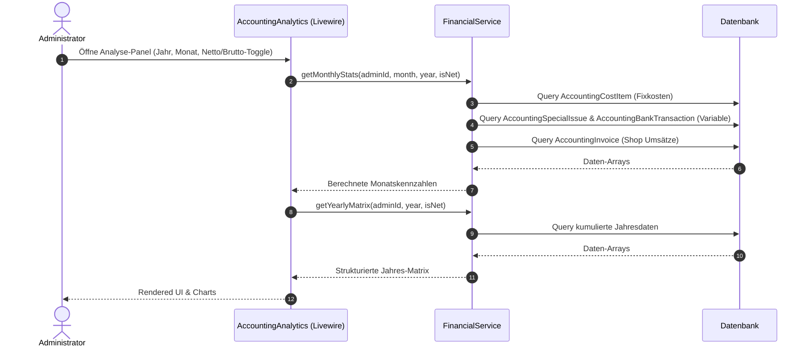

# Dokumentation: Buchhaltung - Analyse

Das Analyse-Modul der Buchhaltung bietet eine vollumfängliche, dynamische Finanzübersicht. Es ermöglicht der Geschäftsführung, Umsätze, Fixkosten und variable Kosten zu konsolidieren, Netto- und Bruttobetrachtungen per Mausklick umzuschalten und steuerlich relevante Kennzahlen in Echtzeit auszuwerten.

## 1. Zielsetzung & Funktionsumfang
*   **Zentrale Finanzübersicht:** Aggregation aller Einnahmen (Shop-Umsätze, wiederkehrende Einnahmen) und Ausgaben (Fixkosten, variable Sonderausgaben).
*   **Netto-/Brutto-Weiche:** Flexible Umschaltung aller Beträge. Bruttobeträge werden anhand der hinterlegten Steuersätze dynamisch in Netto-Werte umgerechnet.
*   **Jahresmatrix:** Eine tabellarische Ganzjahresdarstellung aller Einnahmen- und Ausgabenkategorien aufgeschlüsselt nach Monaten zur Identifikation von Saisonalitäten und Trends.
*   **Export-Zentrale:** Generierung und Bereitstellung monatlicher steuerlich relevanter Finanzexporte für DATEV und ELSTER.

---

## 2. Datenbankmodelle & Architektur

Das Analyse-Modul greift konsolidierend auf verschiedene Datenquellen des Accounting-Systems zu:

*   **[AccountingGroup](file:///wsl.localhost/Ubuntu/home/ubuntuxina/meine-projekte/seelenfunke/app/Models/Accounting/AccountingGroup.php):** Definiert Kosten- und Einnahmengruppen (z. B. "Gewerbliche Fixkosten", "Private Fixkosten").
*   **[AccountingCostItem](file:///wsl.localhost/Ubuntu/home/ubuntuxina/meine-projekte/seelenfunke/app/Models/Accounting/AccountingCostItem.php):** Repräsentiert die einzelnen wiederkehrenden Kosten/Einnahmen innerhalb einer Gruppe (Intervall, Betrag, Steuersatz).
*   **[AccountingSpecialIssue](file:///wsl.localhost/Ubuntu/home/ubuntuxina/meine-projekte/seelenfunke/app/Models/Accounting/AccountingSpecialIssue.php):** Speichert unregelmäßige bzw. variable Ausgaben und Einnahmen (Belege, Betrag, Kategorie).
*   **[AccountingInvoice](file:///wsl.localhost/Ubuntu/home/ubuntuxina/meine-projekte/seelenfunke/app/Models/Accounting/AccountingInvoice.php):** Enthält Ausgangsrechnungen, Stornos und Gutschriften des Online-Shops zur Ermittlung der Shop-Umsätze.

---

## 3. Steuerungslogik & Backend-Komponenten

### Livewire-Controller: [AccountingAnalytics](file:///wsl.localhost/Ubuntu/home/ubuntuxina/meine-projekte/seelenfunke/app/Livewire/Shop/Accounting/AccountingAnalytics.php)
Der Livewire-Controller steuert die Benutzeroberfläche. Er verarbeitet Benutzerinteraktionen wie Jahres- und Monatswechsel, Filterungen (z. B. letzte 12 Monate oder aktuelles Jahr) und die Umschaltung zwischen Netto- und Bruttodarstellung (`$isNet`).
*   **Reaktive Aktualisierung:** Sobald Sonderausgaben erstellt oder Banktransaktionen kategorisiert werden, triggert das System ein Event (`special-issue-created` / `analytics-updated`), das die Statistik-Widgets neu berechnet.
*   **Visualisierung:** Übergibt aufbereitete Chart-Daten (Kreis- und Balkendiagramme für die Ausgabenverteilung) an das Blade-Template.

### Service: [FinancialService](file:///wsl.localhost/Ubuntu/home/ubuntuxina/meine-projekte/seelenfunke/app/Services/FinancialService.php)
Kapselt die mathematischen Berechnungen und DB-Abfragen. Die wichtigsten Berechnungsmodelle sind:

#### A. Monatsstatistik (`getMonthlyStats`)
Berechnet die aggregierten Einnahmen und Ausgaben für einen gewählten Monat.
1.  **Fixkosten:** Iteriert über alle `AccountingGroup` Einträge und deren `AccountingCostItem` Beziehungen. Prüft per `isDueInMonth()`, ob das Item im Zielmonat fällig ist.
    $$\text{Netto-Wert} = \frac{\text{Brutto-Betrag}}{1 + \frac{\text{Steuersatz}}{100}}$$
2.  **Sonderausgaben:** Summiert variable Kosten (`AccountingSpecialIssue`) und kategorisierte Banktransaktionen (`AccountingBankTransaction`).
3.  **Shop-Umsatz:** Abfrage von `AccountingInvoice` mit Status `paid` oder `cancelled`.
    $$\text{Shop-Umsatz} = \sum (\text{total} - \text{tax\_amount}) \quad (\text{falls Netto})$$
    Das Ergebnis wird von Cent in Euro umgerechnet (Division durch 100).
4.  **Verfügbares Budget:**
    $$\text{Budget Gesamt} = \text{Fix-Einnahmen} + \text{Sonder-Einnahmen} + \text{Shop-Einnahmen}$$
    $$\text{Ausgaben Gesamt} = \text{Fixkosten} + \text{Sonderausgaben}$$
    $$\text{Verfügbar} = \text{Budget Gesamt} - |\text{Ausgaben Gesamt}|$$

#### B. Ganzjahres-Matrix (`getYearlyMatrix`)
Erzeugt eine zweidimensionale Matrix (Kategorie $\times$ Monat 1-12) für die Kategorien:
*   *income* (Fix-Einnahmen)
*   *shop_income* (Shop-Umsätze basierend auf Rechnungen)
*   *fixed_private* / *fixed_business* (Fixkosten)
*   *special_private* / *special_business* (Variable Kosten)

---

## 4. Technischer Datenfluss

