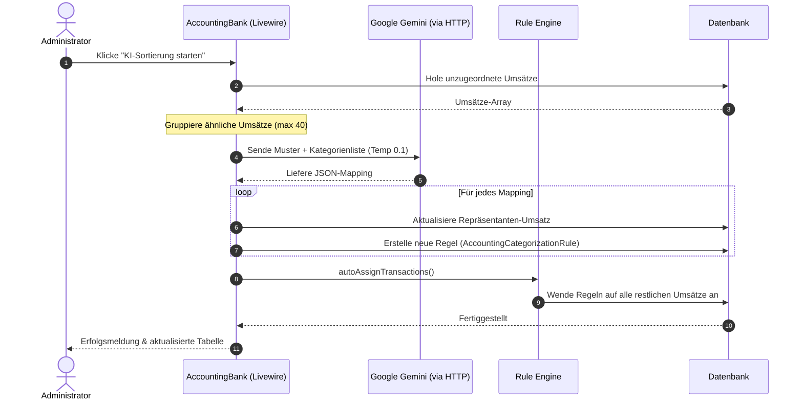

# Dokumentation: Buchhaltung - Banken

Das Banken-Modul synchronisiert Bankkonten und Umsätze des Betreibers und sortiert Transaktionen mithilfe eines KI-gestützten Regelsystems vor. Es verbindet eine strukturierte API-Schnittstelle (finAPI) mit einem flexiblen Regelwerk und modernem LLM-Reasoning (Gemini).

## 1. Zielsetzung & Schnittstellen-Architektur
*   **finAPI Schnittstelle:** Direkte Anbindung an deutsche Kreditinstitute über den PSD2-Schnittstellenanbieter finAPI.
*   **Automatische Kategorisierung:** Transaktionen werden über reguläre Textschablonen oder KI-Analysen vordefinierten Buchungskategorien bzw. Fixkosteneinträgen zugewiesen.
*   **Token-effiziente KI-Zuweisung:** Bündelung ähnlicher Umsätze vor der Übergabe an das LLM, um API-Kosten zu minimieren.

---

## 2. API-Integration & Authentifizierungsfluss

Die Kommunikation mit der finAPI-Plattform wird über den Service [BankApiService](file:///wsl.localhost/Ubuntu/home/ubuntuxina/meine-projekte/seelenfunke/app/Services/BankApiService.php) abgewickelt:

1.  **Client-Authentifizierung:** finAPI nutzt OAuth2. Der Service autorisiert sich mit `client_id` und `client_secret` und erhält ein Client-Token.
2.  **User-Generierung:** Jeder Admin-User im Shop erhält ein eindeutiges finAPI-Gegenstück. Da finAPI User-IDs mit exakt 35 Zeichen verlangt, generiert das System die ID wie folgt:
    ```php
    $finapiUserId = 'sf_' . md5($adminId); // Garantiert exakt 35 Zeichen (3 Zeichen Präfix + 32 Zeichen MD5-Hash)
    ```
3.  **Bankverbindung einrichten:** Der Controller [AccountingBank](file:///wsl.localhost/Ubuntu/home/ubuntuxina/meine-projekte/seelenfunke/app/Livewire/Shop/Accounting/AccountingBank.php) generiert über den Service einen Web-Form-Link von finAPI, über den der Nutzer seine Bank (mittels PIN/TAN) sicher autorisiert.

---

## 3. Intelligente Umsatzkategorisierung (LLM Batch Sorting)

Um unzugeordnete Transaktionen (Soll/Haben) nicht einzeln und teuer an das LLM schicken zu müssen, implementiert [AccountingBank](file:///wsl.localhost/Ubuntu/home/ubuntuxina/meine-projekte/seelenfunke/app/Livewire/Shop/Accounting/AccountingBank.php#L373-L543) ein Token-sparendes Gruppierungsverfahren:

### Ablauf des KI-Sortierprozesses (`startAgentSorting`):
1.  **Transaktions-Sammlung:** Abrufen aller Transaktionen des angemeldeten Administrators, bei denen weder Kategorie noch Fixkosten-Item zugeordnet sind (`assigned_by_type != 'admin'`).
2.  **Muster-Gruppierung (Token-Sparmodus):**
    Das System bildet aus dem Namen des Zahlungspartners (`counterpart_name`) und den ersten 30 Zeichen des Verwendungszwecks (`purpose`) einen MD5-Hash. Jedes eindeutige Muster wird pro Batch nur einmal an das LLM übermittelt (maximal 40 Muster pro Aufruf).
    ```php
    $key = md5(trim($tx->counterpart_name . mb_substr($tx->purpose, 0, 30)));
    ```
3.  **Context Building & Prompt:**
    Der Prompt enthält die verfügbaren Fixkosten (`AccountingCostItem`) und variablen Kategorien (`AccountingCategory`) als kompaktes JSON-Array. Das LLM wird angewiesen, bei absolutem Zweifel `null` zu liefern und zwingend ein valides JSON-Array zurückzugeben. Die LLM-Temperature ist auf `0.1` gesetzt, um deterministische, strukturelle Zuordnungen zu erzwingen.
4.  **Feedback-Schleife (Lernendes System):**
    Sobald das LLM Zuordnungen zurückgibt, werden diese auf die Repräsentanten-Transaktion angewendet. Zudem wird im Hintergrund eine neue [AccountingCategorizationRule](file:///wsl.localhost/Ubuntu/home/ubuntuxina/meine-projekte/seelenfunke/app/Models/Accounting/AccountingCategorizationRule.php) angelegt:
    *   Wurde eine Kategorie zugeordnet, wird eine Regel für diesen `counterpart_name` / `purpose` erstellt.
    *   Wurde ein Fixkosten-Item zugeordnet, wird der Verwendungszweck-Filter für dieses Item verfeinert.
5.  **Globaler Auto-Assign:**
    Nach dem Lernen der neuen Regeln führt das System die Methode `autoAssignTransactions()` aus, die alle verbleibenden Transaktionen im System anhand des aktualisierten Regelkatalogs ohne erneute LLM-Kosten lokal klassifiziert.

---

## 4. Datenbankschema & Datenfluss

### Relevante Datenbank-Tabellen:
*   **[AccountingBankAccount](file:///wsl.localhost/Ubuntu/home/ubuntuxina/meine-projekte/seelenfunke/app/Models/Accounting/AccountingBankAccount.php):** Speichert Kontodaten (IBAN, Kontoname, finAPI-Verbindungs-ID).
*   **[AccountingBankTransaction](file:///wsl.localhost/Ubuntu/home/ubuntuxina/meine-projekte/seelenfunke/app/Models/Accounting/AccountingBankTransaction.php):** Repräsentiert die importierten Umsätze (Wertstellungsdatum, Betrag, Verwendungszweck, Verknüpfung zu Kategorien/Fixkosten, Zuweisungs-Historie).
*   **[AccountingCategorizationRule](file:///wsl.localhost/Ubuntu/home/ubuntuxina/meine-projekte/seelenfunke/app/Models/Accounting/AccountingCategorizationRule.php):** Definiert Zuordnungs-Muster (z.B. PARTNER = "Adobe", ZWECK = "Abo" $\rightarrow$ Kategorie = "Software").


