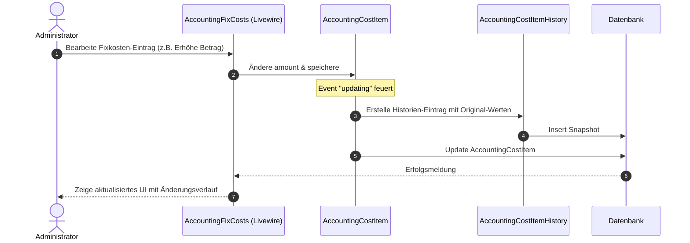

# Dokumentation: Buchhaltung - Fixkosten

Das Fixkosten-Modul dient der Verwaltung und Überwachung aller wiederkehrenden Ausgaben und Einnahmen des Unternehmens (wie Mieten, Software-Lizenzen, Versicherungen oder Gehälter). Es bietet automatische Fälligkeitsberechnungen, Vertragsdokument-Verknüpfungen und eine lückenlose Änderungshistorie.

## 1. Zielsetzung & Funktionsumfang
*   **Wiederkehrende Zahlungsströme:** Erfassung periodischer Posten mit flexiblen Zahlungsintervallen (monatlich, quartalsweise, halbjährlich, jährlich).
*   **Historisierung von Kostenänderungen:** Automatische Protokollierung jeder Änderung an einem Kostenpunkt (z. B. Preisanpassungen bei Software-Lizenzen) zur Wahrung der Nachvollziehbarkeit.
*   **Kündigungs-Assistent:** Generierung rechtsgültiger Kündigungsschreiben als PDF auf Basis der hinterlegten Vertragsdaten direkt aus dem System.

---

## 2. Datenstruktur & Historisierung

### Datenbankmodelle
*   **[AccountingGroup](file:///wsl.localhost/Ubuntu/home/ubuntuxina/meine-projekte/seelenfunke/app/Models/Accounting/AccountingGroup.php):** Strukturiert Fixkosten in logische Gruppen (z. B. "Server & Hosting", "Büromiete").
*   **[AccountingCostItem](file:///wsl.localhost/Ubuntu/home/ubuntuxina/meine-projekte/seelenfunke/app/Models/Accounting/AccountingCostItem.php):** Repräsentiert das konkrete wiederkehrende Element mit Betrag, Fälligkeitsdatum (`first_payment_date`), Kündigungsfrist, Steuersatz und Intervall (`interval_months`).
*   **[AccountingCostItemHistory](file:///wsl.localhost/Ubuntu/home/ubuntuxina/meine-projekte/seelenfunke/app/Models/Accounting/AccountingCostItemHistory.php):** Erfasst historische Zustände. Bei jedem Update eines `AccountingCostItem` wird ein Snapshot in dieser Tabelle abgelegt.

### Historisierungsprozess (Observer/Event-Logik)
Wenn ein Administrator den Betrag oder das Intervall eines Fixkostenpunktes ändert (z. B. Erhöhung der monatlichen Servermiete), wird vor dem Speichern der alte Zustand in `AccountingCostItemHistory` archiviert:
```php
AccountingCostItemHistory::create([
    'accounting_cost_item_id' => $item->id,
    'old_amount' => $item->getOriginal('amount'),
    'new_amount' => $item->amount,
    'old_interval_months' => $item->getOriginal('interval_months'),
    'new_interval_months' => $item->interval_months,
    'changed_by_admin_id' => auth('admin')->id(),
    'changed_at' => now(),
]);
```
Dies erlaubt die korrekte historische Auswertung vergangener Monate in der Jahresmatrix des Analyse-Moduls.

---

## 3. Steuerungslogik & Backend-Komponenten

### Livewire-Controller: [AccountingFixCosts](file:///wsl.localhost/Ubuntu/home/ubuntuxina/meine-projekte/seelenfunke/app/Livewire/Shop/Accounting/AccountingFixCosts.php)
Der Controller regelt das Erstellen, Bearbeiten und Löschen von Kostenpunkten und Gruppen. Er bietet zudem den Kündigungsfrist-Wächter, der optisch warnt, wenn sich Kündigungstermine nähern.

### Kündigungsschreiben-Generator (PDF Streaming)
Das Modul kann für Verträge mit hinterlegten Laufzeit- und Kündigungsdaten ein standardisiertes Kündigungsschreiben im PDF-Format generieren:
1.  Der Administrator klickt auf "Kündigungsschreiben generieren".
2.  Der Controller ermittelt die Kündigungsadresse des Vertragspartners sowie das nächstmögliche Vertragsende anhand der hinterlegten Laufzeitdaten.
3.  Unter Verwendung des PDF-Layouts `accounting-cancellation-contract` wird ein Kündigungs-PDF gestreamt:
    ```php
    $pdf = Pdf::loadView('global.pdf.accounting-cancellation-contract', [
        'costItem' => $costItem,
        'proprietor' => shop_setting('owner_proprietor', 'Alina Steinhauer'),
        'company' => shop_setting('company_name', 'Mein Seelenfunke'),
        'date' => now()->format('d.m.Y')
    ]);
    return response()->streamDownload(function () use ($pdf) {
        echo $pdf->output();
    }, 'Kuendigung_' . Str::slug($costItem->name) . '.pdf');
    ```

---

## 4. Technischer Datenfluss


