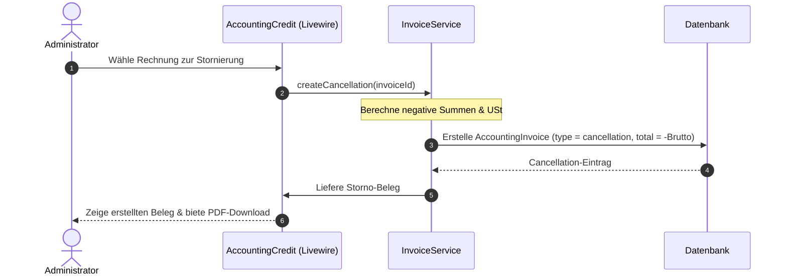

# Dokumentation: Buchhaltung - Gutschriften

Das Gutschriften-Modul verwaltet manuelle Rückerstattungen, Stornierungen und Gutschriften für Kunden. Es stellt sicher, dass Rechnungsstornierungen gesetzeskonform erfasst, negative steuerliche Anpassungen verbucht und die Umsatzzahlen im Analyse- und Steuer-Modul automatisch korrigiert werden.

## 1. Zielsetzung & Steuerliche Logik
*   **Rechtssichere Rechnungskorrektur:** Gesetzeskonforme Aufhebung oder Reduzierung von Forderungen durch Stornorechnungen (`cancellation`) oder Gutschriften (`credit_note`).
*   **Steuerliche Minderung:** Korrekte Minderung der Umsatzsteuerschuld (Kz 81) bei Teil- oder Vollrückerstattungen.
*   **Negative Betragsführung:** Buchung von Stornierungen und Gutschriften mit negativen Vorzeichen in der Datenbank, um die mathematische Summenbildung im Analyse-Modul ohne komplexe Zusatzabfragen zu ermöglichen.

---

## 2. Datenstruktur & Typenunterscheidung

Das System nutzt die Tabelle [AccountingInvoice](file:///wsl.localhost/Ubuntu/home/ubuntuxina/meine-projekte/seelenfunke/app/Models/Accounting/AccountingInvoice.php) für alle Ausgangsbelege. Die Unterscheidung erfolgt über das Feld `type`:

*   **`invoice`:** Reguläre Ausgangsrechnung (positive Werte).
*   **`cancellation`:** Stornierung einer kompletten Rechnung (negative Werte, 1:1 Kopie der Originalrechnung mit negativem Vorzeichen).
*   **`credit_note`:** Manuelle oder teilbezogene Gutschrift (z.B. Kulanz-Rückerstattung, negative Werte).

### Steuerlicher Minderungseffekt
Im Steuer-Modul [AccountingTax](file:///wsl.localhost/Ubuntu/home/ubuntuxina/meine-projekte/seelenfunke/app/Livewire/Shop/Accounting/AccountingTax.php) werden Gutschriften und Stornierungen bei der Berechnung der Umsatzsteuer abgefragt und reduzieren direkt das steuerpflichtige Volumen:
```php
// Gutschriften und Stornos abfragen (Liefern negative Beträge)
$creditNotes = AccountingInvoice::whereYear('invoice_date', $year)
    ->whereMonth('invoice_date', $month)
    ->whereIn('type', ['credit_note', 'cancellation'])
    ->get();

foreach ($creditNotes as $cn) {
    $revenueGross += $cn->total / 100;       // Reduziert Bruttoumsatz
    $vatCollected += $cn->tax_amount / 100;  // Reduziert abzuführende USt
}
```

---

## 3. Steuerungslogik & Backend-Komponenten

### Livewire-Controller: [AccountingCredit](file:///wsl.localhost/Ubuntu/home/ubuntuxina/meine-projekte/seelenfunke/app/Livewire/Shop/Accounting/AccountingCredit.php)
Der Controller verwaltet das Interface für Gutschriften. Er erlaubt es dem Administrator, für bestehende Rechnungen Gutschriften zu erstellen oder freie, manuelle Gutschriften an Kunden auszustellen.

### Rechnungs-Service: [InvoiceService](file:///wsl.localhost/Ubuntu/home/ubuntuxina/meine-projekte/seelenfunke/app/Services/InvoiceService.php)
Kapselt die PDF-Generierung und Validierung.
*   **Belegs-Verknüpfung:** Jede Stornierung referenziert die Original-Rechnungsnummer im Feld `ref_invoice_number` zur lückenlosen Nachvollziehbarkeit bei Betriebsprüfungen.
*   **Nummernkreis:** Gutschriften erhalten einen eigenen eindeutigen Nummernkreis (z. B. `GS-2026-0001`).

---

## 4. Technischer Datenfluss


