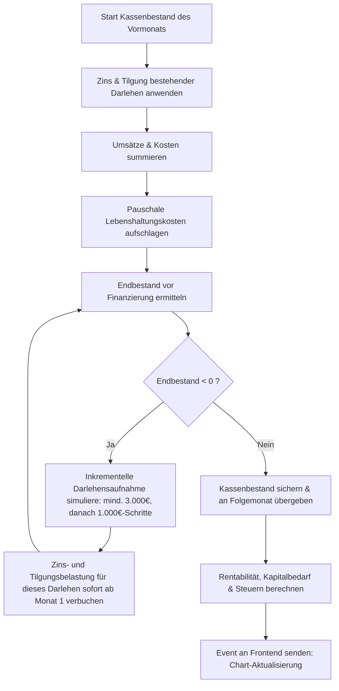

# Liquiditätsplanung

Die Liquiditätsplanung ermöglicht eine dynamische 3-Jahres-Vorschau der Zahlungsströme des Unternehmens. Sie verknüpft historische Geschäftsdaten (Livedaten) mit vordefinierten Businessplan-Szenarien und simuliert zukünftige Kassenbestände, um Liquiditätsengpässe frühzeitig zu erkennen.

## Zielsetzung
Das primäre Ziel des Moduls ist die Sicherstellung der jederzeitigen Zahlungsfähigkeit (Liquidität) des Unternehmens. Sollte der simulierte Kontostand unter Null sinken, berechnet das System automatisch den benötigten Finanzierungsbedarf (Darlehenssimulation) und verplant Zins- und Tilgungsraten nach IHK-Standard.

---

## Beteiligte Komponenten & Klassen

### Datenbank-Modelle
- [AccountingGroup](file:///wsl.localhost/Ubuntu/home/ubuntuxina/meine-projekte/seelenfunke/app/Models/Accounting/AccountingGroup.php): Gruppierung von wiederkehrenden Kostenstellen (z.B. Fixkosten, Raumkosten, Versicherungen).
- [AccountingCostItem](file:///wsl.localhost/Ubuntu/home/ubuntuxina/meine-projekte/seelenfunke/app/Models/Accounting/AccountingCostItem.php): Einzelne wiederkehrende Kosten- oder Einnahmen-Einträge mit Zahlungsintervallen und Fälligkeiten.
- [AccountingSpecialIssue](file:///wsl.localhost/Ubuntu/home/ubuntuxina/meine-projekte/seelenfunke/app/Models/Accounting/AccountingSpecialIssue.php): Einmalige Einnahmen und Ausgaben (z.B. Gründungs-Investitionen, Steuernachzahlungen).
- [OrderOrder](file:///wsl.localhost/Ubuntu/home/ubuntuxina/meine-projekte/seelenfunke/app/Models/Order/OrderOrder.php): Einspielen bezahlter Kundenbestellungen als Forderungseingänge (`sales`).
- [SystemSetting](file:///wsl.localhost/Ubuntu/home/ubuntuxina/meine-projekte/seelenfunke/app/Models/System/SystemSetting.php): Speicherung der Planungskonfiguration unter dem Schlüssel `liquidity_planner_config` (Startjahr, Zinsfuss, Tilgungsdauer, Demo-Daten-Flag).

### Livewire-Controller
- [AccountingLiquidity](file:///wsl.localhost/Ubuntu/home/ubuntuxina/meine-projekte/seelenfunke/app/Livewire/Shop/Accounting/AccountingLiquidity.php): Kern-Controller zur Steuerung der Benutzeroberfläche, Aktualisierung der Werte und Berechnung des Liquiditäts- und Rentabilitätsstatus.

---

## Technischer Ablauf & Berechnungslogik

### 1. Dateninjektion & Livedaten-Abgleich
Bei der Initialisierung (`mount`) oder dem manuellen Sync (`syncLiveData`) lädt der Controller:
1. **Businessplan-Szenario:** Wenn `load_demo_data` aktiv ist, werden vordefinierte Werte für Gründungsinvestitionen (z.B. Laser-Maschinen mit 7.815 €), Marketingkosten und standardmäßige Umsatzprognosen für das 1. bis 3. Jahr injiziert.
2. **Livedaten-Abgleich:** Paid Orders aus [OrderOrder](file:///wsl.localhost/Ubuntu/home/ubuntuxina/meine-projekte/seelenfunke/app/Models/Order/OrderOrder.php) überschreiben die Planzahlen im entsprechenden Monat. Wiederkehrende Verträge aus [AccountingCostItem](file:///wsl.localhost/Ubuntu/home/ubuntuxina/meine-projekte/seelenfunke/app/Models/Accounting/AccountingCostItem.php) werden anhand ihres Intervalls (`interval_months`) und Startdatums (`first_payment_date`) taggenau den Monaten zugeordnet.

### 2. Der Berechnungszyklus (`calculate`)
Die Berechnung läuft monatsweise chronologisch über alle 3 Jahre ab:

### 3. Sonderlogiken & IHK-Konformität
- **Lebenshaltungskosten:** Das System zwingt zur Einrechnung privater Lebenshaltungskosten (450 € im Startjahr als Pauschale, ansteigend auf mind. 1.800 € in Y2 und mind. 2.000 € in Y3), um eine realistische Existenzgrundlage zu planen.
- **Sofortige Belastung:** Neu aufgenommene Darlehen generieren noch im Monat der Auszahlung die erste Zins- und Tilgungsrate, um Liquiditätslöcher durch Ratenverzögerungen zu verhindern.
- **Steuersimulationen:** 
  - **Umsatzsteuer:** Monatlicher Abgleich von eingenommener USt aus Verkäufen und gezahlter Vorsteuer aus Wareneinkauf, Werbung, Büro- und Raumkosten.
  - **Gewerbesteuer:** Errechnung auf Basis des Rentabilitätsgewinns abzüglich des Freibetrags (24.500 €) unter Anwendung des Hebesatzes (380%).
  - **Einkommensteuer:** Progressiver Steuersatz (14% bis 42%) basierend auf dem zu versteuernden Gewinn zuzüglich staatlicher Zuschüsse (ALG 1 / Gründerzuschuss) unter Einbeziehung des Progressionsvorbehalts.

---

## Schnittstellen & Visualisierung
Nach Abschluss der mathematischen Routinen wird das Event `update-liquidity-chart` mit den aufbereiteten Monatswerten geworfen. Ein Frontend-Widget rendert einen interaktiven Kombi-Chart (Kassenbestand als Linie, Ein- und Auszahlungen als Säulen) zur intuitiven Überwachung. Zudem wird eine Risikobewertung ausgegeben (z.B. Unterdeckungs-Hinweise in der Vorgründungsphase vs. echte Insolvenzgefahr).

Ein PDF-Export des kompletten 3-Jahres-Plans ist direkt über die Livewire-Komponente via DomPDF implementiert.
