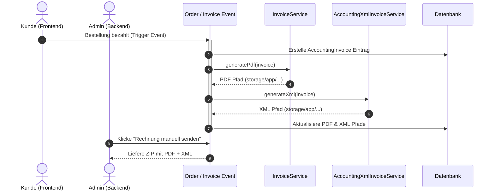

# Dokumentation: Buchhaltung - Rechnungen (PDF & E-Rechnung XML)

Das Rechnungs-Modul steuert die Erstellung, Validierung und Bereitstellung von Kundenbelegen. Neben der Generierung von klassischen PDF-Belegen erfüllt das System die gesetzlichen Vorgaben zur E-Rechnungspflicht durch die Erstellung von strukturierten XML-Rechnungen nach dem europäischen Standard EN 16931.

## 1. Zielsetzung & Rechnungs-Pipelines
*   **Gesetzeskonforme E-Rechnung:** Automatische Erstellung strukturierter Rechnungsdatensätze (XRechnung/ZUGFeRD) im XML-Format bei jedem Kauf.
*   **Automatisierte Beleg-Generierung:** Asynchrone Erstellung von druckfertigen PDF-Rechnungen bei Zahlungseingang oder Bestellabschluss.
*   **Kundenportal-Integration:** Direkte Bereitstellung aller Rechnungen für Endkunden zur Entlastung des Supports.

---

## 2. Datenstruktur & Modelle

*   **[AccountingInvoice](file:///wsl.localhost/Ubuntu/home/ubuntuxina/meine-projekte/seelenfunke/app/Models/Accounting/AccountingInvoice.php):** Das zentrale Journal für alle Rechnungsbelege im Shop. Speichert Belegnummern, Brutto-/Netto-Summen, Steuersätze, Kundendaten und PDF-/XML-Dateipfade.
*   **[OrderOrder](file:///wsl.localhost/Ubuntu/home/ubuntuxina/meine-projekte/seelenfunke/app/Models/Order/OrderOrder.php):** Die zugrunde liegende Kundenbestellung, aus der die Rechnungspositionen und Steuerinformationen abgeleitet werden.

---

## 3. Die Generierungs-Pipelines

### A. PDF-Pipeline: [InvoiceService](file:///wsl.localhost/Ubuntu/home/ubuntuxina/meine-projekte/seelenfunke/app/Services/InvoiceService.php)
Der `InvoiceService` generiert das Kunden-PDF unter Verwendung der `barryvdh/laravel-dompdf` Bibliothek.
1.  **Template-Mapping:** Die Bestelldaten werden in ein minimalistisches, CI-konformes HTML-Layout (`global.pdf.invoice`) geladen.
2.  **Berechnung & Runden:** Beträge werden in Cents berechnet und erst beim Rendern durch Division durch 100 in Euro umgerechnet, um Rundungsfehler zu vermeiden.
3.  **Lokaler Speicher:** Das generierte PDF wird im geschützten Bereich `storage/app/local/buchhaltung/invoices/` abgelegt.

### B. E-Rechnungs XML-Pipeline: [AccountingXmlInvoiceService](file:///wsl.localhost/Ubuntu/home/ubuntuxina/meine-projekte/seelenfunke/app/Services/AccountingXmlInvoiceService.php)
Der XML-Service erzeugt eine gesetzeskonforme E-Rechnungs-XML (UBL-Syntax) nach dem Standard EN 16931:
*   **Pflichtfelder:** Der Service mappt Steuer-Identifikationsnummern, Bankdaten des Verkäufers, Leitweg-ID des Käufers (bei B2B-Behörden) sowie die standardisierten UN/ECE Steuercodes.
*   **ZUGFeRD Integration:** Ermöglicht die Einbettung dieses XML-Datensatzes als Metadatum (`factur-x.xml`) in das Kunden-PDF (Hybrid-Rechnung), sodass sowohl Menschen (PDF) als auch Maschinen (XML) das Dokument einlesen können.

---

## 4. Steuerungs-Komponenten & Frontend-Integration

*   **Livewire-Controller: [AccountingInvoice](file:///wsl.localhost/Ubuntu/home/ubuntuxina/meine-projekte/seelenfunke/app/Livewire/Shop/Accounting/AccountingInvoice.php):** Das administrative Dashboard zur Suche, Stornierung und zum manuellen Nachdruck von Rechnungsbelegen.
*   **Livewire-Controller: [AccountingInvoicePreview](file:///wsl.localhost/Ubuntu/home/ubuntuxina/meine-projekte/seelenfunke/app/Livewire/Shop/Accounting/AccountingInvoicePreview.php):** Bietet eine integrierte PDF-Vorschau direkt in der Administrationsoberfläche.
*   **Kunden-Komponente: [CustomerInvoicesComponent](file:///wsl.localhost/Ubuntu/home/ubuntuxina/meine-projekte/seelenfunke/app/Livewire/Customer/CustomerInvoicesComponent.php):** Ermöglicht Kunden im Frontend-Profil den direkten Download ihrer PDF- und XML-Rechnungen.

---

## 5. Technischer Datenfluss

