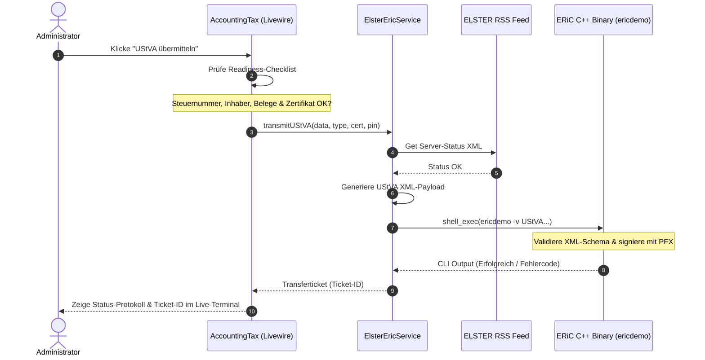

# Dokumentation: Buchhaltung - Steuern (ELSTER & ERiC-API)

Das Steuer-Modul berechnet die monatliche oder vierteljährliche Umsatzsteuer-Voranmeldung (UStVA) dynamisch anhand der erfassten Einnahmen und Ausgaben. Es bietet eine direkte, hochsichere Schnittstelle zu den Finanzbehörden über das offizielle ERiC-Modul (ElsterRichClient) der Steuerverwaltung.

## 1. Zielsetzung & Steuerliche Logik
*   **Dynamische Zahllast-Ermittlung:** Kontinuierliche Berechnung der abzuführenden Umsatzsteuer (aus Shop-Bestellungen und manuellen Rechnungen) abzüglich der gezahlten Vorsteuer (aus Fixkosten und Belegen).
*   **DATEV- & ELSTER-Konformität:** Exportieren von Buchungsstapeln im standardisierten DATEV EXTF-Format und direktes Übertragen der Nutzdaten via XML-Schnittstelle.
*   **ERiC-Integration:** Direkte Ausführung des nativen C++ ERiC-Bibliotheken-Stacks auf dem Host-System zur authentifizierten Datenübermittlung.

---

## 2. Die UStVA-Checkliste (Pre-Flight)

Vor jeder Übertragung an das Finanzamt erzwingt [AccountingTax](file:///wsl.localhost/Ubuntu/home/ubuntuxina/meine-projekte/seelenfunke/app/Livewire/Shop/Accounting/AccountingTax.php) eine dreistufige Validierung:

1.  **Stammdaten-Validierung:** Vorhandensein von Steuernummer (`owner_tax_id`) und Inhaber-Name (`owner_proprietor`) in den Shop-Einstellungen.
2.  **Beleg-Vollständigkeit:** 100%-ige Belegprüfung aller gewerblichen Ausgaben. Jedes `AccountingCostItem` und `AccountingSpecialIssue` im gewählten Monat muss eine verknüpfte PDF- oder Bilddatei besitzen. Fehlende Belege können direkt im Panel inline nachgeladen werden.
3.  **Zertifikats-Tresor:** Das gewählte Software-Zertifikat (`.pfx`) muss physisch im sicheren Verzeichnis `storage/app/erictresor/` vorhanden sein.

---

## 3. Native ERiC C++ Integration

Die Übertragung an das Finanzamt erfolgt über den [ElsterEricService](file:///wsl.localhost/Ubuntu/home/ubuntuxina/meine-projekte/seelenfunke/app/Services/ElsterEricService.php):

### A. Server-Statusabfrage via RSS
Vor dem Absenden fragt das System den offiziellen ELSTER-RSS-Feed (`https://www.elster.de/elsterweb/serverstatus_rss.xml`) ab und analysiert den Status für den Knoten *Anmeldungssteuern (authentifiziert)*. Liegt eine Störung vor, wird die Übermittlung abgebrochen, um Timeouts zu vermeiden.

### B. Sandbox & Test-Modus
Befindet sich die Applikation im Testmodus (`ERIC_TEST_MODE=true`), greifen folgende Sicherheits-Leitplanken zur Vermeidung irrtümlicher Echt-Übertragungen:
*   Die Steuernummer wird hart auf die offizielle ELSTER-Sandbox-Steuernummer `9111081508152` umgeschrieben.
*   Die Finanzamts-ID wird auf `9111` (München) gesetzt.
*   Das XML-Dokument erhält den `<Testmerker>700000004</Testmerker>`, wodurch ELSTER die Nutzdaten ausschließlich im Sandbox-System verarbeitet.

### C. Nativer C++ Binary-Call
Falls das kompilierte C++ Executable `ericdemo` im Zertifikats-Tresor existiert und `ERIC_USE_NATIVE_BINARY=true` gesetzt ist, startet der Service einen Low-Level-Prozess auf dem Linux/Ubuntu-System:
1.  **Payload-Generierung:** Das XML-Dokument wird nach dem offiziellen Finkonsens-Schema strukturiert.
2.  **Kommandozeilen-Kopplung:** Aufruf des Binaries mit Pfaden zum Zertifikat, der XML-Nutzdatei, dem Antwort-Ausgabepfad und dem Pfad zu den geteilten C++ Bibliotheken (`libericapi.so`):
    ```bash
    ./ericdemo -v UStVA_2023 -x [temp_in.xml] -s [temp_out.xml] -d [lib_dir] -l [vault_dir] -c [cert.pfx] -p [pin]
    ```
3.  **Fehler-Parsing & Logging:** Schlägt der CLI-Aufruf fehl, extrahiert der Service die letzten Log-Meldungen aus `eric.log` sowie die XML-Fehlermeldungen aus dem Ausgabe-Dokument und wirft eine detaillierte Laravel-Exception, die im Log-Terminal des Livewire-UIs angezeigt wird.

---

## 4. Berechnungsmodell & Technischer Ablauf

*   **Umsatzsteuer (Kz 81):** Summe der Steuerbeträge aller Bestellungen mit Status `paid` im Abrechnungsmonat minus Steuerbeträge aus Gutschriften/Stornos (`credit_note`, `cancellation`).
*   **Abziehbare Vorsteuer (Kz 66):** Summe der gezahlten Steuern aus verbuchten variablen Ausgaben und wiederkehrenden Fixkosten.
*   **Zahllast (Kz 83):**
    $$\text{Zahllast} = \text{Umsatzsteuer} - \text{Vorsteuer}$$


