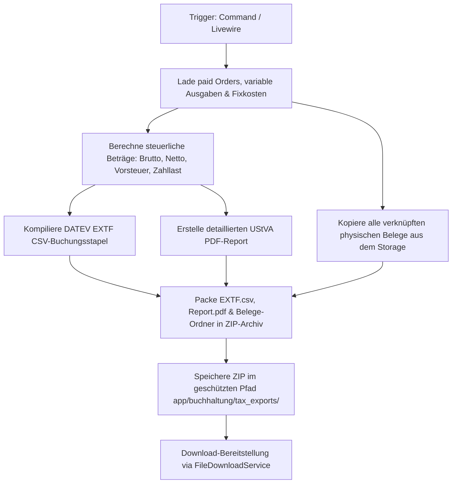

# Systemsteuerung (Buchhaltung)

Die Systemsteuerung im Bereich Buchhaltung steuert die finanztechnischen Parameter der Anwendung (z.B. Umsatzsteuersätze, Kleinunternehmerregelung, Stripe-API-Keys) und stellt Schnittstellen für den steuerlichen Export an den Steuerberater bereit (DATEV EXTF-Export).

## Zielsetzung
Das Modul dient als Brücke zwischen der operativen E-Commerce-Plattform und der externen Buchhaltung. Es verarbeitet Rechnungen, Transaktionen und Belege zu standardisierten DATEV-Stapeln und stellt sicher, dass alle steuerrelevanten Stammdaten zentral konfigurierbar und gesichert sind. Zudem beinhaltet es ein Notfall-Handbuch für den digitalen Nachlass im Todesfall (/notfall).

---

## Beteiligte Komponenten & Klassen

### Datenbank-Modelle
- [SystemSetting](file:///wsl.localhost/Ubuntu/home/ubuntuxina/meine-projekte/seelenfunke/app/Models/System/SystemSetting.php): Speichert globale Parameter wie `is_small_business` (§ 19 UStG), `default_tax_rate`, Bankdaten (IBAN, BIC) und Stripe-Zugangsdaten.
- [Admin](file:///wsl.localhost/Ubuntu/home/ubuntuxina/meine-projekte/seelenfunke/app/Models/Admin/Admin.php): Repräsentiert den Inhaber/Betreiber und speichert persönliche Steuerdaten wie Finanzamtsnummer, Steuer-ID und Sozialversicherungsnummer.
- [SystemCronjob](file:///wsl.localhost/Ubuntu/home/ubuntuxina/meine-projekte/seelenfunke/app/Models/System/SystemCronjob.php): Steuert automatische Ausführungspläne für Steuer-Exporte und Datenprüfungen.

### Livewire-Controller
- [SystemShopConfig](file:///wsl.localhost/Ubuntu/home/ubuntuxina/meine-projekte/seelenfunke/app/Livewire/Shop/System/SystemShopConfig.php): Ermöglicht Inhabern, steuerliche Parameter einzustellen, Notfall-Kontakte zu verwalten und das Notfall-Handbuch als PDF via DomPDF zu generieren (`generateEmergencyPdf()`).
- [AccountingTax](file:///wsl.localhost/Ubuntu/home/ubuntuxina/meine-projekte/seelenfunke/app/Livewire/Shop/Accounting/AccountingTax.php): Manuelle Triggerschnittstelle zur Erstellung des DATEV-Export-Archivs im Backend.

### Services & Commands
- [FinancialService](file:///wsl.localhost/Ubuntu/home/ubuntuxina/meine-projekte/seelenfunke/app/Services/FinancialService.php): Erstellt monatliche Finanzberichte, aggregiert Umsatzstatistiken und bündelt Belege.
- [FileDownloadService](file:///wsl.localhost/Ubuntu/home/ubuntuxina/meine-projekte/seelenfunke/app/Services/Export/FileDownloadService.php): Dient als Dateiauslieferer. Regelt den Download von Rechnungsstapeln aus dem internen Speicher.
- [GenerateTaxExport](file:///wsl.localhost/Ubuntu/home/ubuntuxina/meine-projekte/seelenfunke/app/Console/Commands/GenerateTaxExport.php): Konsolen-Befehl (`generate-tax-export`), welcher vollautomatisiert (z. B. via Cronjob) einmal im Monat die Umsatzsteuer-Voranmeldung (UStVA) vorbereitet, CSVs und PDFs erstellt und als signiertes ZIP verpackt.

---

## Technischer Datenfluss & Export-Pipeline

Das System generiert bei Anforderung (manuell oder zeitgesteuert) ein exportfähiges Archiv im Format `TaxExport_[Year]_[Month].zip`:

### DATEV EXTF CSV-Format
Der erstellte CSV-Buchungsstapel entspricht dem offiziellen DATEV-Standard mit UTF-8 zu Windows-1252 Codierung:
1. **Header-Zeile:** Definiert das Importformat (`"EXTF"`, Version `700`, Kategorie `Buchungsstapel`, etc.).
2. **Umsatzzeilen:**
   - **Kundenbestellungen:** `Soll-Konto: 1200` (Bank), `Haben-Konto: 8400` (Erlöse 19% USt).
   - **Ausgaben / Fixkosten:** `Soll-Konto: 4900` (Sonstige betriebliche Aufwendungen), `Haben-Konto: 1200` (Bank).
3. **Belegfeld-Verknüpfung:** Jede Buchung erhält das Belegdatum (Format `dm`) sowie die Bestellnummer (`Belegfeld 1`) zur automatischen Zuordnung durch das Buchhaltungsprogramm des Steuerberaters.
