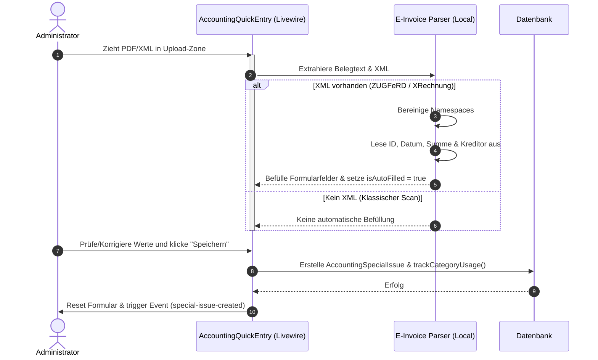

# Dokumentation: Buchhaltung - Variable Kosten & E-Rechnungs-Parser

Das Modul für variable Kosten erfasst unregelmäßige Betriebsausgaben (wie Büromaterial, Werbekosten, Reisekosten oder Wareneinkäufe). Ein intelligenter E-Rechnungs-Parser extrahiert strukturierte Daten direkt aus hochgeladenen PDF- oder XML-Belegen und minimiert die manuelle Dateneingabe.

## 1. Zielsetzung & Funktionsumfang
*   **Variable Belegerfassung:** Schnellere manuelle und automatisierte Erfassung von Betriebsausgaben mit Beleg-Upload.
*   **Magic Upload (CII/UBL Parser):** Automatisches Auslesen hochgeladener E-Rechnungen (ZUGFeRD & XRechnung) zur automatischen Befüllung des Eingabeformulars.
*   **Lernendes Kategorie-System:** Automatische Erfassung und Frequenzanalyse genutzter Ausgabenkategorien zur Bereitstellung intelligenter Autocomplete-Vorschläge.

---

## 2. Der E-Rechnungs-Parser (Magic Upload)

Die automatische Datenextraktion wird im Livewire-Controller [AccountingQuickEntry](file:///wsl.localhost/Ubuntu/home/ubuntuxina/meine-projekte/seelenfunke/app/Livewire/Shop/Accounting/AccountingQuickEntry.php) ausgeführt. Der Parser unterstützt zwei Hauptstandards:

### A. ZUGFeRD / CrossIndustryInvoice (CII)
Das System entfernt Namespaces mittels Regex, um Pfad-Abfragen robuster zu gestalten, und extrahiert folgende Datenpunkte:
*   **Rechnungsnummer:** `ExchangedDocument -> ID`
*   **Belegdatum:** `ExchangedDocument -> IssueDateTime -> DateTimeString` (unterstützt ZUGFeRD Format 102 `YYYYMMDD` und ISO-Formate).
*   **Bruttobetrag:** `SupplyChainTradeTransaction -> ApplicableHeaderTradeSettlement -> SpecifiedTradeSettlementHeaderMonetarySummation -> GrandTotalAmount`
*   **Kreditor (Verkäufer):** `SupplyChainTradeTransaction -> ApplicableHeaderTradeAgreement -> SellerTradeParty -> Name`

### B. XRechnung / Universal Business Language (UBL)
Falls UBL-Tags gefunden werden, extrahiert der Parser:
*   **Rechnungsnummer:** `ID`
*   **Belegdatum:** `IssueDate`
*   **Bruttobetrag:** `LegalMonetaryTotal -> TaxInclusiveAmount`
*   **Kreditor:** `AccountingSupplierParty -> Party -> PartyName -> Name`

### C. PDF-Extraktion ohne externe Bibliotheken
Um Server-Ressourcen zu schonen und Abhängigkeiten zu reduzieren, implementiert das System ein reguläres Suchmuster, das eingebettete XML-Ströme direkt aus dem Binär-Inhalt von Hybrid-PDFs (ZUGFeRD) extrahiert:
```php
$pattern = '/<rsm:CrossIndustryInvoice.*?<\/rsm:CrossIndustryInvoice>/s';
if (preg_match($pattern, $pdfContent, $matches)) {
    return $matches[0]; // Liefert das eingebettete XML zurück
}
```

---

## 3. Datenbankstruktur & Kategorienverwaltung

*   **[AccountingSpecialIssue](file:///wsl.localhost/Ubuntu/home/ubuntuxina/meine-projekte/seelenfunke/app/Models/Accounting/AccountingSpecialIssue.php):** Speichert den Ausgabenbeleg (Titel, Betrag, Ausführungsdatum, Steuersatz, Rechnungsnummer, verknüpfte Datei-Pfade in `file_paths`).
*   **[AccountingCategory](file:///wsl.localhost/Ubuntu/home/ubuntuxina/meine-projekte/seelenfunke/app/Models/Accounting/AccountingCategory.php):** Verwaltet Kategorien. Bei jeder Buchung wird `usage_count` erhöht. Dies sortiert die Kategorie-Dropdowns im UI nach Frequenz und schlägt dem Admin die wahrscheinlichste Kategorie vor.

---

## 4. Technische Komponenten & Datenfluss

*   **Livewire-Controller: [AccountingVariableCosts](file:///wsl.localhost/Ubuntu/home/ubuntuxina/meine-projekte/seelenfunke/app/Livewire/Shop/Accounting/AccountingVariableCosts.php):** Bietet die Haupttabelle zur Übersicht, Filterung und Bearbeitung aller variablen Belege.
*   **Livewire-Komponente: [AccountingQuickEntry](file:///wsl.localhost/Ubuntu/home/ubuntuxina/meine-projekte/seelenfunke/app/Livewire/Shop/Accounting/AccountingQuickEntry.php):** Das Erfassungsformular. Nimmt Belege per Drag & Drop entgegen, führt den Parsing-Prozess aus und aktualisiert nach dem Speichern über ein globales Event (`special-issue-created`) die Analyse-Ansicht.


