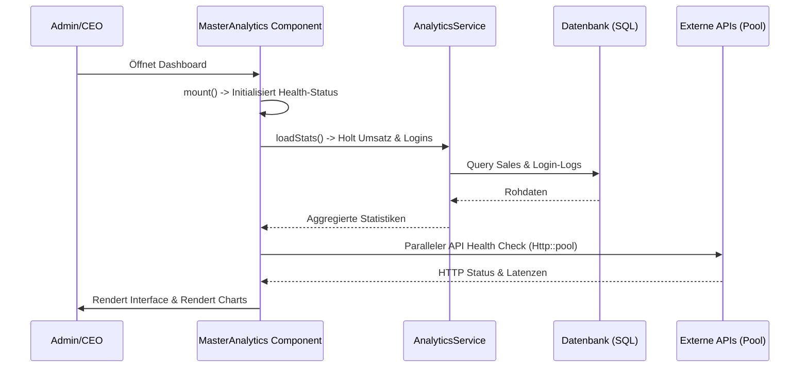

# System-Dokumentation: Admin-Dashboard (Master Analytics)

Das Admin-Dashboard (auch bekannt als **Master Analytics**) ist die zentrale Leitstelle des Projektes "Seelenfunke". Es dient dem CEO bzw. der Systemleitung als grafische und funktionale Schaltzentrale zur Überwachung der gesamten Geschäfts- und Systemprozesse.

---

## 1. Übersicht & Zielsetzung

Das Dashboard vereint zwei Hauptaufgabenbereiche:
1. **Business-Monitoring:** Aggregierte Auswertungen über Umsätze, Gewinne, offene Posten, Warenkörbe und Conversion-Rates (in Kooperation mit dem `AnalyticsService`).
2. **System-Infrastruktur-Monitoring (Health Check):** Echtzeit-Überprüfung aller lokalen Systemdienste und externen Schnittstellen (APIs), um Ausfälle sofort zu erkennen und zu protokollieren.

---

## 2. Technische System-Architektur

### 2.1 Livewire-Komponente
- **Klasse:** [`MasterAnalytics`](file:///wsl.localhost/Ubuntu/home/ubuntuxina/meine-projekte/seelenfunke/app/Livewire/Shop/Master/MasterAnalytics.php)
- **Layout:** `components.layouts.backend_layout` (Themen-basiertes Design `WithDepartmentTheming` mit Standard-Department `Architektur`).

### 2.2 Datenbank-Modelle
- **`App\Models\System\SystemCheckConfig`:** Speichert die benutzerspezifischen Filtereinstellungen des Dashboards (z. B. Start-/Enddatum, Filtertyp).
- **`App\Models\System\SystemLog`:** Protokolliert automatisierte Systemereignisse, KI-Aktionen und Infrastrukturausfälle.
- **`App\Models\System\SystemLoginAttempt`:** Erfasst fehlgeschlagene und erfolgreiche Anmeldeversuche für das integrierte Sicherheits-Monitoring.
- **`App\Models\Ai\AiAgent`:** Lädt die aktiven KI-Agenten und priorisiert den Leitungsagenten (CEO) an oberster Stelle.

---

## 3. Die Health-Check-Engine

Das Dashboard prüft asynchron die Erreichbarkeit und Integrität aller Kernkomponenten:

| Dienst / API | Prüfmethode | Fehlerbehandlung / Auswirkung |
| :--- | :--- | :--- |
| **Datenbank** | Verbindungsversuch per PDO & Latenzmessung | Schreibt bei Fehler in den `SystemLog` (max. 1x pro Stunde) |
| **SMTP (Mail)** | Socket-Verbindung zu Host & Port (`fsockopen`) | Erkennt Verbindungsblockaden (z. B. fehlende Ports) |
| **Redis / Cache** | Ping-Test über den Cache-Manager | Prüft vorab das Vorhandensein der PHP-Redis-Erweiterung |
| **Queue Worker** | Ermittlung der wartenden und fehlgeschlagenen Jobs | Warnung bei fehlgeschlagenen Jobs in der DB-Tabelle |
| **Scheduler** | Letzter Cronjob-Laufzeit-Abgleich aus dem Cache | Warnung, wenn kein Scheduler-Run in den letzten 10 Min. |
| **Backup** | Lokalisierung der neuesten ZIP-Datei auf der Backup-Disk | Warnung, wenn das letzte Backup älter als 48 Stunden ist |
| **Speicherplatz** | Auslesen des freien Speicherplatzes (`disk_free_space`) | Warnung bei < 20%, kritischer Fehler bei < 10% freiem Speicher |
| **Telephony Bridge** | HTTP-Check der Twilio WSS-Umleitung | Gibt Warnung bei Node-Bridge-Ausfällen auf dem Server aus |
| **WebSockets (Reverb)** | Port-Check (z. B. `6001`) des Reverb-Deamons | Meldet Ausfälle des WebSocket-Servers zur Live-Kommunikation |

### Asynchroner API-HTTP-Pool
Um Ladeverzögerungen auf dem Dashboard zu verhindern, werden externe HTTP-APIs parallel über `Http::pool` angepingt (Timeout: 4 Sekunden, ohne Redirects):
- **Stripe API** (`https://api.stripe.com/healthcheck`)
- **DHL API** (`https://api.dhl.com`)
- **finAPI** (Sandbox oder Live-Endpunkt)
- **Google Gemini** (`https://generativelanguage.googleapis.com`)
- **Google Maps** (`https://maps.googleapis.com`)
- **Elster RSS** (`https://www.elster.de/elsterweb/serverstatus_rss.xml`)
- **ScraperAPI** (`http://api.scraperapi.com`)

---

## 4. Die Self-Healing-Engine (`fixSystem`)

Wenn ein Fehler oder Warnzustand im System auftritt, bietet die Methode `fixSystem` automatisierte Heilungsfunktionen:

1. **Redis & Datenbank (Cache Reset):**
   Führt `config:clear` und `cache:clear` aus, um inkonsistente Konfigurationsdaten zu löschen.
2. **Queue (Worker-Neustart):**
   Triggert `queue:restart` zur Aktualisierung der Daemon-Prozesse und versucht fehlgeschlagene Jobs mittels `queue:retry all` erneut einzureihen.
3. **Scheduler (Cronjob-Trigger):**
   Erzwingt einen manuellen Durchlauf des Laravel-Schedulers über `schedule:run`.
4. **Backup (Notfall-Backup):**
   Triggert sofort ein physisches Datenbank-Backup per `backup:run --only-db`.
5. **WebSockets (Zombie-Reverb-Prozesse killen):**
   Kills verwaiste lokale Reverb-Prozesse per `pkill -f "reverb:start"`, um Ports freizugeben und einen sauberen Neustart zu ermöglichen.

---

## 5. Datenfluss und Diagramm

Ein neuer Dashboard-Aufruf initiiert folgenden Datenfluss:

