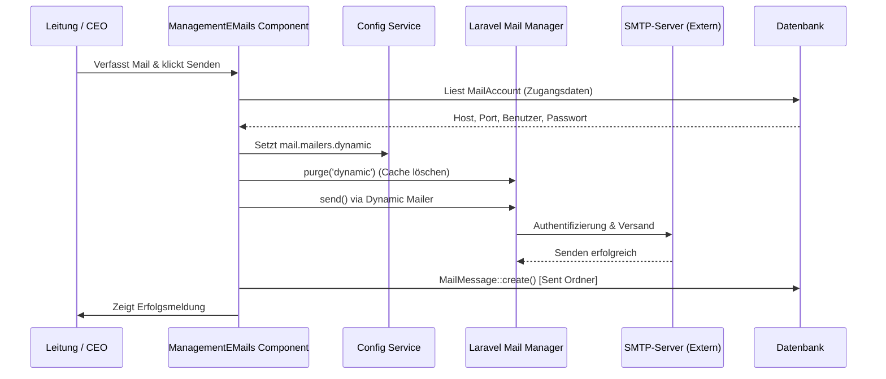

# System-Dokumentation: Leitung / E-Mail (CRM-Posteingang)

Das CRM-E-Mail-Modul ermöglicht die Integration von geschäftlichen und privaten E-Mail-Postfächern direkt im Administrationsbereich des ERP-Systems "Seelenfunke". Die Komponente dient dem CEO zur Verwaltung des Schriftverkehrs, Kundensupports und der Zuweisung von E-Mail-basierten Geschäftsprozessen.

---

## 1. Übersicht & Zielsetzung

- **Ziel:** Ein zentrales Mail-Interface, das native Ordnerstrukturen, SMTP-Versand, IMAP-Empfang, Spam-Abwehr und automatische Filterregeln bereitstellt.
- **Vorteil:** Verknüpfung von E-Mails direkt mit Kontaktdaten (`ManagementContact`) und Rechnungs-/Belegströmen, ohne dass das System verlassen werden muss.

---

## 2. Technische System-Architektur

### 2.1 Livewire-Komponente
- **Klasse:** [`ManagementEMails`](file:///wsl.localhost/Ubuntu/home/ubuntuxina/meine-projekte/seelenfunke/app/Livewire/Shop/Management/ManagementEMails.php)
- **Layout:** `components.layouts.backend_layout` (Department-Theme: `Leitung`)

### 2.2 Datenbank-Modelle (Namespaces unter `App\Models\Management\Mail`)
- **`MailAccount`:** Verwaltet Zugangsdaten für Postfächer. Enthält Server-Host, Ports, Verschlüsselungen (`ssl`/`tls`), Signaturen und Anzeigeeinstellungen.
- **`MailMessage`:** Repräsentiert die tatsächlichen empfangenen oder gesendeten E-Mails (inklusive Empfangsdatum, HTML/Plain-Body und gelesen-Status).
- **`MailAttachment`:** Bildet hochgeladene oder empfangene Anhänge ab (gespeichert im Storage-Ordner `leitung/inbox/attachments`).
- **`MailFolder`:** Speichert benutzerdefinierte, zusätzliche IMAP-Ordner für das jeweilige Konto.
- **`MailRule`:** Enthält automatisierte Regeln (z. B. Blacklists oder Ordner-Routing) basierend auf Kriterien wie Absender-Adresse.

---

## 3. Kernfunktionen & Datenfluss

### 3.1 Synchronisation und IMAP-Import (`syncMails`)
Der Import erfolgt asynchron im Hintergrund oder manuell über den Button "Synchronisieren" auf dem Dashboard:
- Triggert den Artisan-Befehl `crm:fetch-mails`.
- Die Mails werden per IMAP abgerufen und lokal persistiert.
- Bei Fehlern wird der Kontostatus auf `error` gesetzt.

### 3.2 Postfach-Konfigurations-Presets
Für gängige deutsche Provider sind IMAP/SMTP-Voreinstellungen hinterlegt:
- **T-Online:** `secureimap.t-online.de` / `securesmtp.t-online.de`
- **Gmail:** `imap.gmail.com` / `smtp.gmail.com`
- **GMX:** `imap.gmx.net` / `mail.gmx.net`
- **Mittwald:** `mail.agenturserver.de` (wird als primärer Webhost genutzt)

### 3.3 Dynamischer SMTP-Versand (`sendMail`)
Der Versand von E-Mails erfolgt dynamisch unter Umgehung der statischen `.env` Mailer-Einstellung:
1. Das ausgewählte `MailAccount`-Modell wird ausgelesen.
2. Die SMTP-Zugangsdaten werden zur Laufzeit in die Laravel-Konfiguration `mail.mailers.dynamic` injiziert.
3. Der Mails-Manager wird mittels `app('mail.manager')->purge('dynamic')` bereinigt, um die neuen Zugangsdaten sofort anzuwenden.
4. Die Mail wird gesendet. Eine Kopie wird im lokalen Ordner `Sent` abgelegt.

### 3.4 Automatisches Routing & Spam-Schutz (`markAsSpam`, `saveRoutingRule`)
- **Spam-Schutz:** Beim Verschieben einer Mail nach "Junk" wird automatisch eine `MailRule` vom Typ `blacklist` für den Absender angelegt. Zukünftige Mails dieses Absenders werden beim Fetching direkt als Spam einsortiert.
- **Routing:** Mails bestimmter Absender können über Regeln automatisch in vordefinierte Ordner verschoben werden.

---

## 4. Datenflussdiagramm (Versand)

