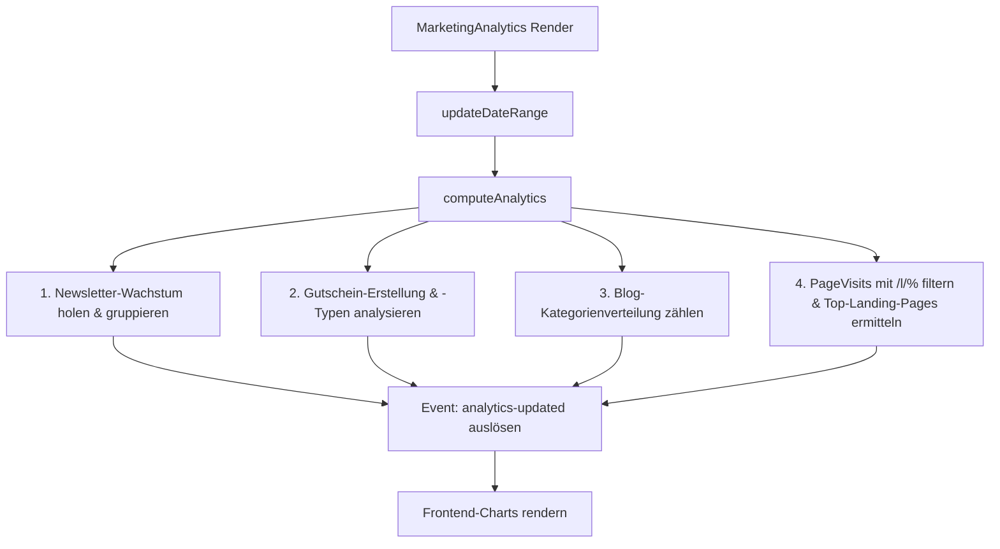

# Marketing - Analyse

Dieses Dokument beschreibt die technische Struktur und den Datenfluss des Marketing-Analyse-Moduls im Laravel-Projekt. Das Modul bereitet Marketing-Kennzahlen (Newsletter-Wachstum, Gutscheingenerierung, Blog-Kategorienverteilung, Gutscheintypen und Landing-Page-Aufrufe) für das Backend-Dashboard auf.

## Zielsetzung
Das Analyse-Modul bietet Administratoren eine aggregierte Übersicht über die Performance laufender Marketing-Aktivitäten. Durch die zeitliche Filterung (7, 30, 90, 365 Tage oder Gesamtlaufzeit) lassen sich Trends im Kundenverhalten und der Erfolg von Kampagnen ablesen.

---

## Beteiligte Komponenten & Modelle

### Livewire-Controller
* [MarketingAnalytics](file:///wsl.localhost/Ubuntu/home/ubuntuxina/meine-projekte/seelenfunke/app/Livewire/Shop/Marketing/MarketingAnalytics.php)
  * Verwaltet den Zustand der Filtereinstellungen (`$dateRange`).
  * Berechnet in `computeAnalytics()` die strukturierten Statistikdaten.
  * Löst das Livewire-Event `analytics-updated` für Frontend-Diagramme (Chart.js) aus.

### Verwendete Modelle
* [MarketingNewsletterSubscriber](file:///wsl.localhost/Ubuntu/home/ubuntuxina/meine-projekte/seelenfunke/app/Models/Marketing/MarketingNewsletterSubscriber.php)
  * Wird herangezogen, um das Wachstum der verifizierten Abonnenten zu messen (`is_verified = true`).
* [MarketingVoucher](file:///wsl.localhost/Ubuntu/home/ubuntuxina/meine-projekte/seelenfunke/app/Models/Marketing/MarketingVoucher.php)
  * Liefert die Anzahl und Typen (`percentage`, `absolute`, `shipping`) der erstellten Gutscheine.
* [MarketingBlogPost](file:///wsl.localhost/Ubuntu/home/ubuntuxina/meine-projekte/seelenfunke/app/Models/Marketing/MarketingBlogPost.php)
  * Wird über die Relation `category` geladen, um die Verteilung von Blog-Artikeln nach Kategorien aufzuzeigen.
* [PageVisit](file:///wsl.localhost/Ubuntu/home/ubuntuxina/meine-projekte/seelenfunke/app/Models/Tracking/PageVisit.php)
  * Zeichnet Seitenaufrufe im Frontend auf. Aufrufe mit dem Pfadmuster `/l/%` werden als Landing-Page-Visits gefiltert und ausgewertet.
* [MarketingLandingPage](file:///wsl.localhost/Ubuntu/home/ubuntuxina/meine-projekte/seelenfunke/app/Models/Marketing/MarketingLandingPage.php)
  * Wird genutzt, um Landing-Page-Pfade zu Namen und Produkten aufzulösen.

---

## Technische Funktionsweise & Datenfluss

### 1. Zeitraum-Berechnung (`updateDateRange`)
Je nach gewählter `$dateRange` (7, 30, 90, 365 Tage oder `all`) wird der Startzeitpunkt `$dateFrom` (mittels Carbon) berechnet:
* `7`: Letzte 7 Tage.
* `30`: Letzte 30 Tage.
* `90`: Letzte 90 Tage.
* `365`: Letzte 365 Tage.
* `all`: Letzte 5 Jahre.

### 2. Datenaggregations-Logik (`computeAnalytics`)
Die Methode `computeAnalytics()` wird bei jedem Rendern aufgerufen und gruppiert Daten basierend auf dem Zeitraum:
* Bei **großen Zeiträumen** (`365` oder `all`) erfolgt die Gruppierung monatlich (`Y-m`).
* Bei **kleineren Zeiträumen** erfolgt sie täglich (`Y-m-d`).

### 3. Ausgewertete Datensätze
1. **Newsletter Growth**: Ermittlung aller verifizierten Abonnenten im gewählten Intervall. Die Gruppierung erfolgt nach Datum, um eine Wachstumskurve darzustellen.
2. **Voucher Generation**: Anzahl der neu erstellten Rabattcodes.
3. **Blog Categories**: Kreisdiagramm-Daten über die Verteilung von Blog-Einträgen auf Kategorien.
4. **Voucher Types**: Verteilung der Rabattarten (`percentage` -> Prozentual, `absolute` -> Fester Wert, `shipping` -> Versandkostenfrei).
5. **Landing Page Visits**: Gesamtanzahl an Aufrufen aller Landing-Pages im Zeitraum.
6. **Top Landing Pages**: Die 4 meistbesuchten Landing-Pages werden über `PageVisit::groupBy('path')` ermittelt und mit den Produktnamen aus `MarketingLandingPage` angereichert.

---

## Frontend-Kopplung
Im zugehörigen Blade-View [marketing-analytics.blade.php](file:///wsl.localhost/Ubuntu/home/ubuntuxina/meine-projekte/seelenfunke/resources/views/livewire/shop/marketing/marketing-analytics/marketing-analytics.blade.php) werden die aufbereiteten Arrays als JSON-Daten an Chart.js-Instanzen übergeben. Das Event `analytics-updated` triggert bei Updates ein Re-Rendering der Diagramme.
