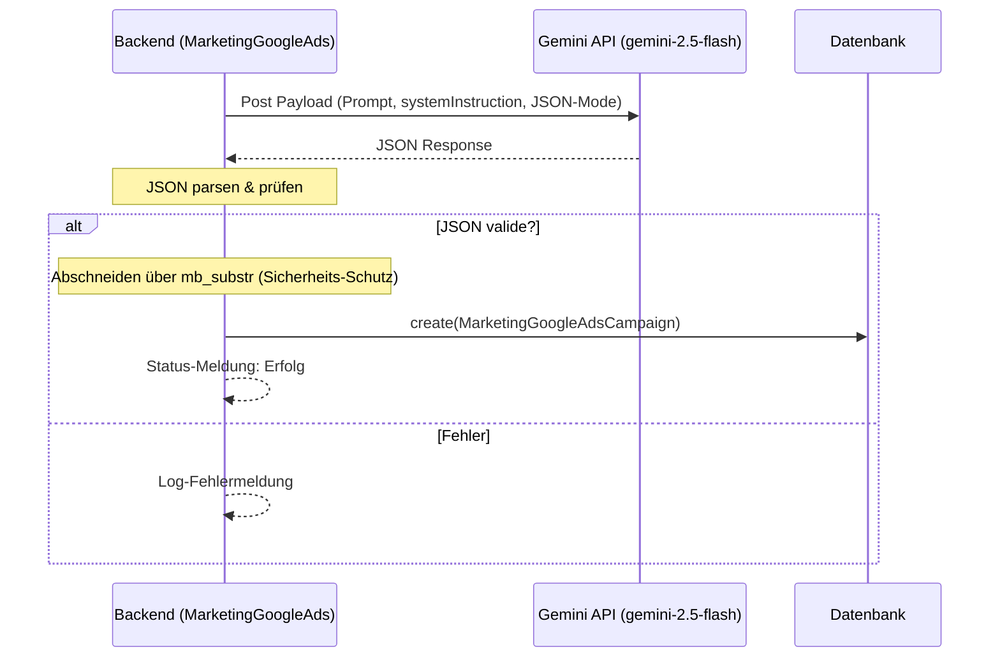

# Marketing - Google Ads

Dieses Dokument beschreibt die Struktur und Funktionsweise des Google Ads Kampagnen-Generators im Laravel-Projekt. Dieses System nutzt direkt die Google Gemini API, um hochoptimierte Suchanzeigen, Zielgruppen-Keywords und Ausschlusslisten (Negative Keywords) für die Produkte des Webshops zu erstellen.

## Zielsetzung
Der Kampagnen-Generator ermöglicht es, für aktive Produkte mit einem Klick Google Ads Suchnetzwerk-Kampagnen zu entwerfen. Dabei werden die Google-Richtlinien für Textlängen (Überschriften und Beschreibungen) streng berücksichtigt.

---

## Beteiligte Komponenten & Modelle

### Backend-Livewire-Controller
* [MarketingGoogleAds](file:///wsl.localhost/Ubuntu/home/ubuntuxina/meine-projekte/seelenfunke/app/Livewire/Shop/Marketing/MarketingGoogleAds.php)
  * Verarbeitet die Anfragen zur Generierung von Google Ads Kampagnen.
  * Kommuniziert per cURL direkt mit der Gemini REST-API.
  * Überwacht die Stringlängen-Restriktionen und speichert Entwürfe ab.

### Modelle
* [MarketingGoogleAdsCampaign](file:///wsl.localhost/Ubuntu/home/ubuntuxina/meine-projekte/seelenfunke/app/Models/Marketing/MarketingGoogleAdsCampaign.php)
  * Speichert die Kampagnenstruktur: `campaign_name`, `ad_group_name`, `keywords` (JSON Array), `negative_keywords` (JSON Array), Headlines, Descriptions und `status`.
* [Product](file:///wsl.localhost/Ubuntu/home/ubuntuxina/meine-projekte/seelenfunke/app/Models/Product/Product.php)
  * Referenziert das beworbene Produkt.
* [AiAgent](file:///wsl.localhost/Ubuntu/home/ubuntuxina/meine-projekte/seelenfunke/app/Models/Ai/AiAgent.php)
  * Liefert den System-Prompt des Marketing-Agenten, welcher als `systemInstruction` an Gemini übergeben wird.

---

## Technischer Ablauf & KI-Integration

### 1. API-Aufruf per cURL (Direct API integration)
Um Timeouts und Parsierungs-Fehler herkömmlicher Chat-Schnittstellen zu umgehen, nutzt das System einen direkten cURL-Aufruf auf die Google Generative Language API mit dem Modell **gemini-2.5-flash**:
* **URL**: `https://generativelanguage.googleapis.com/v1beta/models/gemini-2.5-flash:generateContent?key={api_key}`
* **Formatierung**: Die `generationConfig` wird auf `'responseMimeType' => 'application/json'` gesetzt. Dies zwingt das Modell, valides JSON auszugeben, ohne Markdown-Ummantelungen (` ```json `).

### 2. Prompt-Design & Restriktionen
Der KI-Prompt übermittelt Produktname, Preis und Beschreibung. Zudem fordert er strikt:
* **Headlines**: Maximal 30 Zeichen inkl. Leerzeichen (3 Stück).
* **Descriptions**: Maximal 90 Zeichen inkl. Leerzeichen (2 Stück).
* **Target Keywords**: ca. 10 exakte Suchbegriffe.
* **Negative Keywords**: Mindestens 15 unpassende Begriffe (z. B. "gratis", "selber machen", "billig").

### 3. Datenfluss und Validierung



### 4. Sicherheits-Truncation
Falls die KI trotz Aufforderung die Längenlimits überschreitet, kürzt das System die Texte serverseitig vor dem Speichern mittels `mb_substr`:
* `headline_1` bis `headline_3`: Gekürzt auf **30 Zeichen**.
* `description_1` und `description_2`: Gekürzt auf **90 Zeichen**.
* Der Standardstatus für neu erstellte Kampagnen ist `draft`.
