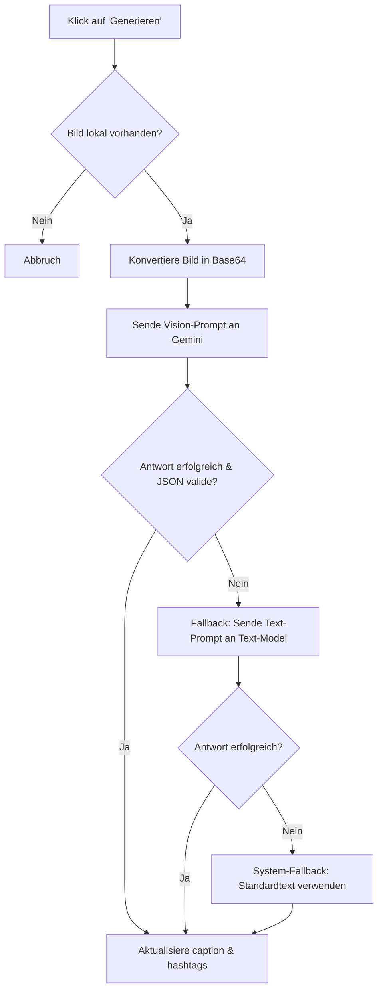

# Marketing - Instagram

Dieses Dokument beschreibt die technische Architektur des Instagram-Synchronisations- und Planungsmoduls im Laravel-Projekt. Das Modul ermöglicht es, Instagram-Beiträge vorzubereiten, Bilder hochzuladen und Bildbeschreibungen (Captions) sowie Hashtags automatisiert mittels künstlicher Intelligenz (Gemini Vision AI) zu generieren.

## Zielsetzung
Das Instagram-Modul stellt eine Schnittstelle für Social-Media-Marketing bereit. Hauptmerkmal ist die Bildanalyse durch KI-Agenten, wodurch direkt passender B2B- oder B2C-Marketingcontent anhand des hochgeladenen Produktfotos entworfen werden kann.

---

## Beteiligte Komponenten & Modelle

### Backend-Livewire-Controller
* [MarketingInstagram](file:///wsl.localhost/Ubuntu/home/ubuntuxina/meine-projekte/seelenfunke/app/Livewire/Shop/Marketing/MarketingInstagram.php)
  * Steuert das Erstellen von Posts, den Bild-Upload, die Steuerung der KI-Generierung und das Umschalten des Veröffentlichungsstatus.

### KI-Schnittstellen
* [GeminiAgent](file:///wsl.localhost/Ubuntu/home/ubuntuxina/meine-projekte/seelenfunke/app/Services/AI/GeminiAgent.php)
  * Stellt die Methode `processVisionPrompt()` zur Übergabe von Bilddaten (Base64) an die Google Gemini Live/Vision API zur Verfügung.
* [AiAgentFactory](file:///wsl.localhost/Ubuntu/home/ubuntuxina/meine-projekte/seelenfunke/app/Services/AI/AiAgentFactory.php)
  * Fallback für reine Text-Prompts, falls die Vision-Schnittstelle temporär nicht verfügbar ist.

### Modelle
* [MarketingInstagramPost](file:///wsl.localhost/Ubuntu/home/ubuntuxina/meine-projekte/seelenfunke/app/Models/Marketing/MarketingInstagramPost.php)
  * Speichert den Beitragsstatus (`draft`, `published`), Bildpfade, Textinhalte (`caption`) und eine Liste von Hashtags (`hashtags`, als Array gecastet).
* [AiAgent](file:///wsl.localhost/Ubuntu/home/ubuntuxina/meine-projekte/seelenfunke/app/Models/Ai/AiAgent.php)
  * Bestimmt den zuständigen Marketing-KI-Agenten, der die Textgenerierung übernimmt.

---

## Technischer Ablauf & Datenfluss

### 1. Post-Entwurf anlegen (`createDraftPost`)
1. Es wird nach einem aktiven KI-Agenten gesucht, der dem Bereich Marketing angehört (`ai_department_id` oder Name filtert nach `%Marketing%`).
2. Ein neuer `MarketingInstagramPost`-Eintrag wird mit dem Status `draft` und leeren Texten erzeugt.

### 2. Bild-Upload (`updatedPhotos`)
1. Über das Livewire-Trait `WithFileUploads` wird das Foto temporär hochgeladen.
2. Das System erstellt im `local`-Disk ein dediziertes Verzeichnis für den Post: `marketing/instagram/posts/{post_id}/`.
3. Die Datei wird als `image.jpg` permanent abgespeichert.
4. Der relative Pfad wird im Modell als `image_url` hinterlegt.

### 3. KI-Textgenerierung (`generateCaptionForPost`)
Sobald ein Bild hochgeladen wurde, kann die Caption-Generierung angestoßen werden:



#### Vision-Prompt Details
Die KI erhält das Bild und eine detaillierte Rollenanweisung:
* **Rolle**: Online-Shop "Seelenfunke" für 3D-Glasinnengravuren.
* **Erwartete Antwort**: Ein JSON-String mit den Schlüsseln `caption` und `hashtags`.
* **Muster-Prompt**:
  ```json
  {
    "caption": "Hier der Post-Text mit passenden Emojis und konkretem Bezug zum Bild",
    "hashtags": ["#Seelenfunke", "#Laser"]
  }
  ```

#### Fallback-Verfahren
1. **Gemini Vision**: Übergabe des Mime-Types und Base64-Strings an `processVisionPrompt()`.
2. **Text-Modell Fallback**: Wenn die Vision-API fehlschlägt (z. B. Limits des API-Proxys), wird ein vordefinierter Text-Prompt mit wechselnden Themen (Mitarbeiter-Award, Firmenjubiläum, Handwerkskunst) an `processDirectPrompt()` übergeben.
3. **Hardcoded Fallback**: Scheitern alle KI-Dienste, setzt das System eine Standard-Caption für Glasinnengravuren ein, um Abstürze zu verhindern.

---

## Veröffentlichungs- und Löschlogik
* **Veröffentlichung umschalten (`togglePublishPost`)**: Wechselt den Status zwischen `draft` und `published` (vorbereitete Schnittstelle zur API-Publikation).
* **Löschen (`deletePost`)**: Löscht sowohl den Datenbankeintrag als auch das gesamte zugehörige Datei-Verzeichnis auf dem Server.
