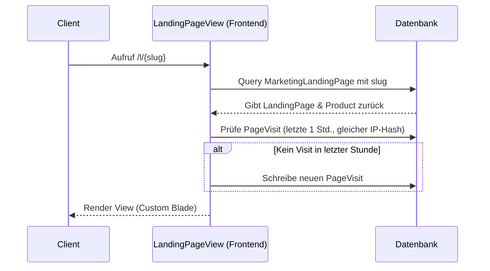

# Marketing - Landing Pages

Dieses Dokument beschreibt die Funktionsweise und Implementierung des Landingpage-Systems im Laravel-Projekt. Dieses System ermöglicht es, für ausgewählte Produkte vollautomatisch SEO-optimierte Landingpages mit dedizierten Designs und integriertem Besuchertracking zu generieren.

## Zielsetzung
Das Landingpage-System dient der Erstellung fokussierter Verkaufsseiten für Produkte. Es trennt die administrative Erstellung im Backend von der dynamischen Ausspielung im Frontend, wobei jede Landingpage als eigenständige Blade-Layout-Datei erzeugt wird. So können Entwickler oder Marketing-Mitarbeiter das Design individuell im Dateisystem verfeinern.

---

## Beteiligte Komponenten & Modelle

### Backend-Livewire-Controller
* [MarketingLandingPages](file:///wsl.localhost/Ubuntu/home/ubuntuxina/meine-projekte/seelenfunke/app/Livewire/Shop/Marketing/MarketingLandingPages.php)
  * Verwaltet die Generierung und Regeneration der Layout-Dateien.
  * Steuert die Verknüpfung mit den Produkten und die Initialisierung der Standardtexte.

### Frontend-Livewire-Controller
* [LandingPageView](file:///wsl.localhost/Ubuntu/home/ubuntuxina/meine-projekte/seelenfunke/app/Livewire/Landing/LandingPageView.php)
  * Löst die Route `/l/{slug}` auf.
  * Prüft die Existenz der Landingpage in der Datenbank und lädt die Produktinformationen.
  * Enthält die IP-basierte Sperrlogik zur Vermeidung von Tracking-Spam.

### Modelle
* [MarketingLandingPage](file:///wsl.localhost/Ubuntu/home/ubuntuxina/meine-projekte/seelenfunke/app/Models/Marketing/MarketingLandingPage.php)
  * Repräsentiert den Datenbankeintrag mit Attributen wie `slug`, `title`, `headline`, `sales_copy`, `cta_text` und `status`.
* [Product](file:///wsl.localhost/Ubuntu/home/ubuntuxina/meine-projekte/seelenfunke/app/Models/Product/Product.php)
  * Die Landingpage ist direkt an ein Produkt gebunden.
* [PageVisit](file:///wsl.localhost/Ubuntu/home/ubuntuxina/meine-projekte/seelenfunke/app/Models/Tracking/PageVisit.php)
  * Dient zur Protokollierung der Aufrufe.

---

## Technischer Datenfluss & Generierungsprozess

### 1. Generierung einer neuen Landingpage (`doGenerate`)
Wenn im Backend der Button zur Erstellung einer Landingpage gedrückt wird:
1. Das `Product` wird geladen.
2. Der Dateipfad für das Blade-Template wird bestimmt: `resources/views/frontend/pages/landingpages/{product-slug}.blade.php`.
3. Es wird ein Standard-Stub geladen (`resources/views/stubs/landing-page-template.stub`) und in die Zieldatei geschrieben.
4. Es wird ein Datenbank-Eintrag in `marketing_landing_pages` erstellt oder aktualisiert (`updateOrCreate`):
   * **Headline**: standardmäßig `"Entdecke die Magie von " + Produktname`
   * **Sales-Copy**: Produktbeschreibung.
   * **CTA-Text**: Wird dynamisch über `getDefaultCtaText` je nach Produkttyp bestimmt.

### 2. CTA-Text-Bestimmung (`getDefaultCtaText`)
Die Call-To-Action (CTA) Beschriftung wird intelligent vorselektiert:
* **Personalisierbar**: `"Jetzt dein Unikat gestalten"`
* **Digitales Produkt**: `"Jetzt digitalen Download ansehen"`
* **Service/Dienstleistung**: `"Jetzt Dienstleistung buchen"`
* **Physisches Standardprodukt**: `"Jetzt zum Produkt"`

---

## Frontend-Routing & Tracking

### 1. Routing
Die Routen-Definition ist in `routes/partials/global_routes.php` registriert:
```php
Route::get('/l/{slug}', \App\Livewire\Landing\LandingPageView::class)->name('landing-page');
```

### 2. Besucher-Tracking (`mount` in `LandingPageView`)
Beim Aufruf der Landingpage wird im Hintergrund ein `PageVisit`-Eintrag angelegt. Um Klick-Spam und doppeltes Zählen zu vermeiden, greift eine **1-Stunden-Sperre pro IP-Hash**:
1. Der IP-Hash wird erzeugt: `hash('sha256', Request::ip())`.
2. Es wird geprüft, ob in der letzten Stunde bereits ein Eintrag für diesen Pfad (`/l/{slug}`) mit diesem IP-Hash vorhanden ist.
3. Falls nicht, wird ein neuer `PageVisit`-Eintrag erfasst mit:
   * `session_id`
   * `ip_hash`
   * `url` & `path`
   * `user_agent` & `referer` (Herkunfts-URL zur UTM-Auswertung)


