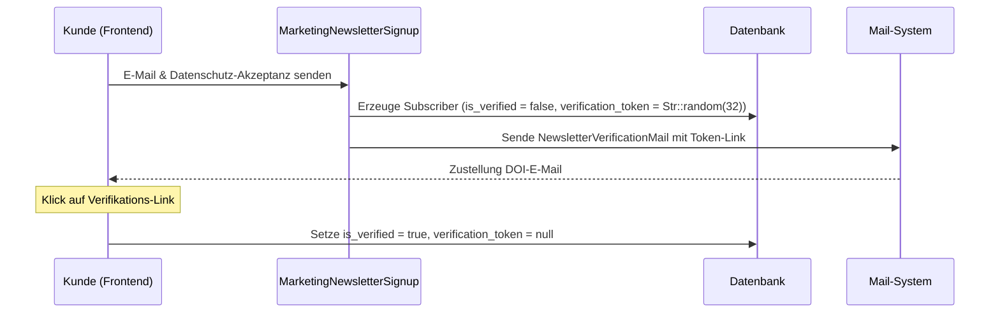

# Marketing - Newsletter

Dieses Dokument beschreibt das integrierte E-Mail-Marketing- und Newsletter-System im Laravel-Projekt. Das System verwaltet Abonnenten, verarbeitet Double-Opt-In-Registrierungen (DOI) datenschutzkonform und berechnet eine automatisierte Versand-Timeline basierend auf jährlichen und variablen Feiertagen.

## Zielsetzung
Das Newsletter-Modul stellt sicher, dass Kunden direkt über Marketingkampagnen und Rabattaktionen informiert werden können. Dabei wird Wert auf DSGVO-Konformität (IP-Protokollierung, Double-Opt-In, Unsubscribe-Links) und Automatisierung (Feiertags-Timeline) gelegt.

---

## Beteiligte Komponenten & Modelle

### Backend-Livewire-Controller
* [MarketingNewsletter](file:///wsl.localhost/Ubuntu/home/ubuntuxina/meine-projekte/seelenfunke/app/Livewire/Shop/Marketing/MarketingNewsletter.php)
  * Dient dem Kampagnen-Management und der Abonnentenverwaltung.
  * Berechnet die chronologische Timeline der Kampagnen.
  * Stellt Test-Mail-Funktionen bereit.

### Frontend-Livewire-Controller
* [MarketingNewsletterSignup](file:///wsl.localhost/Ubuntu/home/ubuntuxina/meine-projekte/seelenfunke/app/Livewire/Shop/Marketing/MarketingNewsletterSignup.php)
  * Kompakte Registrierungs-Komponente für Footer oder Sidebar.
* [MarketingNewsletterPage](file:///wsl.localhost/Ubuntu/home/ubuntuxina/meine-projekte/seelenfunke/app/Livewire/Shop/Marketing/MarketingNewsletterPage.php)
  * Dedizierte Frontend-Seite für Newsletter-An- und Abmeldung.

### Mail-Klassen
* [NewsletterVerificationMail](file:///wsl.localhost/Ubuntu/home/ubuntuxina/meine-projekte/seelenfunke/app/Mail/NewsletterVerificationMail.php)
  * DOI-Verifikations-Mail mit dem Bestätigungslink.
* [AutomaticNewsletterMail](file:///wsl.localhost/Ubuntu/home/ubuntuxina/meine-projekte/seelenfunke/app/Mail/AutomaticNewsletterMail.php)
  * Repräsentiert die versendete Kampagnen-Mail.

### Modelle
* [MarketingNewsletterSubscriber](file:///wsl.localhost/Ubuntu/home/ubuntuxina/meine-projekte/seelenfunke/app/Models/Marketing/MarketingNewsletterSubscriber.php)
  * Speichert `email`, `ip_address`, `privacy_accepted` (Boolean), `is_verified` (Boolean) und das `verification_token`.
* [MarketingNewsletter](file:///wsl.localhost/Ubuntu/home/ubuntuxina/meine-projekte/seelenfunke/app/Models/Marketing/MarketingNewsletter.php)
  * Speichert die E-Mail-Templates: `type` (`automated` oder `manual`), `title`, `target_event_key`, `subject`, `content`, `days_offset`, `send_at` und `is_active`.

---

## Double-Opt-In Ablauf & DSGVO-Konformität

Um die rechtlichen Anforderungen zu erfüllen, erfolgt die Anmeldung in drei Stufen:

* **Datenschutzeinwilligung**: Die Akzeptanz der Datenschutzerklärung (`privacy_accepted` = `accepted`) ist zwingend erforderlich.
* **IP-Adressen-Protokollierung**: Zur Nachweisbarkeit der Anmeldung wird die IP-Adresse (`request()->ip()`) des Absenders in der Datenbank gespeichert.
* **Abmeldeprozess**: In `MarketingNewsletterPage` können sich Benutzer über die Angabe ihrer E-Mail-Adresse und Klick auf Abmelden (`unsubscribe()`) direkt aus der Datenbank löschen.

---

## Feiertagsberechnung & Timeline-Automatisierung

Eine Besonderheit des Moduls ist die dynamische Timeline-Berechnung in `getNewsletterTimeline($year)`. Automatisierte Kampagnen sind an bestimmte Feiertage gebunden und werden um eine definierte Anzahl von Tagen vorverlegt (`days_offset`):

### 1. Feste Feiertage
* **Valentinstag**: 14. Februar
* **Weltfrauentag**: 8. März
* **Halloween**: 31. Oktober
* **Weihnachten**: 24. Dezember
* **Neujahr / Winter-Sale**: 1. Januar
* **Sommer-Sale**: 1. Juli

### 2. Variable Feiertage
* **Ostern**: Berechnet über den Gaußschen Oster-Algorithmus in `getEasterDate($year)`.
* **Muttertag**: Berechnet als zweiter Sonntag im Mai (`nthOfMonth(2, Carbon::SUNDAY)`).
* **Vatertag**: Berechnet als Ostern + 39 Tage (Christi Himmelfahrt).
* **1. Advent**: Sonntag nach dem 26. November.

### 3. Fortlaufende Timeline
Wenn das errechnete Versanddatum für das aktuelle Jahr bereits in der Vergangenheit liegt, berechnet das System den Termin automatisch für das Folgejahr (`$year + 1`). Dadurch läuft die Vorschau im Admin-Bereich nahtlos weiter und ermöglicht eine permanente Planung.

### 4. Manuelle Sonderkampagnen
Zusätzlich zu automatisierten Events können manuelle Newsletter (`type` = `'manual'`) mit einem festen Datum (`send_at`) versehen werden, welche sich nahtlos in die chronologische Timeline einreihen.
