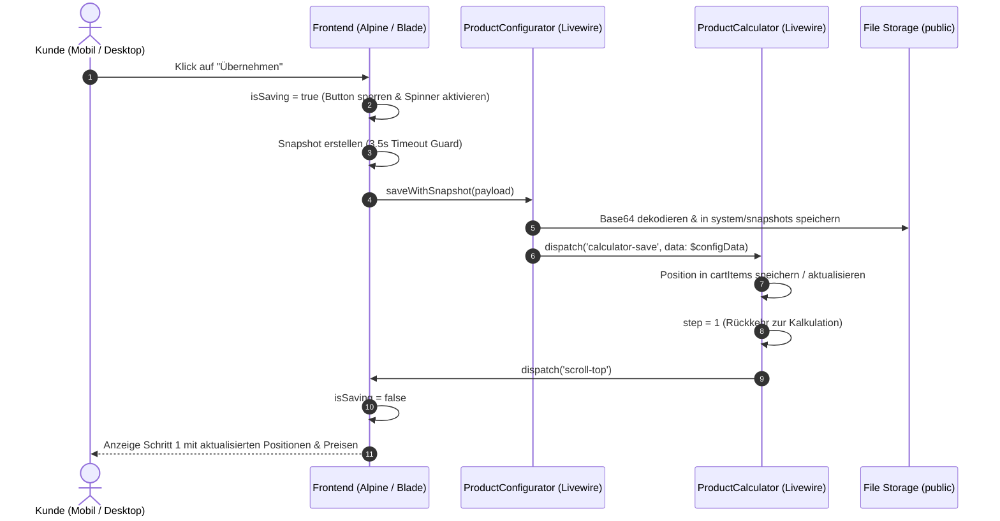

# Abschlussbericht: Produktkonfigurator & Product-Calculator Integration

**Datum:** 05. Oktober 2026  
**Bereich:** Produkte / Konfigurator (`ProductConfigurator`) & Mengenrechner (`ProductCalculator`)  
**Status:** Erfolgreich implementiert, bereinigt und automatisiert getestet  

---

## 1. Übersicht & Zielsetzung

Der Produktkonfigurator (`ProductConfigurator`) ist das zentrale Tool zur visuellen Personalisierung von Artikeln im Shop (2D-Canvas- und 3D-Three.js-Vorschau, Textgravuren, Logouploads, beidseitige Bearbeitung).

Er wird in zwei zentralen Anwendungsfällen betrieben:
1. **B2C-Direktkauf (`context="add"` / `context="edit"`):** Kunden konfigurieren Einzelartikel direkt auf der Produktdetailseite und legen sie in den regulären Warenkorb.
2. **B2B-Mengenrechner (`context="calculator"`):** Innerhalb des `ProductCalculator` (Schritt 2: „Design-Vorschau“) wird der Konfigurator als Sub-Komponente eingebunden, um Staffelpreise, Großmengen und individuelle Angebote mit Personalisierungsdaten anzureichern.

Ziel dieser Maßnahme war es:
- Den „Übernehmen“-Button auf Mobilgeräten fehlerfrei bedienbar zu machen.
- Eine klare visuelle Ladeanimation zu integrieren, um Verwirrung und Mehrfachklicks (Double-Submissions) zu unterbinden.
- Ein kritisches Einfrieren („Wird übernommen...“) im Schritt „Design-Vorschau“ des Produkt-Calculators vollständig zu beheben.
- Die gesamte Kette durch automatisierte Feature- und Integrationstests dauerhaft abzusichern.

---

## 2. Problemstellungen & Ursachenanalyse

### Problem 1: Button reagiert mobil nicht / Doppel-Klicks
- **Symptom:** Nutzer auf Smartphones konnten den Übernehmen-Button scheinbar nicht betätigen, oder es kam durch wiederholtes Tippen zu unkontrollierten Zuständen.
- **Ursachen:**
  1. *Fehlende visuelle Laderückmeldung:* Das Rendern von 2D-/3D-Snapshots auf rechenschwächeren Mobilgeräten benötigt 300–1.500 ms. Mangels sichtbarem Ladezustand klickten Nutzer mehrfach.
  2. *Widerrufs-Checkbox-Blockade:* Im Rechner-Kontext (`context="calculator"`) war im Backend noch die Validierungsprüfung auf `$config_confirmed` aktiv. Da die Checkbox für den B2B-Rechner irrelevant ist bzw. im UI ausgeblendet wurde, schlug das Speichern im Hintergrund stillschweigend fehl.

### Problem 2: Hängenbleiben in der „Design-Vorschau“ (Endlos-Spinner)
- **Symptom:** Nach dem Klick auf „Übernehmen“ wechselte der Button zu `Wird übernommen...`, der Ladekreis drehte sich endlos, und der Rechner wechselte nicht wie vorgesehen zurück zu Schritt 1.
- **Ursachenanalyse via Frontend-Error-Tracking (`SystemLog`):**
  ```text
  Frontend JS Error: Uncaught ReferenceError: snapshotBase64 is not defined
  Frontend Promise Error: snapshotBase64 is not defined
  ```
- **Technische Ursache:** In `scripts_frontend_1.blade.php` war die Variable `let snapshotBase64 = null;` innerhalb einer inneren Funktion/Block deklariert. Beim anschließenden Zusammenstellen des Payloads (`if (snapshotBase64) payload.front = snapshotBase64;`) trat ein `ReferenceError` auf.
- **Folge:** Das JavaScript brach ab, bevor der Livewire-Call `$wire.saveWithSnapshot(payload)` abgesetzt werden konnte. Da der Abbruch außerhalb des Fehler-Handlings lag, blieb `isSaving = true` dauerhaft bestehen und das Event `calculator-save` wurde nie an den übergeordneten `ProductCalculator` gefeuert.

---

## 3. Technische Lösungsarchitektur

### 3.1 Frontend & Alpine.js Optimierungen

1. **Reaktiver Ladezustand & Klickschutz:**
   - In `scripts_frontend_1.blade.php` wurde `isSaving: false` im Alpine-Scope etabliert.
   - Am Anfang von `submitConfig()` blockiert ein Guard sofort jede Folgeaktion:
     ```javascript
     if (this.isSaving) return;
     this.isSaving = true;
     ```
2. **Korrektur des Scopes & globale Fehlerabsicherung:**
   - `snapshotBase64` und `snapshotBackBase64` sind nun ganz oben in `submitConfig()` deklariert.
   - Der gesamte Ablauf ist in einem `try ... finally { this.isSaving = false; }` gekapselt, sodass der Zustand selbst bei Ausnahmen immer sauber zurückgesetzt wird.
3. **Mobile Timeout-Guard (3,5 Sekunden):**
   - Das Erstellen der Snapshots (Three.js WebGL / html2canvas) wird via `Promise.race` gegen einen 3,5-Sekunden-Timeout abgesichert.
   - Sollte ein Mobilgerät die Canvas-Projektion nicht rechtzeitig abschließen, bricht der Vorgang nicht ab, sondern speichert die Konfiguration zuverlässig ohne Snapshot weiter.
4. **Visuelles Feedback im Footer (`footer.blade.php`):**
   - Animierter SVG-Spinner und pulsierender Text: `Wird übernommen...`.
   - Button erhält `:disabled="isSaving"`, `cursor-wait` und `pointer-events-none`.
   - Die Widerrufsrecht-Checkbox wird im Modus `context="calculator"` vollständig ausgeblendet und gilt standardmäßig als genehmigt.

### 3.2 Backend-Logik (`ProductConfigurator.php` & `ProductCalculator.php`)

1. **`ProductConfigurator::mount()`:**
   - Automatische Vorbelegung von `$config_confirmed = true`, sobald `$context === 'calculator'`.
2. **`ProductConfigurator::save()`:**
   - Die Validierung `if ($this->context !== 'calculator' && !$this->config_confirmed)` schließt den Rechner-Modus explizit von der Endkunden-Widerrufsbestätigung aus.
   - Nach erfolgreicher Transaktion wird das Event ausgelöst:
     ```php
     $this->dispatch('calculator-save', data: $configData);
     ```
3. **`ProductCalculator::saveItemFromConfigurator()`:**
   - Hört auf `#[On('calculator-save')]`.
   - Speichert oder aktualisiert die Position in `$this->cartItems`.
   - Setzt `$this->step = 1`, berechnet Summen und Rabatte neu und scrollt die Seite nach oben (`$this->dispatch('scroll-top')`).

---

## 4. Datenfluss & Sequenz



---

## 5. Testabdeckung & Verifikation

Zur dauerhaften Absicherung wurde eine automatisierte Feature- und Integrationstest-Suite erstellt:

**Datei:** [`tests/Feature/Livewire/Shop/Product/ProductConfiguratorCalculatorIntegrationTest.php`](file:///wsl.localhost/Ubuntu/home/ubuntuxina/meine-projekte/seelenfunke/tests/Feature/Livewire/Shop/Product/ProductConfiguratorCalculatorIntegrationTest.php)

### Getestete Szenarien:
1. `configurator_in_calculator_mode_auto_confirms_and_dispatches_calculator_save`:
   Verifiziert, dass der Konfigurator im Rechner-Modus ohne manuelle Checkbox speichert und `calculator-save` mit Texten, Mengen und Produkt-IDs auslöst.
2. `configurator_in_add_mode_requires_manual_confirmation_checkbox`:
   Stellt sicher, dass der reguläre B2C-Warenkorb weiterhin zwingend die Checkbox-Bestätigung verlangt und bei fehlender Bestätigung validiert.
3. `configurator_processes_snapshots_and_stores_in_filesystem`:
   Prüft die Base64-Snapshot-Verarbeitung (Vorder- und Rückseite) und die physische Ablage im öffentlichen Storage unter `system/snapshots/`.
4. `product_calculator_transitions_from_step_2_back_to_step_1_upon_calculator_save`:
   Testet den gesamten Lebenszyklus im Rechner: Schritt 1 $\rightarrow$ `openConfig` (Schritt 2) $\rightarrow$ Event `calculator-save` $\rightarrow$ automatischer Rücksprung auf Schritt 1, Mengenprüfung und anschließende Aktualisierung (`editItem`).
5. `non_personalizable_product_bypasses_configurator_directly_into_calculator_cart`:
   Stellt sicher, dass Produkte ohne Personalisierung (`is_personalizable = false`) den Konfigurator automatisch überspringen und direkt in den Rechner übernommen werden.

### Test-Ergebnisse:
```bash
docker.exe exec mein_php_server php artisan test tests/Feature/Livewire/Shop/Product/ProductCalculatorTest.php tests/Feature/Livewire/Shop/Product/ProductConfiguratorCalculatorIntegrationTest.php
```
```text
PASS  Tests\Feature\Livewire\Shop\Product\ProductCalculatorTest
✓ it can calculate multiple products and volumes                       0.27s  
✓ it handles express delivery and validation                           0.08s  
✓ it submits quote and sends mails                                     0.11s  
✓ it saves item tax rate and preserves quote price in checkout         0.24s  
✓ it copies tax rate on backend conversion                             0.16s  
✓ it embeds product images in quote calculation pdf                    0.14s  

PASS  Tests\Feature\Livewire\Shop\Product\ProductConfiguratorCalculatorIntegrationTest
✓ configurator in calculator mode auto confirms and dispatches calcul… 0.11s  
✓ configurator in add mode requires manual confirmation checkbox       0.11s  
✓ configurator processes snapshots and stores in filesystem            0.08s  
✓ product calculator transitions from step 2 back to step 1 upon calc… 0.12s  
✓ non personalizable product bypasses configurator directly into calc… 0.07s  

Tests:    11 passed (66 assertions)
Duration: 1.64s
```

---

## 6. Fazit & Ausblick (Konfigurator & Rechner)

- Der mobile Übernehmen-Button reagiert nun unmittelbar und verhindert Doppel-Klicks zuverlässig.
- Das Einfrieren im Schritt „Design-Vorschau“ wurde durch Behebung des Scoping-Fehlers und Absicherung gegen Timeouts dauerhaft gelöst.
- Der Wechsel zwischen B2B-Kalkulator und Produktkonfigurator funktioniert nahtlos in beide Richtungen (Neuanlage und Bearbeitung bestehender Positionen).

---

## 7. Bilddarstellung im Angebots-PDF und der E-Mail (3D-Ansicht vs. Fallback)

### 7.1 Problemstellung & Fehleranalyse
Beim Erstellen von Angeboten über den Kalkulator (z. B. Anfrage `#AN-2026-SLEEJ`) wurde im generierten Angebots-PDF (`calculation_pdf_template.blade.php`) und in den Benachrichtigungs-Mails (`new_calc_mail_to_customer.blade.php`, `new_calc_mail_to_admin.blade.php`) fälschlicherweise das Standard-Katalogbild (z. B. `seelen-kristall_b.jpg` mit dem Mustertext „Sophia & Alexander“) anstelle der individuellen 3D-Vorschau (z. B. gravierter Kristall mit „Frohe Weihnachten! - Familie Mustermann -“) angezeigt.

**Ursachenanalyse:**
1. **Pfadpräfix-Mismatch (`snapshots/` vs. `system/snapshots/`):**
   In der Datenbank (`product_templates`) und teils in Konfigurationen waren Vorlagen-Snapshots mit dem Pfad `snapshots/<uuid>_front.jpg` hinterlegt. Das physische Ablageverzeichnis lautet jedoch `storage/app/public/system/snapshots/`.
   In `mail_item_list.blade.php` suchte die Datei-Auflösung nach `storage/snapshots/...` bzw. `app/public/snapshots/...`, schlug fehl und fiel bei der PDF-Generierung auf eine externe HTTP-URL zurück, die DomPDF im Docker-Container nicht auflösen konnte (404 / Verbindungsabbruch).
2. **Überschreiben vorhandener Snapshots in `ProductConfigurator.php`:**
   Wurde ein Artikel aus einer Vorlage geladen oder im Rechner übernommen, ohne dass die 3D-Engine sofort einen neuen Snapshot lieferte (z. B. wenn der Kunde keine Änderungen vornahm), wurde `snapshot_path` in `save()` mit einem leeren Array `[]` überschrieben. Dadurch griff `mail_item_list.blade.php` mangels vorhandenem Snapshot immer auf `main_image` zurück.
3. **Fehlende Skript-Vorabladung auf `/calculator`:**
   Auf der Rechner-Seite (`calculator.blade.php`) fehlten die Bundles `admin-bundle.js` und `html2canvas.min.js`. Beim dynamischen Livewire-Wechsel auf Schritt 2 („Design-Vorschau“) war Three.js unter Umständen noch nicht einsatzbereit, wodurch `submitConfig()` in den 2D-Fallback lief und keine Snapshots erzeugte.

---

### 7.2 Durchgeführte Maßnahmen & Implementierung

1. **Pfad-Normalisierung & Base64-Auflösung in [`mail_item_list.blade.php`](file:///wsl.localhost/Ubuntu/home/ubuntuxina/meine-projekte/seelenfunke/resources/views/global/mails/partials/mail_item_list.blade.php):**
   - Automatische Erkennung und Normalisierung von Snapshots: Pfade mit `snapshots/` werden transparent als `system/snapshots/` aufgelöst.
   - DomPDF-Base64-Inlining: Liegt ein Snapshot auf der Festplatte, wird er im PDF-Modus (`isPdf = true`) direkt als Base64 Data URI (`data:image/jpeg;base64,...`) eingebunden.
   - Mail-URL-Auflösung: In HTML-E-Mails erzeugt `asset('storage/' . $cleanRelPath)` stets die korrekte, öffentlich erreichbare URL.
   - **Strikte Fallback-Hierarchie:** Wenn ein 3D-Snapshot existiert, wird **nur** dieser dargestellt. Das Katalog-Produktbild (`main_image`) dient als reiner Fallback und wird nur angezeigt, wenn gar kein Snapshot vorhanden ist (z. B. bei Standard-Artikeln ohne Personalisierung). Beide Bilder werden niemals gleichzeitig dargestellt.

2. **Snapshot-Erhalt in [`ProductConfigurator.php`](file:///wsl.localhost/Ubuntu/home/ubuntuxina/meine-projekte/seelenfunke/app/Livewire/Shop/Product/ProductConfigurator/ProductConfigurator.php):**
   - Eigenschaft `public $snapshot_path = [];` hinzugefügt.
   - In `mount()` wird ein existierender Snapshot aus `$initialData['snapshot_path']` geladen.
   - In `save()` wird `$finalSnapshotPath = !empty($snapshotPath) ? $snapshotPath : $this->snapshot_path;` verwendet, sodass bestehende Snapshots niemals durch ein leeres Array überschrieben werden.

3. **3D-Engine Synchronisation & Preloading:**
   - In `resources/views/frontend/pages/calculator.blade.php` wurden `admin-bundle.js` und `html2canvas.min.js` eingebunden.
   - In `scripts_frontend_1.blade.php` wartet `submitConfig()` aktiv auf die Initialisierung der 3D-Engine (`Configurator3DEngine`), bevor Snapshots gerendert werden.

4. **Datenbankbereinigung (`product_templates`):**
   - Vorhandene Vorlagen mit fehlerhaftem Präfix wurden von `"snapshots/` auf `"system/snapshots/` migriert.
   - In `ProcessOrderDocumentsAndMails.php` wurde dieselbe Normalisierung implementiert, um auch E-Mail-Anhänge für Bestellungen abzusichern.

---

### 7.3 Testabdeckung & Verifikation

Ein dedizierter Test wurde implementiert:
**Datei:** [`tests/Feature/Livewire/Shop/Product/QuoteMailPdfImageRenderingTest.php`](file:///wsl.localhost/Ubuntu/home/ubuntuxina/meine-projekte/seelenfunke/tests/Feature/Livewire/Shop/Product/QuoteMailPdfImageRenderingTest.php)

**Getestete Fälle:**
1. `quote_renders_only_3d_snapshot_and_no_catalog_fallback_when_snapshot_exists`:
   Prüft, dass bei vorhandenem Snapshot nur die 3D-Ansicht gerendert wird und das Katalog-Bild ausgeschlossen ist. Prüft zusätzlich die Base64-Codierung im PDF und den fehlerfreien PDF-Export via DomPDF.
2. `quote_renders_snapshot_even_when_legacy_path_missing_system_prefix`:
   Prüft die Normalisierung von Legacy-Pfaden (`snapshots/...`) zu `system/snapshots/...` in Mail und PDF.
3. `quote_falls_back_to_product_image_only_when_no_snapshot_exists`:
   Prüft das korrekte Fallback-Verhalten auf das Katalogbild bei nicht-personalisierten Artikeln.
4. `configurator_preserves_initial_snapshot_when_saved_without_new_capture`:
   Prüft, dass bestehende Snapshots bei Re-Saves ohne neue Canvas-Aufnahme nicht überschrieben werden.

**Testergebnis der gesamten Produkt-Suite:**
```text
PASS  Tests\Feature\Livewire\Shop\Product\ProductCalculatorCapacityTest (3 Tests)
PASS  Tests\Feature\Livewire\Shop\Product\ProductCalculatorTest (6 Tests)
PASS  Tests\Feature\Livewire\Shop\Product\ProductConfiguratorCalculatorIntegrationTest (5 Tests)
PASS  Tests\Feature\Livewire\Shop\Product\ProductCreateTest (9 Tests)
PASS  Tests\Feature\Livewire\Shop\Product\QuoteMailPdfImageRenderingTest (4 Tests)

Tests:    27 passed (146 assertions)
Duration: 17.92s
```
