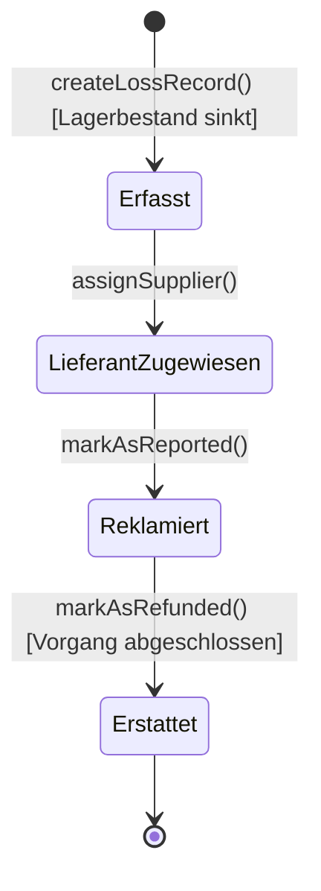

# System-Dokumentation: Produkte / Schaden (Ausschuss & Reklamationen)

Das Schadens-Modul erfasst Bruchware, Retourenbeschädigungen, Produktionsfehler und Ausschussware im Lager. Es steuert den Reklamationsprozess gegenüber Lieferanten und bucht automatische Bestandsanpassungen.

---

## 1. Übersicht & Zielsetzung

- **Ziel:** Lückenlose Erfassung von Materialverlusten zur steuerlichen Abschreibung und prozessualen Reklamation bei Lieferanten.
- **Lagerbestandskorrektur:** Automatisierte Reduktion des Produktbestands bei Schadenserfassung und Zurückbuchung bei Stornierung.
- **Rückerstattungs-Tracking:** Verfolgung des Reklamationsstatus (gemeldet, erstattet) bei Großhändlern zur Rückforderung von Einkaufskosten.

---

## 2. Technische System-Architektur

### 2.1 Livewire-Komponente
- **Klasse:** [`ProductFracture`](file:///wsl.localhost/Ubuntu/home/ubuntuxina/meine-projekte/seelenfunke/app/Livewire/Shop/Product/ProductFracture.php)
- **Layout:** `components.layouts.backend_layout` (Department-Theme: `Produkte`)

### 2.2 Datenbank-Modelle
- **`App\Models\Product\ProductLoss`:**
  Repräsentiert den einzelnen Schadensfall.
  - `product_id`: Referenzierte Ware.
  - `product_supplier_id`: Lieferant, bei dem reklamiert wird.
  - `quantity`: Menge der beschädigten Artikel.
  - `cost_value`: Finanzieller Verlust (Einkaufswert * Menge).
  - `reason`: Schadensursache (z. B. "Transportschaden", "Laserfehler").
  - `recorded_by`: Mitarbeiter, der den Schaden eingetragen hat.
  - `reported_to_supplier_at`: Zeitstempel, wann die Reklamation an den Lieferanten ging.
  - `refund_received_at`: Zeitstempel der Gutschrift/Ersatzlieferung.

---

## 3. Workflow & Datenfluss

### 3.1 Schadenserfassung
- Über ein Modal wird das Produkt, die Menge und der Grund angegeben.
- Das System validiert, ob ausreichender Lagerbestand zur Abbuchung vorhanden ist.
- Bei erfolgreicher Erfassung (`createLossRecord()`):
  - Der Schadenseintrag wird mit dem berechneten Einkaufswert angelegt.
  - Der Lagerbestand des betroffenen Produkts wird um die Schadensmenge reduziert (`$product->reduceStock(...)`).

### 3.2 Reklamation beim Lieferanten
- Dem Schadenseintrag kann ein Lieferant zugewiesen werden.
- Wird der Schaden beim Lieferanten eingereicht, markiert der Mitarbeiter den Eintrag als reklamiert (`reported_to_supplier_at = now()`).
- Nach Erhalt einer Gutschrift oder Ersatzlieferung wird der Erstattungsstatus gesetzt (`refund_received_at = now()`).

### 3.3 Stornierung & Korrektur
- **Eintrag stornieren (`deleteLoss`):** Löscht die Schadensmeldung und bucht den entnommenen Bestand automatisch zurück in das Hauptlager (`$product->increaseStock(...)`).
- **Eintrag bearbeiten (`updateLoss`):** Ermöglicht die nachträgliche Anpassung von Menge und Grund. Bestandsdifferenzen werden automatisch berechnet und im Lagerbestand ausgeglichen.
