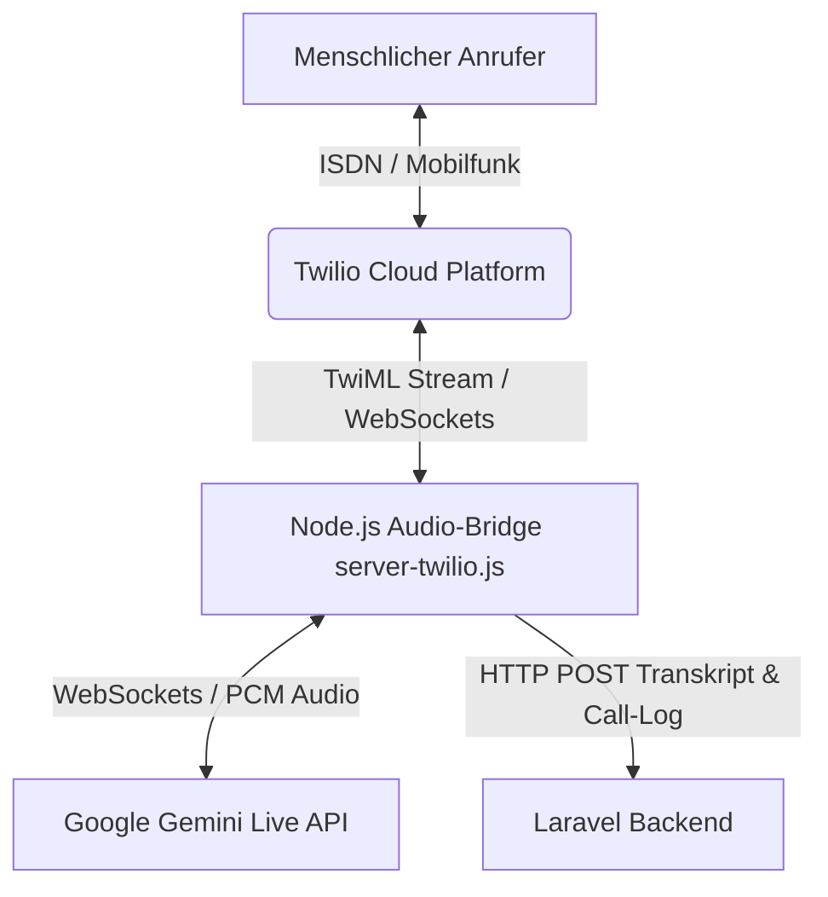

# System-Dokumentation: Support / Telefonie (Twilio & Gemini Voice Bridge)

Das Telefonie-Modul bindet das herkömmliche Festnetz über eine Echtzeit-Audio-Bridge (WebSockets) an die künstliche Intelligenz (Google Gemini Live API) an. Dies ermöglicht autonome KI-Support-Telefonate sowie eine anschließende Auswertung und Transkript-Analyse im Backend.

---

## 1. Übersicht & Zielsetzung

- **Ziel:** Bereitstellung eines Sprachkanals (Telefonhotline), über den Kunden mit einer KI ("Funki") sprechen können, um Support-Fragen zu klären, Bestellstatus abzufragen oder Termine zu koordinieren.
- **Echtzeit-Audio-Bridge:** Verbindung von Telefonie (Twilio) und KI (Gemini Live API) mit einer Latenz von unter einer Sekunde.
- **Automatisierte Nachbereitung:** Vollständige Transkription, Zusammenfassung und Generierung von To-Dos am Ende jedes Anrufs zur Entlastung des Support-Teams.

---

## 2. Technische System-Architektur

Die Telefonie-Infrastruktur besteht aus drei tragenden Komponenten:

### 2.1 Laravel Backend
- **Livewire-Komponente:** [`SupportTelephony`](file:///wsl.localhost/Ubuntu/home/ubuntuxina/meine-projekte/seelenfunke/app/Livewire/Shop/Support/SupportTelephony.php)
- **Modell:** `App\Models\SupportTelephonyCall`
- **Aufgabe:** Initiierung ausgehender Anrufe, Speicherung der Gesprächsdaten (Transkripte, Audio-Aufzeichnungen, Dauer) und Bereitstellung der Prompts und RAG-Daten für die Bridge.

### 2.2 Node.js Audio-Bridge (`server-twilio.js`)
- **Protokoll:** WebSockets (`ws` und `wss`)
- **Aufgabe:** Dient als bidirektionaler Übersetzer zwischen dem Twilio-Netzwerk und der Gemini API.
- **Audio-Konvertierung:**
  - Twilio sendet und empfängt Audio im **8kHz mu-Law Format** (Base64-kodiert).
  - Gemini benötigt hochauflösenderes Audio (**16kHz oder 24kHz PCM-Format**).
  - Die Bridge führt diese Konvertierungen live durch.
- **Unterbrechungserkennung (Voice Activity Detection):**
  Spricht der Anrufer, während die KI antwortet, sendet die Bridge ein `<Clear>`-Kommando an Twilio, um den aktuellen Sprachpuffer der KI sofort zu leeren (Vermeidung von "Übersprechen").

### 2.3 Google Gemini Live API (Multimodal Live)
- **Modell:** Gemini 2.0 Flash (Multimodal Live API)
- **Aufgabe:** Verstehen der gesprochenen Sprache und Generieren von Echtzeit-Sprchantworten (Text-to-Speech & Speech-to-Text in einem Schritt).

---

## 3. Datenfluss bei einem Telefonat

1. **Anrufauslösung:** Das Laravel Backend sendet eine Anfrage an die Twilio API.
2. **TwiML Stream:** Twilio antwortet mit TwiML (Twilio Markup Language) und stellt eine Verbindung zum WebSocket der Node.js-Bridge (`server-twilio.js`) unter `TWILIO_WSS_URL` her.
3. **Session-Kopplung:** Die Bridge verbindet sich mit der Gemini Live API und sendet das System-Prompt sowie Tools, die die KI aufrufen darf.
4. **Gesprächsende:** Sobald aufgelegt wird, sendet die Node.js-Bridge das komplette Transkript an das Laravel-Backend.
5. **Post-Call-Analyse:**
   - Ein Laravel-Job sendet das Transkript an Gemini 2.5 Flash.
   - Die KI analysiert das Gespräch und generiert ein kurzes Fazit (`summary`) sowie nächste Schritte/Aufgaben (`next_steps`).
   - Diese Daten werden in der Tabelle `support_telephony_calls` gespeichert und im Livewire-Dashboard angezeigt.

---

## 4. Sicherheitssteuerung & Kostenkontrolle
- **Nachtruhe-Switch:** In den globalen Systemeinstellungen kann die Telefonie nachts automatisch deaktiviert werden, um automatisierte Spam-Anrufe zu verhindern.
- **Tages-Kosten-Limit:** Da Telefonie über Twilio und Gemini nach Minuten/Token abgerechnet wird, schützt ein Tageslimit vor unerwarteten Kosten durch Endlosschleifen der KI.
- **IP-Whitelist:** Die Node.js-Bridge akzeptiert nur Verbindungen von verifizierten Twilio-IP-Adressen.
