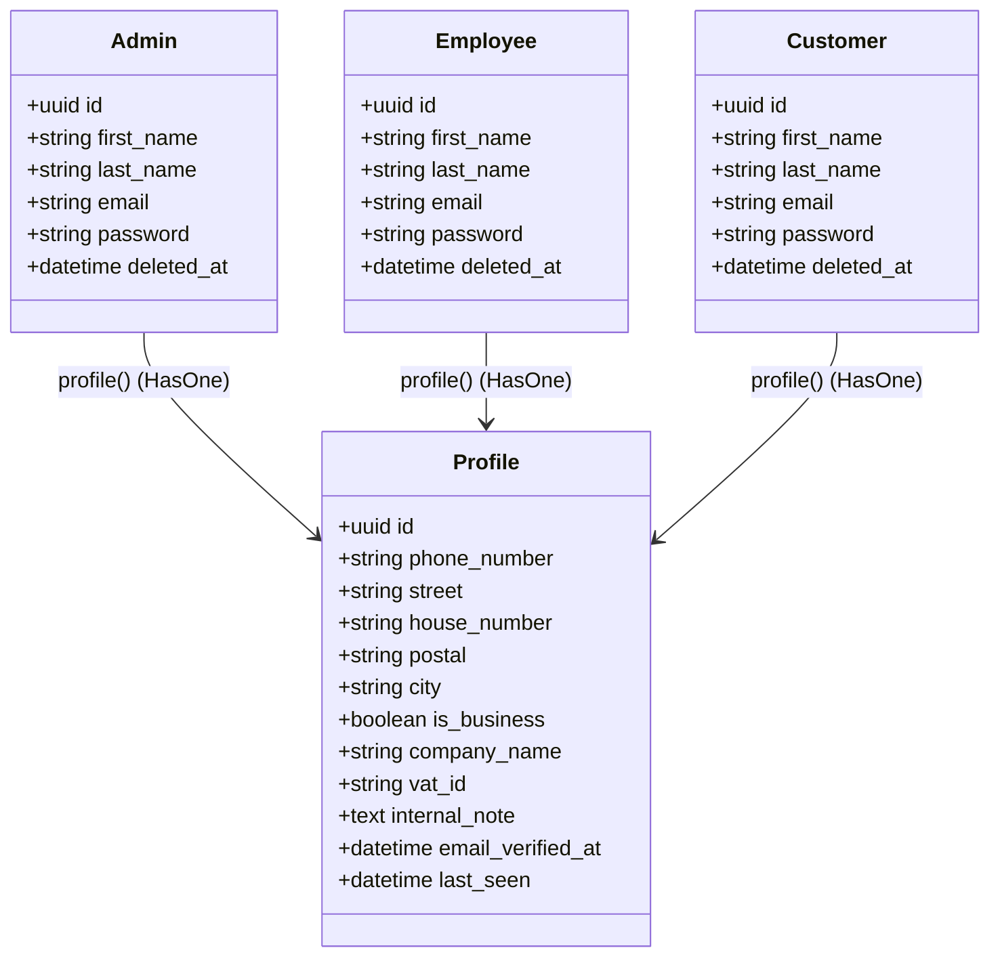

# System-Benutzerverwaltung

Die System-Benutzerverwaltung bildet die zentrale administrative Schnittstelle zur Verwaltung aller im Seelenfunke-Ökosystem registrierten Konten. Sie trennt sauber zwischen verschiedenen Benutzerrollen, steuert Profil- und Adressdaten und protokolliert jegliche administrativen Änderungen manipulationssicher im System-Log.

## Zielsetzung
Das Modul konsolidiert die Verwaltung von Administratoren, Mitarbeitern und Endkunden. Es ermöglicht CRUD-Operationen, Soft-Deletes (Archivierung), endgültige Löschungen sowie die Pflege detaillierter Rechnungs- und Profildaten für B2B- und B2C-Konten.

---

## Beteiligte Komponenten & Klassen

### Datenbank-Modelle
- [Admin](file:///wsl.localhost/Ubuntu/home/ubuntuxina/meine-projekte/seelenfunke/app/Models/Admin/Admin.php): Benutzerkonten für Administratoren mit uneingeschränktem Systemzugriff.
- [Employee](file:///wsl.localhost/Ubuntu/home/ubuntuxina/meine-projekte/seelenfunke/app/Models/Employee/Employee.php): Konten für Mitarbeiter mit eingeschränkten Bereichsrechten.
- [Customer](file:///wsl.localhost/Ubuntu/home/ubuntuxina/meine-projekte/seelenfunke/app/Models/Customer/Customer.php): Endkunden-Accounts für den Shopbereich.
- [SystemLog](file:///wsl.localhost/Ubuntu/home/ubuntuxina/meine-projekte/seelenfunke/app/Models/System/SystemLog.php): Wird zur Dokumentation aller Benutzeränderungen verwendet (Audit-Trail).

### Livewire-Controller
- [SystemUserManagement](file:///wsl.localhost/Ubuntu/home/ubuntuxina/meine-projekte/seelenfunke/app/Livewire/Shop/System/SystemUserManagement.php): Bietet das administrative Kontrollzentrum. Steuert Paginierung über drei verschiedene DB-Tabellen hinweg, regelt das Formular-State-Management und berechnet Änderungs-Deltas.

---

## Datenbankschema & Rollenarchitektur

Die Konten sind in drei separaten Tabellen strukturiert, nutzen jedoch eine gemeinsame Profiltabelle für erweiterte Stammdaten:



---

## Lebenszyklus und Audit-Trail (System-Protokollierung)

Um Sicherheitsrichtlinien (Compliance) einzuhalten, wird jede administrative Interaktion über [SystemLog](file:///wsl.localhost/Ubuntu/home/ubuntuxina/meine-projekte/seelenfunke/app/Models/System/SystemLog.php) auditiert.

### 1. Benutzererstellung (`user:create`)
Beim Anlegen eines neuen Kontos wird nach der Validierung die jeweilige Modell-Instanz erzeugt und das Profil befüllt. Das System loggt die Aktion mit Status `success`.

### 2. Delta-Berechnung bei Profilaktualisierung (`user:update`)
Beim Speichern von Änderungen (`saveInline`) vergleicht der Controller die übermittelten Formulardaten mit den Werten in der Datenbank. Es wird ein präzises Änderungs-Delta berechnet und als Payload im Log gespeichert:
```php
$changes = [];
foreach ($oldData as $key => $oldValue) {
    if (isset($this->formData[$key]) && $oldValue !== $this->formData[$key]) {
        $changes[$key] = [
            'old' => $oldValue,
            'new' => $this->formData[$key]
        ];
    }
}
```
*Beispiel-Payload im SystemLog:*
```json
{
  "actor": "admin@seelenfunke.de",
  "target_user": "kunde@seelenfunke.de",
  "changes": {
    "city": { "old": "Bonn", "new": "Köln" },
    "is_verified": { "old": false, "new": true }
  }
}
```

### 3. Archivierung und Löschung (Soft/Force Delete)
- **Archivierung (`user:archive`)**: Setzt das Löschdatum (`deleted_at`) über Eloquent-SoftDeletes. Log-Status: `warning`.
- **Wiederherstellung (`user:restore`)**: Setzt das Löschdatum zurück auf `null`. Log-Status: `success`.
- **Dauerhafte Löschung (`user:force_delete`)**: Entfernt den Datensatz unwiderruflich aus der Datenbank. Da dies eine destruktive Aktion ist, wird das Log mit dem Status `error` aufgezeichnet, um in Admin-Statistiken sofort als kritischer Eintrag aufzufallen.
