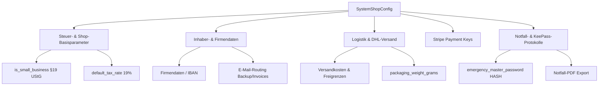

# System-Einstellungen (Shop-Konfiguration)

Das System-Einstellungsmodul bildet das zentrale Nervensystem für geschäftliche Parameter, Steuereinstellungen, API-Integrationsdaten und Notfallvorsorge-Dokumente im Seelenfunke-Projekt.

## Zielsetzung
Das Modul dient der Speicherung und Bereitstellung globaler Konfigurationsvariablen. Es trennt Eingaben im Frontend (z. B. Euro-Preise) sauber von der internen Datenbank-Repräsentation (z. B. Cent-Beträge) und verwaltet sensible Zahlungsdienstleister-Schlüssel sowie ein generierbares Notfall-Handbuch zur Absicherung des operativen Betriebs.

---

## Beteiligte Komponenten & Klassen

### Datenbank-Modelle
- [SystemSetting](file:///wsl.localhost/Ubuntu/home/ubuntuxina/meine-projekte/seelenfunke/app/Models/System/SystemSetting.php): Ein einfaches Key-Value-Modell, das die Einstellungen persistent in der Tabelle `system_settings` speichert.
- [AccountingGroup](file:///wsl.localhost/Ubuntu/home/ubuntuxina/meine-projekte/seelenfunke/app/Models/Accounting/AccountingGroup.php): Wird bei der Generierung des Notfall-Handbuchs ausgelesen, um Finanzgruppen einzubinden.

### Livewire-Controller
- [SystemShopConfig](file:///wsl.localhost/Ubuntu/home/ubuntuxina/meine-projekte/seelenfunke/app/Livewire/Shop/System/SystemShopConfig.php): Steuert das administrative Einstellungs-Panel, führt Validierungen durch, steuert Dateiuploads für Update-Berichte, verwaltet Cache-Löschungen bei Einstellungs-Updates und erzeugt das Notfall-PDF.

---

## Einstellungsbereiche & Datenschemata

Die Konfigurationsparameter sind in folgende logische Gruppen unterteilt:



### 1. Währungs- und Betragskonvertierung
Um Rundungsfehler bei Fließkommazahlen in der Datenbank zu vermeiden, werden alle Euro-Beträge (z. B. `shipping_cost`, `shipping_free_threshold`, `express_surcharge_min`) als Ganzzahlen (Cents) gespeichert. Der Controller führt die Umrechnung beim Laden und Speichern automatisch durch:
- **Laden aus DB**: $Cents / 100$ (Formatiert auf 2 Nachkommastellen)
- **Speichern in DB**: $\text{Euro-Eingabe} \times 100$ (Rundung auf Integer)

### 2. Notfall-Vorsorge & Notfall-PDF (`generateEmergencyPdf`)
Eine Besonderheit des Systems ist die Notfall-Absicherung (unter `/notfall` abrufbar). 
- **`emergency_master_password`**: Wird über die Standard-Laravel-Hash-Facade verschlüsselt gespeichert und niemals an das Frontend zurückgesendet.
- **`generateEmergencyPdf()`**: Erzeugt über die Bibliothek `dompdf` ein physisch ausdruckbares Notfall-Handbuch. Dieses enthält neben den KeePass-Dateisystempfaden, Notar- und Familienkontakten auch die aktuellen Fixkosten- und Bankverbindungsstrukturen aus der Buchhaltung (`AccountingGroup`), um im Ernstfall (z. B. Handlungsunfähigkeit der Inhaberin) die Unternehmensfortführung zu sichern.

### 3. Caching-Strategie
Änderungen an den Einstellungen erfordern eine sofortige Cache-Erneuerung, da wichtige Shoptarif-Berechnungen und Lagerbestandsschwellen performanceoptimiert gecacht werden. Daher werden beim Speichern gezielt die Cache-Tags gelöscht:
```php
Cache::forget('global_shop_settings');
Cache::forget('shop_setting_inventory_threshold');
```

### 4. Laravel-Update-Scraper
Über die integrierte File-Schnittstelle können technische Update-Berichte (Logfiles von Composer-Updates oder Server-Migrationen) im Verzeichnis `storage/app/shopverwaltung/reports/laravel-updates/` hochgeladen, gelistet und zur Fehlerverfolgung eingesehen werden.
