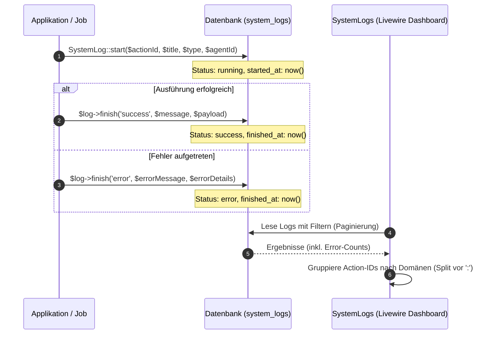

# System-Protokolle (Logs)

Das System-Protokollierungssystem (System-Logs) von Seelenfunke bietet eine konsolidierte und strukturierte Übersicht über alle im Hintergrund laufenden Systemaktivitäten, Fehlerzustände, KI-Agenten-Ausführungen und automatisierten System-Cronjobs.

## Zielsetzung
Ziel dieses Moduls ist es, Administratoren und Entwicklern eine zentrale Diagnoseplattform zur Verfügung zu stellen. Es überwacht fehlerhafte Ausführungsschritte, protokolliert Payload-Daten von externen Webhooks und API-Anfragen und ermöglicht es, Systemfehler interaktiv als gelöst zu markieren.

---

## Beteiligte Komponenten & Klassen

### Datenbank-Modelle
- [SystemLog](file:///wsl.localhost/Ubuntu/home/ubuntuxina/meine-projekte/seelenfunke/app/Models/System/SystemLog.php): Das zentrale Modell für Log-Einträge. Speichert den ausführenden KI-Agenten (`ai_agent_id`), Log-Typ, die Action-ID zur Gruppierung nach Domänen, einen Titel, Detailnachrichten, Status (`success`, `error`, `running`), JSON-Payloads sowie Start- und Endzeitpunkte.

### Livewire-Controller
- [SystemLogs](file:///wsl.localhost/Ubuntu/home/ubuntuxina/meine-projekte/seelenfunke/app/Livewire/Shop/System/SystemLogs.php): Der Controller für das administrative Log-Cockpit. Bietet Such- und Filtersysteme (nach Status, Log-Typ, Agent, Domain) und Funktionen zum Löschen von Einträgen oder zum manuellen Umschalten des Lösungsstatus (`toggleStatus`).

---

## Logging-Lifecycle & Domänen-Parsing

Logs werden im System asynchron oder synchron bei der Ausführung von Hintergrund-Tasks oder Webhook-Empfängern gestartet. Dabei folgt das System folgendem Datenfluss:



### 1. Start- / Finish-Architektur
Um Laufzeiten von Automatisierungen genau zu tracken, nutzt das System zwei Hilfsmethoden:
- **`SystemLog::start(...)`**: Initiiert den Protokollsatz im Status `running` und setzt `started_at` auf den aktuellen Timestamp.
- **`$log->finish(...)`**: Setzt `finished_at` auf den aktuellen Timestamp und speichert den Ausgangsstatus sowie die Detailnachricht und Nutzdaten (`payload`).

### 2. Domänen-Parsing (`action_id`)
Log-Einträge verwenden strukturierte `action_id`-Werte im Format `domain:action` (z. B. `stripe:webhook`, `ebay:crawler`, `ai:workspace`). 
Der Controller parst diese IDs im Render-Prozess dynamisch vor dem Doppelpunkt (`:`), um eine Liste aller aktiven Log-Domänen zu generieren. Dadurch kann der Administrator das Log-Terminal nach spezifischen Integrationen filtern.

### 3. Fehler-Wiederholungs-Analyse (Error Grouping)
In der Log-Übersicht ermittelt der Controller über ein Sub-Select die Häufigkeit identischer Fehlermeldungen:
```sql
SELECT COUNT(*) FROM system_logs as l2 WHERE l2.message = system_logs.message AND l2.status = "error"
```
Dadurch sieht der Administrator sofort, ob ein bestimmter API-Fehler (z. B. Verbindungsabbruch zu Shopify oder Twilio) ein isolierter Einzelfall ist oder periodisch auftritt.

### 4. Interaktive Fehlerauflösung
Über die Methode `toggleStatus($logId)` können Fehler im Livewire-Dashboard als `success` (gelöst) markiert werden. Das System ändert den Status und fügt dem Titel das Präfix `[GELÖST] ` hinzu, um gelöste Systemtickets von ungelösten Fehlern visuell abzugrenzen.
