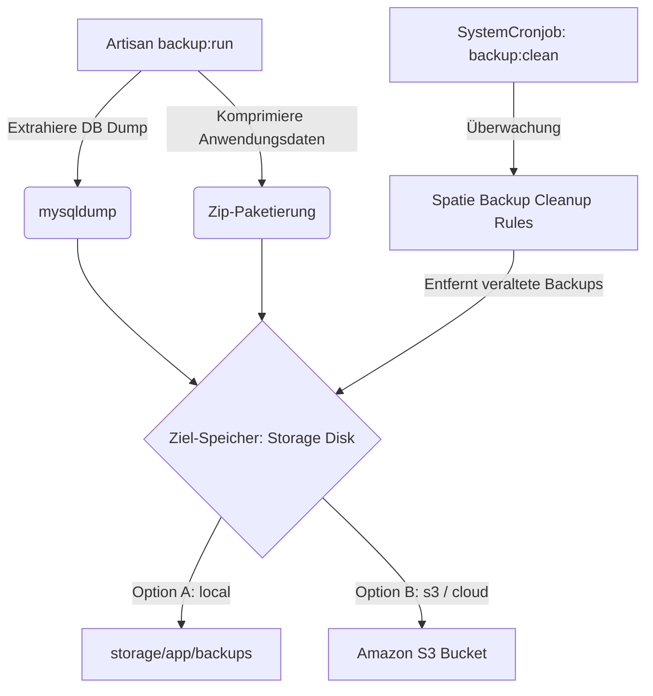

# System-Sicherungen (Backups)

Das System-Sicherungssystem (Sicherungen) im Seelenfunke-Projekt stellt die Integrität und Wiederherstellbarkeit aller geschäftskritischen Geschäftsdaten und Anwendungsdateien sicher. Es basiert auf dem Branchenstandard `Spatie Backup` und bindet die systemweiten Cronjobs zur automatisierten Steuerung ein.

## Zielsetzung
Das Modul dient der regelmäßigen Sicherung der relationalen MySQL-Datenbank und wichtiger Anwendungsdateien. Es bietet dem Administrator eine visuelle Übersicht über alle erstellten Archive, zeigt statistische Auswertungen (Speicherplatzbedarf, Alter der Backups) und ermöglicht die manuelle Ausführung, das Herunterladen und das Löschen von Backup-ZIP-Dateien directly im Backend.

---

## Beteiligte Komponenten & Klassen

### Systemkomponenten & Drittanbieter-Bibliotheken
- **Spatie Laravel Backup**: Die zugrundeliegende Backup-Engine, welche die ZIP-Paketierung und Bereinigung alter Backups (`backup:run`, `backup:clean`) übernimmt.
- [SystemCronjob](file:///wsl.localhost/Ubuntu/home/ubuntuxina/meine-projekte/seelenfunke/app/Models/System/SystemCronjob.php): Steuert das Ausführungsintervall der Sicherungs- und Bereinigungsskripte.

### Livewire-Controller
- [SystemBackups](file:///wsl.localhost/Ubuntu/home/ubuntuxina/meine-projekte/seelenfunke/app/Livewire/Shop/System/SystemBackups.php): Der Livewire-Controller für das administrative Backup-Dashboard. Ruft die Backup-Dateien über Spaties API-Klassen ab, berechnet Speichermetriken und steuert die manuellen Datei-Operationen (Download, Delete, Trigger).

---

## Backup-Architektur & Speicherziele

Backups werden gemäß der Laravel-Konfiguration (`config/backup.php`) verarbeitet. Standardmäßig arbeitet das System mit folgendem Datenfluss:



### 1. Speicherziele (Storage Disks)
Die Ziel-Disk wird dynamisch aus der Konfigurationsdatei ausgelesen:
```php
$this->diskName = config('backup.backup.destination.disks.0', 'local');
```
Das System unterstützt dabei nahtlos sowohl lokale Dateisystem-Sicherungen als auch Cloud-Ziele wie **Amazon S3** oder kompatible S3-Dienste (z. B. DigitalOcean Spaces, MinIO).

### 2. Cronjob-Steuerung
Die Frequenz der Bereinigung wird im Mount-Prozess des Controllers aus der `system_cronjobs`-Tabelle ermittelt:
```php
$cronjob = \App\Models\System\SystemCronjob::where('command', 'backup:clean')->first();
$this->cronjobSchedule = $cronjob ? $cronjob->schedule : 'Nicht konfiguriert';
```
Die Bereinigung (`backup:clean`) sorgt dafür, dass ältere Backups nach definierten Regeln (z. B. Behalten von täglichen Backups für 7 Tage, wöchentlichen für 4 Wochen etc.) automatisch gelöscht werden, um S3- oder Festplatten-Speicherplatz zu sparen.

### 3. Manuelle Backup-Auslösung (`runTestBackup`)
Administratoren können über die UI eine sofortige Sicherung der Datenbank auslösen. Der Controller ruft dazu das Artisan-Kommando asynchron/synchron auf:
```php
\Illuminate\Support\Facades\Artisan::call('backup:run', ['--only-db' => true]);
```
Die Option `--only-db` stellt sicher, dass der Prozess extrem schnell abschließt und nur die SQL-Strukturen gesichert werden (ideal vor System-Updates oder Migrationen).
